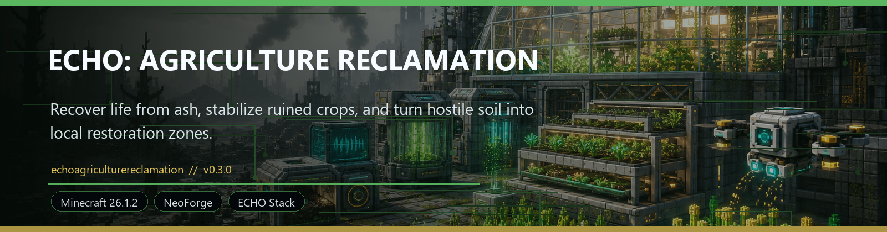
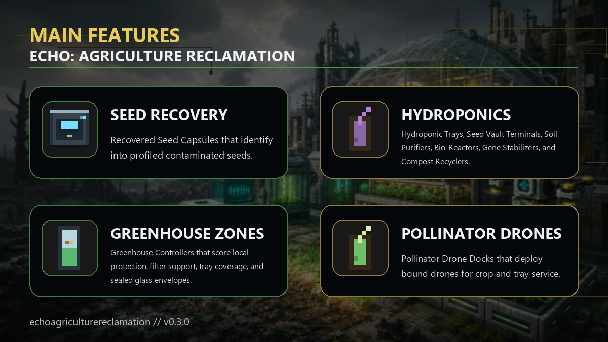

<!-- CURSEFORGE_README_START -->
# ECHO: Agriculture Reclamation



**Recover life from ash, stabilize ruined crops, and turn hostile soil into local restoration zones.**



## CurseForge Summary

Field agriculture recovery with seed vaults, hydroponics, greenhouse zones, Pollinator Drones, and local soil restoration.

## Overview

ECHO: Agriculture Reclamation is the field recovery chapter for players who want the ruined world to answer back with life instead of free vanilla abundance. It adds profiled seed recovery, contaminated and stabilized genetics, soil purification, hydroponic growth, greenhouse scoring, and Pollinator Drone service as a practical survival loop.

The addon is built for the ECHO stack but stays focused on local recovery. It does not rewrite entire biomes or hand the player a clean world. Instead, progress is earned block by block and chunk by chunk through seed capsules, purification enzymes, Bio-Gel, greenhouse control, and crop utility chains.

With ECHO Terminal installed, Agriculture Reclamation publishes FIELD > Reclamation records, diagnostics, milestones, support-cache hooks, and optional Survival Route side leads so the ecology route feels like a first-class chapter beside Ashfall, Orbital, Nexus, and Industrial systems.

## Main Features

- Recovered Seed Capsules that identify into profiled contaminated seeds.
- Hydroponic Trays, Seed Vault Terminals, Soil Purifiers, Bio-Reactors, Gene Stabilizers, and Compost Recyclers.
- Greenhouse Controllers that score local protection, filter support, tray coverage, and sealed glass envelopes.
- Pollinator Drone Docks that deploy bound drones for crop and tray service.
- Useful crops including Ash Wheat, Hardroot, Glow Beans, Radleaf, Cryo Moss, Clean Corn, Medicinal Aloe, Filter Reed, Nexus Orchid, and Signal Fungus.
- Soft compatibility with Ashfall soils, Nexus recovery routes, Orbital resources, and Industrial support loops.

## How It Plays

- Recover or craft a Seed Capsule, identify a seed profile, plant it in compatible soil or a Hydroponic Tray, then harvest crop matter for Bio-Gel and nutrient loops.
- Stabilize genetics with Gene Samples or Bio-Gel, build a safer greenhouse, deploy Pollinator Drones, and raise local restoration pressure without bypassing the wider survival game.

## Requirements

- Minecraft 26.1.2
- NeoForge 26.1.2.29-beta or newer
- Java 25+
- ECHO: Core 1.1.0 or newer

## Recommended Pairings

- ECHO: Terminal 1.0.0 or newer for missions, records, diagnostics, and support caches; Terminal 1.2.0 or newer is recommended for explicit Survival Route placement
- ECHO: Ashfall Protocol for ruined soils and survival context
- ECHO: Industrial Nexus for infrastructure support

## Compatibility Notes

- Optional integration is registry-id based so the addon can load safely without sibling chapters.
- Restoration is intentionally local and does not replace normal biome generation.

## CurseForge Asset Files

- Banner: `docs/curseforge/echoagriculturereclamation-banner.png`
- Feature image: `docs/curseforge/echoagriculturereclamation-features.png`

<!-- CURSEFORGE_README_END -->

---

## Existing Developer Notes

# ECHO: Agriculture Reclamation

Agriculture Reclamation is the ECHO field recovery chapter for ruined-world farming. It is a standalone NeoForge addon with mod id `echoagriculturereclamation`, package `com.knoxhack.echoagriculturereclamation`, and version `1.2.0`.

## Production Status

- Build and resources are wired into the beta and full ECHO stacks.
- The player route is usable in survival: recover a profiled seed, purify soil or use a Hydroponic Tray, grow and harvest crops, produce Bio-Gel or nutrient mix, stabilize genes, scan greenhouse safety, and raise chunk-local restoration pressure.
- Restoration stays local to blocks and chunks. It does not rewrite biome ids or restore vanilla ecology for free.
- Terminal and Core integration publish FIELD > Reclamation metrics, route records, diagnostics, recovery cache support, six route milestones, and optional Terminal Survival Route placement when the current Terminal API is present.
- Cross-addon compatibility is optional and registry-id based for Ashfall ruined soils, Restoration Project-style soils, Nexus restore alignment, and ECHO faction preferences.

## Player Smoke Route

1. Recover a `Recovered Seed Capsule` from ECHO ruin loot, or craft one from wheat seeds, bone meal, a glass bottle, and copper.
2. Use the `Seed Vault Terminal` or direct capsule use to get a profiled `Contaminated Seed`.
3. Plant the profiled seed on dirt, grass, farmland, or compatible reclamation soil, or insert it into a `Hydroponic Tray`.
4. Grow and harvest at least one crop output.
5. Craft a `Bio-Reactor` with `Soil Nutrient Mix`, then convert any crop matter into `Bio-Gel`.
6. Craft and use `Gene Stabilizer` with a contaminated seed plus `Gene Sample` or `Bio-Gel`.
7. Build a sealed greenhouse with glass, filters, dock support, trays, and controller scan.
8. Mature restoration crops and scan ecology until local soil conversion pressure is visible.

## Crop Utility Notes

- `Medicinal Aloe` feeds the Bio-Reactor for Bio-Gel and can award Ashfall bandage output when that addon is loaded.
- `Signal Fungus` is a stronger Bio-Reactor input and also composts into extra nutrient mix.
- `Cryo Moss` converts to Bio-Gel plus Purification Enzyme in the Bio-Reactor or extra nutrient mix in the Compost Recycler.
- `Filter Reed` composts into extra nutrient mix, can award Ashfall plant fiber when present, and crafts into paper for Spore Filter recovery.
- `Nexus Orchid` converts to Bio-Gel plus Gene Sample and can award Nexus gel when Nexus Protocol is loaded.

## Validation

Run from the workspace root:

```powershell
.\gradlew.bat :echoagriculturereclamation:build --warning-mode all
.\gradlew.bat :echoagriculturereclamation:runGameTestServer --warning-mode all
.\gradlew.bat :echoterminal:build --warning-mode all
.\gradlew.bat :echoterminal:runGameTestServer --warning-mode all
.\gradlew.bat -PechoAddonSet=beta validateEchoResources buildEchoWorkspace --warning-mode all
.\gradlew.bat -PechoAddonSet=all validateEchoResources buildEchoWorkspace --warning-mode all
.\gradlew.bat -PechoAddonSet=all validateReleaseArtifacts printReleaseManifest --warning-mode all
.\gradlew.bat -PechoAddonSet=all verifyEchoRelease --warning-mode all
```

If Python is not on `PATH`, pass `-PechoPythonExecutable="C:/path/to/python.exe"` to the Gradle validation commands.

## Release Notes

- The pollinator dock contributes greenhouse safety when it can service nearby crops or Hydroponic Trays; no drone entity is spawned.
- Greenhouse safety is enclosure-aware: open support helps, but a sealed Greenhouse Glass shell with overhead glass is required for full safe-envelope rating.
- Crop, soil, machine, and progression rules live under `data/echoagriculturereclamation/echoagriculturereclamation`.
- Global seed and gene recovery injections live under NeoForge `data/echoagriculturereclamation/loot_modifiers`.
- Mature crop loot is conservative: immature crops do not drop produce.
- Generic seed items must carry the `seed_profile` data component before planting or tray growth.
- 1.2.0 focuses on Terminal Survival Route placement and release readiness, not new Agriculture gameplay.
- Agriculture remains the owner of FIELD > Reclamation actions, rewards, support caches, and detailed diagnostics.
- No blocks, items, entities, recipes, save fields, data components, datapack schemas, or gameplay migrations are added in 1.2.0.

The 1.2.0 release note lives in the root docs at `../../docs/releases/agriculture_reclamation_1.2.0.md`.
