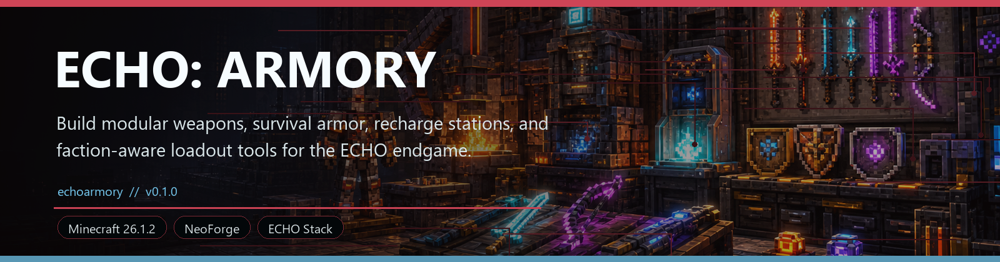
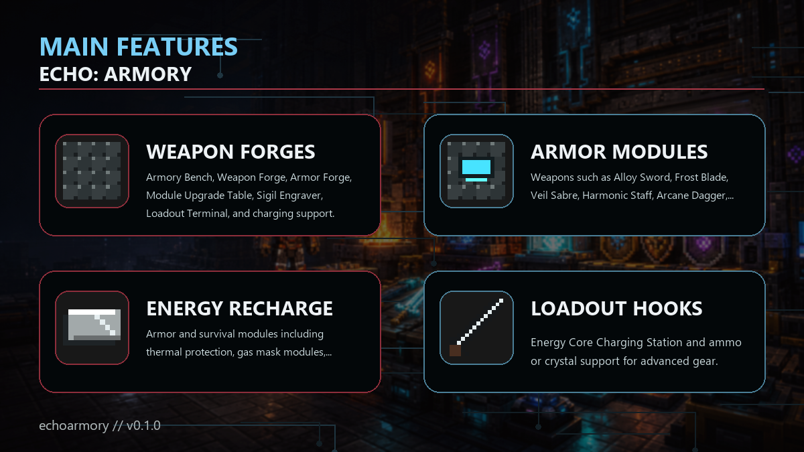

<!-- CURSEFORGE_README_START -->
# ECHO: Armory

**Build modular weapons, survival armor, recharge stations, and route-ready loadout tools for the ECHO endgame.**

## CurseForge Summary

Weapons, armor, modules, recharge systems, workstations, and loadout hooks for ECHO combat progression.

## Overview

ECHO: Armory adds a dedicated combat equipment layer for the ECHO ecosystem. It centers on workstations, alloy components, energy cores, modular weapons, survival armor, and upgrade tools that let a player turn recovered technology into field-ready gear.

The addon is designed to sit across the release chain: Ashfall expeditions need stronger survival equipment, Logistics can organize loadouts, Industrial can feed component production, Orbital and Stationfall benefit from specialized protection, and Nexus or Blackbox routes can gate stranger technology.

Armory is not just a list of stronger swords. Its identity is modular preparation: build the workstation network, craft the core gear, slot useful modules, keep energy systems charged, and bring the right kit for the route ahead. In 1.2.0, route-kit readiness ties loadouts, hazard protection, boss previews, MissionCore side ops, and Logistics dispatch into one shared readiness model.

## Main Features

- Armory Bench, Weapon Forge, Armor Forge, Module Upgrade Table, Sigil Engraver, Loadout Terminal, and charging support.
- Weapons such as Alloy Sword, Frost Blade, Veil Sabre, Harmonic Staff, Arcane Dagger, Energy Rifle, Veil Bow, Convergence Gun, Resonance Hammer, Sigil Chakram, and Construct Gauntlet.
- Armor and survival modules including thermal protection, gas mask modules, radiation shielding, mobility servos, drone docks, and orbital boots.
- Energy Core Charging Station and ammo or crystal support for advanced gear.
- Route Kit Readiness for mission kits, staged gear, per-hazard protection requirements, faction locks, and Logistics availability.
- Soft integrations with Terminal, Logistics Network, Industrial Nexus, Orbital Remnants, Stationfall, Nexus Protocol, and Blackbox Protocol.

## How It Plays

- Recover rare components, craft the Armory workstation chain, assemble weapons and armor, then improve them through elemental cores, sigils, and route-specific survival modules.
- Use loadout and logistics hooks to make equipment prep part of the wider ECHO mission flow instead of a separate gear grind. The Terminal Armory tab now reports whether a kit is ready, staged, missing parts, or faction locked.

## Requirements

- Minecraft 26.1.2
- NeoForge 26.1.2.29-beta or newer
- Java 25+
- ECHO: Core 1.1.0 or newer

## Recommended Pairings

- ECHO: Logistics Network for loadout handling
- ECHO: Industrial Nexus for component manufacturing context
- ECHO: Terminal for shared chapter visibility

## Compatibility Notes

- Sibling chapter integrations are optional and guarded.
- Armory is intended to complement route difficulty rather than replace chapter-specific rewards.

## CurseForge Asset Files

- Banner: `docs/curseforge/echoarmory-banner.png`
- Feature image: `docs/curseforge/echoarmory-features.png`

<!-- CURSEFORGE_README_END -->
