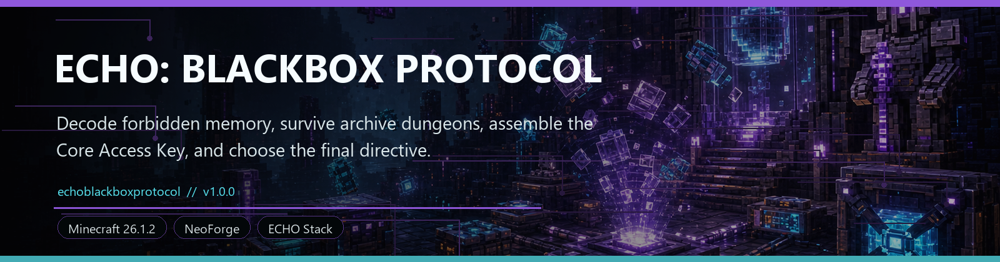
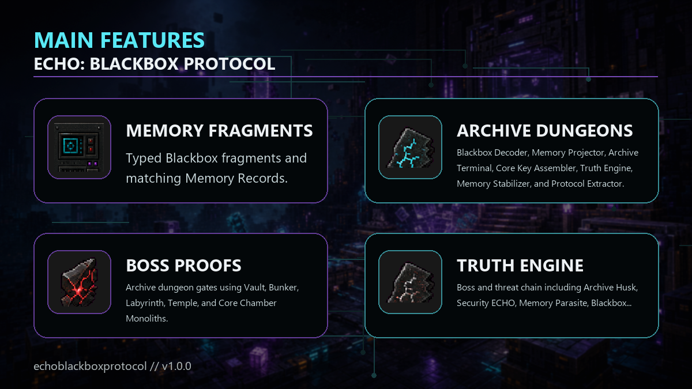

<!-- CURSEFORGE_README_START -->
# ECHO: Blackbox Protocol

**Decode forbidden memory, survive archive dungeons, assemble the Core Access Key, and choose the final directive.**

## CurseForge Summary

Late-game memory finale with typed Blackbox fragments, archive dungeons, boss proofs, the Truth Engine, and final directives.

## Overview

ECHO: Blackbox Protocol is the late-game memory chapter of the ECHO saga. It turns recovered evidence into a full route of typed fragments, decoded records, memory instability, hostile recordings, archive dungeons, boss proof, and final directive choices.

Players decode Personal, ECHO, Security, Command, Core, and Deleted fragments, then push deeper through the Blackbox Vault, Command Bunker, Memory Labyrinth, Core Access Temple, and Nexus Core Chamber. Each step asks whether the player is recovering truth or giving the old systems another way in.

The chapter culminates in the Truth Engine and the Restore, Control, Destroy, or Merge directive set. It is meant for packs that want a final ECHO ending with evidence, consequence, and a clean handoff from Stationfall and Nexus Protocol.

## Main Features

- Typed Blackbox fragments and matching Memory Records.
- Blackbox Decoder, Memory Projector, Archive Terminal, Core Key Assembler, Truth Engine, Memory Stabilizer, and Protocol Extractor.
- Archive dungeon gates using Vault, Bunker, Labyrinth, Temple, and Core Chamber Monoliths.
- Boss and threat chain including Archive Husk, Security ECHO, Memory Parasite, Blackbox Sentinel, False ECHO, Command Remnant, and Nexus Guardian.
- Core Access Key assembly from logs, boss proofs, identity fragments, command keys, and protocol schematics.
- Final directives for Restore, Control, Destroy, and the secret Merge route.

## How It Plays

- Decode fragments to reveal records, manage memory stability and false signal pressure, clear archive dungeon proof chains, then assemble the Nexus Core Access Key.
- Use the Truth Engine only when you are ready to commit a final directive for the save's ECHO memory state.

## Requirements

- Minecraft 26.1.2
- NeoForge 26.1.2.29-beta or newer
- Java 25+
- ECHO: Core 1.0.0 or newer

## Recommended Pairings

- ECHO: Terminal for records, chapter pages, and actions
- ECHO: Stationfall for the blackbox handoff
- ECHO: Nexus Protocol for Core context

## Compatibility Notes

- Orbital Remnants, Stationfall, and Nexus Protocol hooks are optional where supported.
- The chapter is intended as late-game content and assumes the player has reached advanced ECHO infrastructure.

## CurseForge Asset Files

- Banner: `docs/curseforge/echoblackboxprotocol-banner.png`
- Feature image: `docs/curseforge/echoblackboxprotocol-features.png`

<!-- CURSEFORGE_README_END -->
