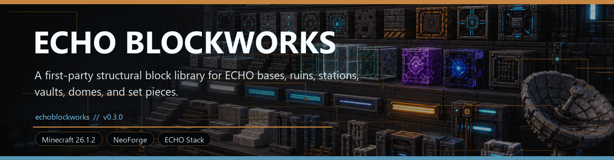
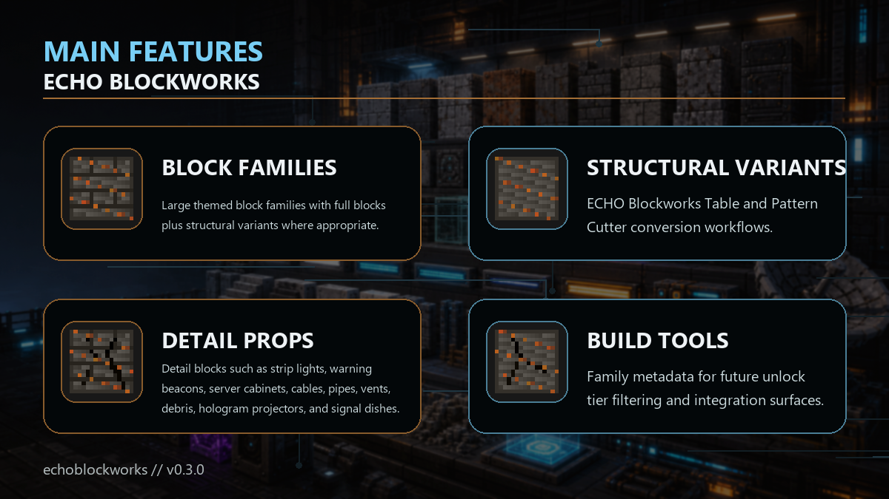

<!-- CURSEFORGE_README_START -->
# ECHO Blockworks

**A first-party structural block library for ECHO bases, ruins, stations, vaults, domes, and set pieces.**

## CurseForge Summary

Decorative and structural block families for ECHO builds, ruins, command rooms, orbital interiors, and late-game facilities.

## Overview

ECHO Blockworks is the construction and set-dressing library for the ECHO and Ashfall ecosystem. It provides themed block families, structural variants, detail blocks, and conversion tools so bases and generated ruins can share a consistent visual language.

Families cover reinforced metal, rusted metal, ashstone, charred concrete, terminal panels, ECHO circuits, orbital hulls, Nexus crystals, Blackbox vault materials, and reclamation glass. Structural families include slabs, stairs, and walls for production-ready building variety.

The addon is valuable for players who like building functional outposts and for pack authors who want ECHO structures to feel connected across Ashfall, Orbital, Stationfall, Nexus, Industrial, Blackbox, and Agriculture content.

## Main Features

- Large themed block families with full blocks plus structural variants where appropriate.
- ECHO Blockworks Table and Pattern Cutter conversion workflows.
- Detail blocks such as strip lights, warning beacons, server cabinets, cables, pipes, vents, debris, hologram projectors, and signal dishes.
- Family metadata for future unlock tier filtering and integration surfaces.
- Optional visibility in ECHO Index, Lens, and MultiblockCore style workflows.

## How It Plays

- Craft or recover a family block, place the Blockworks Table, then convert blocks across variants and shapes to build clean command rooms, ruined streets, factory shells, orbital interiors, and sealed greenhouse structures.
- Use detail blocks to make functional bases look like they belong in the ECHO world instead of ordinary survival rooms with a new coat of paint.

## Requirements

- Minecraft 26.1.2
- NeoForge 26.1.2.29-beta or newer
- Java 25+
- ECHO: Core 1.0.0 or newer

## Recommended Pairings

- ECHO: Index for block family browsing
- ECHO: Lens for inspection support
- ECHO: MultiblockCore for future casing workflows

## Compatibility Notes

- Blockworks is safe to use as a visual library even when other chapter mods are missing.
- Themed blocks are first-party ECHO assets and are intended for both survival builds and generated structures.

## CurseForge Asset Files

- Banner: `docs/curseforge/echoblockworks-banner.png`
- Feature image: `docs/curseforge/echoblockworks-features.png`

<!-- CURSEFORGE_README_END -->
---

## Existing Developer Notes

# ECHO Blockworks

ECHO Blockworks is the first-party decorative and structural block library for the ECHO / Ashfall ecosystem. It provides a Chisel-inspired building library for bases, rare showcase worldgen, ruined cities, crash zones, convoy depots, orbital interiors, Terminal rooms, Blackbox vaults, Nexus structures, reclamation domes, and future MultiblockCore casings.

Mod ID: `echoblockworks`  
Package: `com.knoxhack.echoblockworks`  
Version: `1.0.0`

## Block Families

Blockworks content is organized into families. Each family has eight full-block variants, metadata for theme and future unlock tier filtering, and conversion support through the Blockworks Table and Pattern Cutter.

| Family | Theme | Unlock tier | Full variants |
| --- | --- | --- | --- |
| Reinforced Metal | Industrial / ECHO infrastructure | Industrial | Panel, Riveted, Grate, Frame, Cracked, Hazard Stripe, Lit Panel, Pillar |
| Rusted Metal | Ruined industrial | Starter | Panel, Riveted, Grate, Pipe Wall, Cracked, Hazard Stripe, Dark Plate, Pillar |
| Ashstone | Ashfall ruins | Starter | Raw, Brick, Cracked Brick, Chiseled, Tile, Pillar, Debris, Smooth |
| Charred Concrete | Ruined city / crash zone | Starter | Smooth, Cracked, Tile, Rebar, Road Plate, Warning Stripe, Scorched, Broken |
| Terminal Panel | Terminal / command room | Terminal Restored | Wall Panel, Screen, Trim, Cyan Lit, Dark Panel, Data Panel, Warning Panel, Server Rack |
| ECHO Circuit | Core tech | Terminal Restored | Circuit Panel, Data Conduit, Service Node, Matrix, Glowing Circuit, Offline Circuit, Warning Circuit, Encrypted Circuit |
| Orbital Hull | Orbital Remnants / Stationfall | Orbital | Hull Panel, Thermal Tile, Airlock Frame, Docking Trim, Lit Strip, Damaged Hull, White Hull, Black Hull |
| Nexus Crystal | Nexus Protocol | Nexus | Nexus Glass, Nexus Frame, Glowing Crystal, Cracked Crystal, Energy Conduit, Anomaly Tile, Pillar, Rift Panel |
| Blackbox Vault | Blackbox Protocol / archive | Blackbox | Vault Wall, Locked Panel, Archive Panel, Memory Glass, Warning Light, Dark Alloy, Secure Frame, Cracked Vault |
| Reclamation Glass | Agriculture Reclamation | Reclamation | Clear Glass, Framed Glass, Green Glass, Overgrown Glass, Hydroponic Panel, Lit Grow Panel, Dome Panel, Irrigation Pipe |

Structural families also ship slab, stair, and wall variants for every full block: Reinforced Metal, Rusted Metal, Ashstone, Charred Concrete, Orbital Hull, and Blackbox Vault.

## Detail Blocks

The library includes sixteen structure detail blocks:

`ECHO Strip Light`, `Warning Beacon`, `Flickering Warning Light`, `Data Wall`, `Broken Monitor`, `Server Cabinet`, `Cable Bundle`, `Wall Pipe`, `Ceiling Pipe`, `Steam Vent`, `Sparking Cable Panel`, `Rubble Pile`, `Scattered Debris`, `Hanging Wire`, `Hologram Floor Projector`, and `Signal Dish Decorative`.

Lit blocks emit light. Directional detail blocks use horizontal placement. Pipes, cables, vents, debris, and ceiling strips use non-full shapes where appropriate. Sparking cable panels have client-side spark/sound feedback.

## Conversion

### ECHO Blockworks Table

Craft and place the `ECHO Blockworks Table`. Insert any registered Blockworks family block into the input slot. The table shows available variants for the same family and shape, and the output slot previews the selected result. Taking the output consumes one input and returns one converted block.

Shape is preserved. A slab converts to another slab in the same family, stairs convert to stairs, walls convert to walls, and full blocks convert to full blocks. Unsupported shapes are not shown. The v3 table resets selection when the input family, shape, view mode, selected kit, or visible target set changes.

The table has two view modes:

- `All`: shows every variant in the inserted block's family and shape.
- `Kit`: cycles through curated palette kits and shows only matching kit variants for the inserted family and shape. If the selected kit has no match, the table falls back to all variants and shows a no-match status.

Shift-clicking the output converts as many input blocks as can fit into the player inventory. The conversion remains strictly 1:1 and does not duplicate blocks.

### ECHO Pattern Cutter

Use the `ECHO Pattern Cutter` directly in the world:

- Right-click a Blockworks block to cycle forward through variants in the same family and shape.
- Sneak-right-click to cycle backward.
- The cutter preserves shared state properties such as facing, slab type, stair half/shape, wall state, and waterlogged state when the target block supports them.
- Survival mode damages the cutter by one point per successful conversion.

## Tags

Block tags:

`echoblockworks:reinforced_frames`, `industrial_panels`, `rusted_panels`, `ruined_city_blocks`, `ashfall_ruin_blocks`, `terminal_panels`, `echo_circuit_blocks`, `orbital_hulls`, `nexus_blocks`, `nexus_glass`, `blackbox_vault_blocks`, `reclamation_blocks`, `convoy_depot_blocks`, `hazard_blocks`, `lab_blocks`, `multiblock_valid_frames`, `multiblock_decorative_valid`, and `worldgen_ruin_materials`.

Item tags:

`echoblockworks:blockworks_blocks`, `pattern_cuttable`, `industrial_theme`, `orbital_theme`, `nexus_theme`, `blackbox_theme`, and `reclamation_theme`.

Minecraft tags are also generated for pickaxe mining, tool tiers, slabs, stairs, and walls.

## Recipes

Blockworks uses practical survival recipes for one base block per family, the Blockworks Table, and the Pattern Cutter. Variants are primarily produced through the Blockworks Table, Pattern Cutter, or stonecutting fallback recipes. Structural slabs, stairs, and walls have stonecutting recipes from their matching full block.

## Palette Kits

v3 adds ten curated builder kits. Kits are metadata and table filters, not new blocks:

Ashfall Ruined City, Crash Zone, Terminal Bunker, Orbital Station, Nexus Gate, Blackbox Vault, Reclamation Dome, Convoy Depot, Industrial Factory, and Starter Base.

Each kit records recommended family IDs, featured blocks, accent blocks, theme, usage notes, and an optional worldgen site link. Runtime JSON is generated under `data/echoblockworks/palette_kits`, and ECHO Index receives one entry per kit.

## Worldgen And Palettes

Palette JSON lives under `data/echoblockworks/palettes` for:

Ashfall Ruined City, Crash Zone, Terminal Bunker, Orbital Station, Nexus Gate, Blackbox Vault, Reclamation Dome, and Convoy Depot.

Blockworks includes rare real worldgen:

- `echoblockworks:blockworks_showcase_site`, a jigsaw structure using eight weighted templates.
- `echoblockworks:blockworks_showcase_sites`, a rare overworld structure set with spacing `56` and separation `20`.
- `BlockworksScatterGenerationHandler`, a config-gated new-chunk scatter pass that places small rubble/debris fragments without loot, entities, or progression hooks.

Worldgen config defaults:

- `proceduralScatterEnabled=true`
- `scatterSpacingChunks=32`
- `scatterSearchRadius=10`
- `scatterMaxPieces=7`

Disable showcase structures with a datapack override for `data/echoblockworks/tags/worldgen/biome/has_structure/blockworks_showcase_site.json` or the Blockworks structure set. Disable procedural scatter through the common config.

Recommended usage by module:

- Ashfall: Ashstone, Charred Concrete, Rusted Metal, rubble and debris.
- Terminal: Terminal Panel, ECHO Circuit, Data Wall, Server Cabinet, strip lights.
- Industrial Nexus: Reinforced Metal, Rusted Metal, pipes, cables, vents, hazard blocks.
- Convoy Protocol: Charred road plates, warning stripes, reinforced frames, beacon details.
- Orbital Remnants: Orbital Hull, airlock frames, docking trim, signal dish details.
- Nexus Protocol: Nexus Crystal, Rift Panels, Energy Conduits, Encrypted Circuits.
- Blackbox Protocol: Blackbox Vault, Memory Glass, Archive Panels, Warning Lights.
- Agriculture Reclamation: Reclamation Glass, Overgrown Glass, Hydroponic Panels, Lit Grow Panels.
- MultiblockCore: use `multiblock_valid_frames` and `multiblock_decorative_valid`.

## Optional Integrations

Blockworks registers an ECHO addon chapter through `EchoAddonRegistry` and an ECHO Index provider through `EchoCoreServices` when ECHO Index is loaded. The Index provider includes family entries, detail entries, the eight worldgen site palettes, and the ten v3 palette kits. Terminal, Lens, and MultiblockCore integration is metadata/tag-ready but intentionally not hard-wired.

## Development Notes

Repetitive runtime resources are generated by `tools/generate_blockworks_assets.py` and committed. Re-run it after changing family, variant, detail, recipe, palette kit, texture, or worldgen template definitions. Set `ECHO_BLOCKWORKS_SKIP_TEXTURES=1` only when intentionally regenerating JSON/data without refreshing committed PNG art.

1.0.0 is intentionally a builder polish release. It does not add new families, new shape types, or new worldgen systems. Visual polish is vanilla-compatible weighted model variety and stronger procedural texture overlays, not a custom connected-texture renderer.
