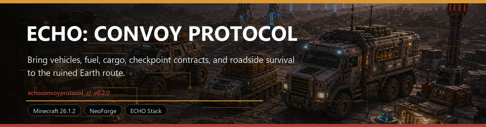
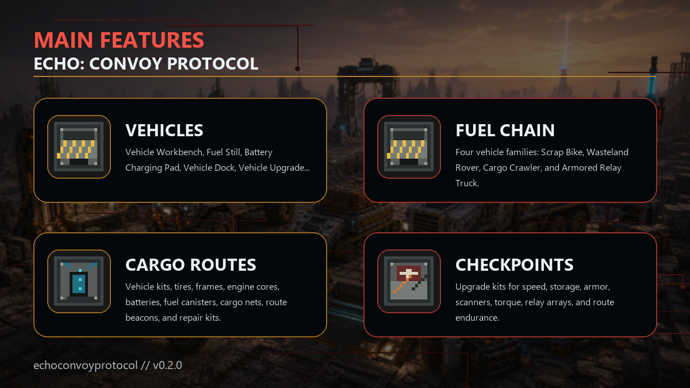

<!-- CURSEFORGE_README_START -->
# ECHO: Convoy Protocol



**Bring vehicles, fuel, cargo, convoy depots, field operations, checkpoint contracts, and roadside survival to the ruined Earth route.**



## CurseForge Summary

Ruined-Earth convoy travel with vehicles, fuel, cargo systems, multiblock depots, deterministic field operations, route contracts, checkpoints, and roadside threats.

## Overview

ECHO: Convoy Protocol turns long-distance ruined-world travel into a real gameplay layer. It adds vehicle kits, fuel support, cargo equipment, convoy depots, route beacons, field-operation staging, roadside contracts, checkpoint logic, and travel hazards for players who want expeditions to feel planned, supplied, and risky.

The addon is built around field vehicles such as the Scrap Bike, Wasteland Rover, Cargo Crawler, and Armored Relay Truck. Each one supports the fantasy of moving through a dangerous ECHO landscape with cargo, upgrades, repairs, and route infrastructure.

Convoy Protocol ties naturally into Logistics, HoloMap, MultiblockCore, RenderCore, and Terminal surfaces, but it keeps the core loop grounded: build a vehicle, fuel it, maintain it, scan the route, carry supplies, and make the next checkpoint alive.

## Main Features

- Vehicle Workbench, Fuel Still, Battery Charging Pad, Vehicle Dock, Vehicle Upgrade Bay, Convoy Beacon, Cargo Anchor, and Field Repair Station.
- Four vehicle families: Scrap Bike, Wasteland Rover, Cargo Crawler, and Armored Relay Truck.
- Vehicle kits, tires, frames, engine cores, batteries, fuel canisters, cargo nets, route beacons, and repair kits.
- Upgrade kits for speed, storage, armor, scanners, torque, relay arrays, and route endurance.
- Route contracts, staged field operations, checkpoint gates, roadside signal markers, recovery states, and Terminal route status.

## How It Plays

- Craft a vehicle kit, assemble and maintain the vehicle, fuel it through the Convoy support blocks, then use route tools to connect supply movement with actual wasteland traversal.
- Larger vehicles reward planning: they carry more, survive more, and turn remote expeditions into logistics runs instead of backpack sprints.

## Requirements

- Minecraft 26.1.2
- NeoForge 26.1.2.29-beta or newer
- Java 25+
- ECHO: Core
- ECHO: NetCore
- ECHO: MultiblockCore 1.0.0 or newer

## Recommended Pairings

- ECHO: Terminal for route reports
- ECHO: Logistics Network for supply movement
- ECHO: RenderCore for enhanced vehicle visuals

## Compatibility Notes

- Terminal, Logistics, and RenderCore integrations are optional.
- Vehicles are tuned for ruined-world traversal and may feel strongest in packs with large ECHO regions.

## CurseForge Asset Files

- Banner: `docs/curseforge/echoconvoyprotocol-banner.png`
- Feature image: `docs/curseforge/echoconvoyprotocol-features.png`

<!-- CURSEFORGE_README_END -->
---

## Existing Developer Notes

# ECHO: Convoy Protocol

Convoy Protocol is the ECHO field logistics module: depot infrastructure, vehicle service, cargo loading, fuel handling, route dispatch, field-operation lifecycles, recovery, and readiness tracking for post-Ashfall mobile operations.

It depends on `echomultiblockcore` and uses that addon as the shared engine/API for structure validation, controller behavior, crates, robotic arms, workcells, task queues, diagnostics, integrity, blueprint inspection, and Terminal/Lens/HoloMap-ready provider snapshots. Convoy Protocol only adds gameplay content and Convoy-specific state/tasks.

## Multiblock Facilities

- Convoy Depot: main mobile operations facility for readiness, cargo, fuel, robotic loading, and route dispatch.
- Vehicle Repair Gantry: repairs depot vehicles and installs armor plating.
- Cargo Loading Bay: loads field supply crates and unloads salvage returns.
- Fuel Refinery Pad: handles fuel cells and injector-arm refueling.
- Route Dispatch Tower: prepares dispatch contracts, route risk data, and map marker provider data.
- Mobile Command Garage: late-pack combined repair, cargo, upgrade, and dispatch garage.
- Convoy Recovery Beacon: recovers damaged convoys and returns them to depot service.

Definitions live in `src/main/resources/data/echoconvoyprotocol/echo_multiblocks/*.json`.

## Workcells And Robotics

Convoy definitions use MultiblockCore workcells:

- `VEHICLE_DOCK`
- `REPAIR`
- `CARGO_INPUT`
- `CARGO_OUTPUT`
- `CARGO_LOADER`
- `FUEL_INPUT`
- `FUEL_PROCESSING`
- `FUEL_INJECTION`
- `ROUTE_DISPATCH`
- `ROUTE_PLANNING`
- `MISSION_DISPATCH`
- `HOLOMAP_UPLINK`
- `UPGRADE_INSTALL`
- `RECOVERY`
- `DIAGNOSTIC`

Specialized Convoy tool heads are thin MultiblockCore tool-head items:

- Cargo Clamp Head -> `CLAMP`
- Vehicle Welder Head -> `WELDER`
- Fuel Injector Head -> `INJECTOR`
- Heavy Loader Head -> `GRIPPER`
- Route Scanner Head -> `SCANNER`

## Tasks

Registered MultiblockCore tasks:

- `echoconvoyprotocol:repair_convoy_vehicle`
- `echoconvoyprotocol:install_armor_plating`
- `echoconvoyprotocol:load_field_supply_crate`
- `echoconvoyprotocol:refuel_convoy`
- `echoconvoyprotocol:prepare_route_dispatch`
- `echoconvoyprotocol:dispatch_convoy_to_route`
- `echoconvoyprotocol:recover_damaged_convoy`
- `echoconvoyprotocol:unload_salvage_return`
- `echoconvoyprotocol:request_route_supplies`
- `echoconvoyprotocol:sync_logistics_inventory`
- `echoconvoyprotocol:cancel_route_supply_request`
- `echoconvoyprotocol:export_salvage_manifest`
- `echoconvoyprotocol:stage_field_operation`
- `echoconvoyprotocol:launch_field_operation`
- `echoconvoyprotocol:resolve_field_incident`
- `echoconvoyprotocol:recall_convoy_operation`
- `echoconvoyprotocol:recover_failed_operation`

Tasks consume required input on start, require a formed Convoy multiblock, require matching workcells, require a compatible robotic arm/tool head, produce outputs through MultiblockCore crates, and mutate the controller's persisted Convoy facility state on completion.

## Readiness

Convoy controller block entities persist an MVP depot readiness model:

- Vehicle Integrity
- Fuel Level
- Cargo Loaded / Capacity
- Armor Rating
- Threat Preparedness
- Signal Link
- Depot Integrity
- Prepared Route / Active Route
- Recovery state and completed mission count
- Logistics network status, selected loadout, active request, delivered cargo, and fuel resupply availability

The readiness state is authoritative when no full vehicle entity is attached to the depot.

## Field Operations

Version `1.0.0` adds the authoritative Field Ops lifecycle. Depot controllers persist `ConvoyFieldOperationState` with route id, operation id, phase, start tick, ETA, current stage, joined vehicle UUID, active incident, failure reason, recovery marker, completion reward state, and salvage export state.

Operation phases:

- `STAGED`
- `EN_ROUTE`
- `AWAITING_SIGNAL`
- `INCIDENT_BLOCKED`
- `RETURNING`
- `COMPLETE`
- `FAILED`
- `RECOVERY_PENDING`
- `RECOVERED`

The depot owns the operation. A physical vehicle can join through route start and roadside signal progress; this improves precise route/marker diagnostics but is not required for MVP depot-based play. Operations tick from the MultiblockCore controller tick path every 20 server ticks while the depot is loaded and formed.

Incidents are deterministic. They come from route incident profile data, stage, operation readiness score, unresolved blockers, and depot/vehicle state. They do not use surprise random punishment. An unresolved incident pauses the operation until `resolve_field_incident` completes; failed or recalled operations expose recovery state and HoloMap recovery markers until recovered.

## Routes

Preferred route data lives in `src/main/resources/data/echoconvoyprotocol/convoy_routes/*.json`. The legacy nested path `data/echoconvoyprotocol/echoconvoyprotocol/convoy_routes/*.json` still loads.

New route metadata includes mission type, distance, biome/theme, fuel cost, readiness requirement, hazards, Logistics Network metadata, Field Ops metadata, and HoloMap marker metadata. `logisticsNetworkId` defaults to `global`, `logisticsLoadoutId` can be blank, `autoRequestCargo` defaults to `false`, and `holomapMarker.layer` defaults to the Convoy route layer. Optional `fieldOps` data supports `durationTicks`, `stageCount`, `incidentProfile`, `vehicleJoinPolicy`, and `completionMode`. Missing `fieldOps` derives duration from distance and stages from route legs.

Field incident profiles live in `src/main/resources/data/echoconvoyprotocol/convoy_incidents/*.json`. This addon ships `standard`, `ruined_highway`, `ash_wastes`, and `crash_recovery` profiles.

This addon ships:

- `echo_7_ruined_highway`
- `ash_wastes_supply_run`
- `crash_zone_recovery`

Existing legacy routes are preserved.

## Optional Hooks

Convoy registers provider data through MultiblockCore integration services for:

- Terminal-style status snapshots
- Lens scan snapshots
- HoloMap marker snapshots
- DataCore-style runtime snapshots

Convoy also registers a real optional HoloMap provider through ECHO Core map services when HoloMap is present. It publishes `Convoy Facilities`, `Convoy Routes`, and `Recovery Signals` layers, including ordered route markers for route-line rendering, active operation progress markers, incident warning markers, recovery markers, and fallback search-zone markers when no precise signal is known.

Logistics Network compatibility is optional-safe but functional when Logistics is loaded. Convoy contributes loadout data under `data/echoconvoyprotocol/echologisticsnetwork/loadouts`, registers depot crate/tank/item-bus endpoints through the Logistics external endpoint API, can request route supplies, sync inventory state, cancel active supply deliveries, and export salvage manifests. Fluid capability fuel pipes/tanks are still future work; v1.0.0 fuel remains item/tank-inventory based.

## Debug Commands

Operator-only:

- `/echo_convoy routes`
- `/echo_convoy depot info`
- `/echo_convoy depot validate`
- `/echo_convoy task start <task>`
- `/echo_convoy task clear`
- `/echo_convoy readiness`
- `/echo_convoy dispatch <route>`
- `/echo_convoy complete <route>`
- `/echo_convoy recover`
- `/echo_convoy logistics`
- `/echo_convoy markers`
- `/echo_convoy ops`
- `/echo_convoy ops launch <route>`
- `/echo_convoy ops recall`
- `/echo_convoy ops resolve`
- `/echo_convoy ops recover`

## Adding A Convoy Multiblock

1. Add Convoy blocks/items in `ModBlocks` and `ModItems`.
2. Create a JSON definition under `data/echoconvoyprotocol/echo_multiblocks`.
3. Use MultiblockCore controller/crate/robot/workcell semantics instead of local copies.
4. Add workcells and allowed task ids.
5. Add block/item assets, loot, recipes, tags, and lang keys.
6. Add smoke-test steps for structure formation and task execution.

## Adding A Route

1. Add JSON under `data/echoconvoyprotocol/convoy_routes`.
2. Include `title`, `summary`, `missionType`, `distance`, `biomeTheme`, `threatLevel`, `fuelCost`, `requiredReadiness`, rewards, hazards, `logisticsNetworkId`, optional `logisticsLoadoutId`, `autoRequestCargo`, optional `fieldOps`, and `holomapMarker`.
3. Use existing Convoy item ids or vanilla fallback items so resource validation can resolve references.

## Adding An Incident Profile

1. Add JSON under `data/echoconvoyprotocol/convoy_incidents`.
2. Give each incident a stable `id`, `stageId`, `displayText`, `readinessThreshold`, optional fuel/integrity/cargo effects, `delayTicks`, `requiredResponseTask`, and `holomapMarkerHint`.
3. Reference the profile from a route's `fieldOps.incidentProfile`.

## Build Environment

This workspace currently expects JDK 25. In PowerShell:

```powershell
$env:JAVA_HOME='C:\Users\knox\AppData\Local\EchoToolchains\jdk25\jdk-25.0.3+9'
$env:Path="$env:JAVA_HOME\bin;$env:Path"
```

## Verification

```powershell
.\gradlew.bat :echomultiblockcore:build --no-daemon
.\gradlew.bat :echologisticsnetwork:build --no-daemon
.\gradlew.bat :echoholomap:build --no-daemon
.\gradlew.bat :echoconvoyprotocol:build --no-daemon
.\gradlew.bat :echoconvoyprotocol:runGameTestServer --no-daemon
python tools\validate_gameplay_data.py
python tools\validate_resources.py --addon-set all
```
