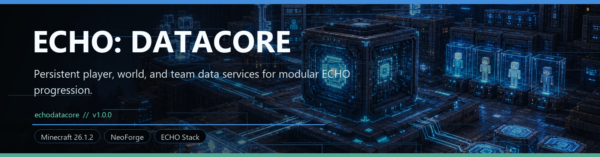
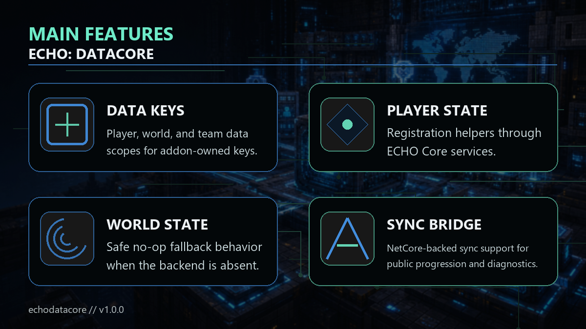

<!-- CURSEFORGE_README_START -->
# ECHO: DataCore



**Persistent player, world, and team data services for modular ECHO progression.**



## CurseForge Summary

Shared persistent data service for player, world, team, progression, sync, and addon-owned state.

## Overview

ECHO: DataCore is the concrete persistence layer behind the lightweight data contracts exposed by ECHO: Core. It gives addons a safe way to register data keys, store player/world/team values, sync public state, and keep optional modules from hard-crashing when a backend is absent.

The design keeps ownership clear. Addons define stable namespaced keys for their own state, Core exposes no-op-safe service access, and DataCore provides the real storage and sync behavior when installed.

For players, DataCore is a library mod. For pack authors and addon developers, it is the part that makes cross-addon progression more reliable without forcing every gameplay chapter to reinvent persistence.

## Main Features

- Player, world, and team data scopes for addon-owned keys.
- Registration helpers through ECHO Core services.
- Safe no-op fallback behavior when the backend is absent.
- NetCore-backed sync support for public progression and diagnostics.
- Stable key naming guidance for long-term save compatibility.

## How It Plays

- Install it alongside ECHO gameplay chapters that need shared persistent state. Most players will never interact with DataCore directly; it quietly keeps route flags, unlocks, team data, and world records stable.
- Addon authors can depend on Core contracts and let DataCore supply the storage implementation.

## Requirements

- Minecraft 26.1.2
- NeoForge 26.1.2.29-beta or newer
- Java 25+
- ECHO: Core 1.0.0 or newer
- ECHO: NetCore 1.0.0 or newer

## Recommended Pairings

- ECHO: Terminal for surfacing synced records and diagnostics

## Compatibility Notes

- Data keys should remain namespaced to the owning addon.
- If missing, Core no-op services avoid hard failure for optional integrations.

## CurseForge Asset Files

- Banner: `docs/curseforge/echodatacore-banner.png`
- Feature image: `docs/curseforge/echodatacore-features.png`

<!-- CURSEFORGE_README_END -->
---

## Existing Developer Notes

# ECHO: DataCore

ECHO: DataCore is the shared persistent data and progression layer for the ECHO/Ashfall addon ecosystem. It owns the concrete data service behind the lightweight contracts in ECHO: Core.

DataCore's required public dependency is ECHO: Core. Its sync packet is registered directly with NeoForge so addons can keep depending only on Core contracts when DataCore is optional.

## Public Contract

Addons should depend on `echocore` and use `EchoCoreServices.dataService()` or the convenience methods:

- `EchoCoreServices.registerDataKey(IDataKey<T> key)`
- `EchoCoreServices.playerData(player)`
- `EchoCoreServices.worldData(level)`
- `EchoCoreServices.teamData(level, teamId)`
- `EchoCoreServices.dataSyncBridge()`

If DataCore is absent, Core returns `NoOpDataService`. Reads return key defaults, writes return `false`, and registered key metadata remains safe for debug display.

## Key Naming

Use stable ids in the owning addon namespace:

- `echoashfallprotocol:discovery/crash_site`
- `echoorbitalremnants:unlock/telemetry_tier`
- `echoarmory:research/armor_module`
- `echoconvoyprotocol:route/discovered_northern_freight`
- `echomissioncore:objective/first_signal`

Register keys during common setup:

```java
public static final IDataKey<Boolean> CRASH_SITE_DISCOVERED = IDataKey.flag(
    Identifier.fromNamespaceAndPath("echoashfallprotocol", "discovery/crash_site"),
    DataScope.PLAYER,
    false,
    true
);

EchoCoreServices.registerDataKey(CRASH_SITE_DISCOVERED);
```

Read and write through views:

```java
boolean discovered = EchoCoreServices.playerData(player).get(CRASH_SITE_DISCOVERED);
EchoCoreServices.playerData(player).set(CRASH_SITE_DISCOVERED, true);
```

## Save Format

Player data is stored in `player.getPersistentData()["echodatacore"]`:

- `version`: DataCore schema version.
- `values`: map of key id to `{ kind, value, updatedGameTime }`.
- `migrations`: namespace-to-version migration markers.

World data is stored as `SavedData` id `echodatacore:data_world` with equivalent world values and team/base values. Team data uses a caller-supplied `Identifier` and is not bound to scoreboard teams.

## Sync Format

DataCore sends `echodatacore:data_sync` from server to client. Packets include:

- scope: player, world, or team.
- owner id: player UUID, dimension id, or team id.
- full snapshot flag.
- revision.
- changed key entries.

Repeated unchanged writes do not dirty state. Dirty player keys are batched on a configurable tick interval and capped per packet to avoid network spam.

## Legacy Saves

DataCore never deletes or rewrites legacy save roots. It exposes read-through/debug adapters for existing roots such as:

- `echocore_profile`
- `echocore_progress_ledger`
- `echocore_factions`
- `echoorbitalremnants_progress`
- `echoconvoyprotocol`
- `echoagriculturereclamation_progress`
- `echoindustrialnexus_progress`
- `echostationfall_progress`
- `echoblackboxprotocol_progress`
- `signalos`

Reflection snapshots are provided for loaded Ashfall `QuestData`, Terminal `TerminalPlayerData`, and Nexus `NexusPlayerData` attachments without hard dependencies.

## Integration Notes

- Ashfall should register discovery/objective keys and keep `QuestData` authoritative until a safe write-through migration is desired.
- Orbital should register unlock counters/flags for telemetry tiers and route gates while legacy progress remains readable.
- Armory should store researched armor/module unlocks as DataCore player flags because current Armory state is item-component based.
- Convoy should register route discovery/completion keys and may keep route runtime state in its existing progress root.
- Terminal reads Core data contracts only; the built-in Data Core tab shows service status and registered keys.
- MissionCore should check objective flags through `EchoCoreServices.playerData(player)`.
- RenderCore and HoloMap should subscribe to `EchoDataBus` and refresh visual markers on `DataChangeMessage`.

## Debug Commands

- `/echodata keys`
- `/echodata inspect player [target]`
- `/echodata inspect world`
- `/echodata flag set <key> <true|false>`
- `/echodata flag unset <key>`

Inspect commands require gamemaster permission. Mutating flag commands also require `debug.commandsEnabled=true` or an integrated server.
