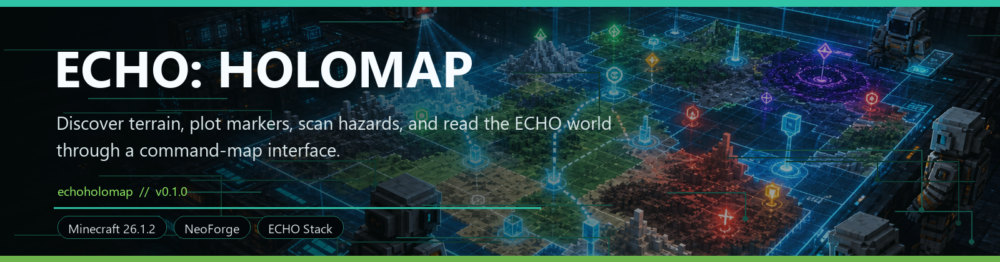
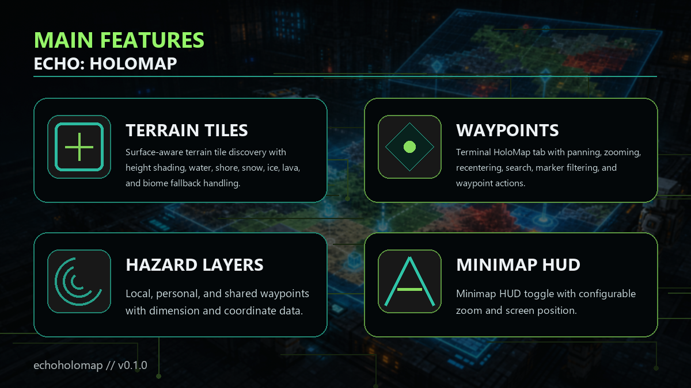

<!-- CURSEFORGE_README_START -->
# ECHO: HoloMap



**Discover terrain, plot markers, scan hazards, and read the ECHO world through a command-map interface.**



## CurseForge Summary

Terminal-integrated command map for regions, routes, hazards, missions, scans, markers, waypoints, and minimap terrain.

## Overview

ECHO: HoloMap adds a tactical map layer for the ECHO stack. It samples discovered terrain around players, stores compact per-player map tiles, renders world markers, and provides map controls that make routes, hazards, missions, bases, anomalies, and scan data easier to understand.

The addon is not a magical full-world reveal. Terrain is discovered from loaded chunks near the player, then rendered through a lightweight command-map view and minimap HUD. That makes exploration feel earned while still giving players a readable operational picture.

HoloMap is especially useful in a modular ECHO pack because WorldCore markers, Convoy routes, Orbital scans, Ashfall hazards, Nexus anomalies, and Terminal objectives can all share one map vocabulary.

## Main Features

- Surface-aware terrain tile discovery with height shading, water, shore, snow, ice, lava, and biome fallback handling.
- Terminal HoloMap tab with panning, zooming, recentering, search, marker filtering, and waypoint actions.
- Local, personal, and shared waypoints with dimension and coordinate data.
- Minimap HUD toggle with configurable zoom and screen position.
- Integration surfaces for WorldCore markers, Terminal pages, RenderCore visuals, routes, hazards, and addon scan markers.

## How It Plays

- Explore the world to discover map tiles, open the ECHO Terminal HoloMap page, filter markers and hazards, set waypoints, and use the minimap for field navigation.
- The map becomes more valuable as the pack gains route systems, faction outposts, anomaly zones, and deep expedition targets.

## Requirements

- Minecraft 26.1.2
- NeoForge 26.1.2.29-beta or newer
- Java 25+
- ECHO: Core
- ECHO: NetCore

## Recommended Pairings

- ECHO: Terminal for the main map surface
- ECHO: WorldCore for rich region and marker data
- ECHO: RenderCore for optional visual polish

## Compatibility Notes

- HoloMap terrain data is owned by HoloMap and does not force-load chunks.
- Core markers are drawn over discovered terrain when available.

## CurseForge Asset Files

- Banner: `docs/curseforge/echoholomap-banner.png`
- Feature image: `docs/curseforge/echoholomap-features.png`

<!-- CURSEFORGE_README_END -->
---

## Existing Developer Notes

# ECHO: HoloMap

ECHO: HoloMap adds a Terminal command-map tab for shared world telemetry: crash sites, routes, hazards, missions, bases, orbital scan overlays, anomalies, and drone scan markers. It also discovers a real, per-player terrain map while players move through loaded chunks and renders the same terrain cache in a lightweight minimap HUD.

## Terrain Discovery

HoloMap terrain is owned by the `echoholomap` module, not ECHO Core. The server samples loaded chunks around each player on a configurable interval and stores compact `16x16` terrain tiles per player and dimension. The scanner never force-loads chunks and client tile requests can only fetch terrain the server has already discovered for that player.

V3 terrain is surface-aware: newly sampled tiles store a tile format version, detail mode, sampled game time, and ARGB pixels derived from the top visible block map color, biome tint, water/shore detection, snow/ice/lava highlights, and height shading. Legacy biome-colored tiles still load as `BIOME_FALLBACK` and are lazily resampled when their chunks are loaded near the player.

Terrain detail modes:

- `BIOME_FALLBACK`: legacy tiles or dimensions/columns where no safe top surface is available.
- `SURFACE_BLOCK`: mixed fallback/surface tile, usually at difficult columns or dimension edges.
- `SURFACE_SHADED`: v3 surface tile using block map colors plus ECHO shading.

Markers remain Core API data and are drawn over the terrain camera using real world X/Z coordinates.

Client controls:

- Open the existing ECHO Terminal and select `HoloMap`.
- Pan with left mouse drag or arrow keys.
- Zoom around the cursor with the mouse wheel, or use `+` and `-`.
- Press `CENTER`, double-click the map, or press `Home`/`C` to recenter on the player.
- Right-click the map for waypoint actions: create local, personal, or shared waypoints, move the selected waypoint, or copy coordinates.
- Use the search box to filter markers and waypoints by title, layer, source, dimension, or coordinates.
- Cycle the side-list sort between nearest, name, layer, and state.
- Press `J` in-game to toggle the minimap HUD.
- Use `[` and `]` in-game to adjust minimap zoom, and `\` to cycle minimap corners.

## Waypoints

HoloMap v2 waypoints are owned by `echoholomap`; they do not expand the ECHO Core marker contracts.

Waypoint fields:

- `id`: stable resource id.
- `owner`: waypoint owner UUID, or all-zero for local-only entries.
- `scope`: `LOCAL`, `PERSONAL`, or `SHARED`.
- `dimension`, `x`, `y`, `z`: map location.
- `title`, `color`, `icon`, `visible`: display metadata.
- `createdTime`, `updatedTime`: server/client timestamp bookkeeping.

Scopes:

- `LOCAL`: client-only personal waypoint stored in `config/echoholomap-local-waypoints.json`.
- `PERSONAL`: server-persisted per-player waypoint stored in world `SavedData`.
- `SHARED`: server-persisted shared waypoint. Create/update/delete is permission-gated for operator workflows.

Local waypoints never request server permission and never reveal terrain. Server waypoints sync as a capped packet and render over the existing discovered terrain cache.

## Addon Marker API

Addons should register map data from common setup through ECHO Core:

```java
EchoCoreServices.registerMapDataProvider(new IMapDataProvider() {
    @Override
    public Identifier providerId() {
        return Identifier.fromNamespaceAndPath("exampleaddon", "map_provider");
    }

    @Override
    public List<IMapLayer> layers(Player player) {
        return List.of(new EchoMapLayer(
                Identifier.fromNamespaceAndPath("echoholomap", "layer/crash_sites"),
                "Crash Sites", 10, 0xFFFFA05B, true));
    }

    @Override
    public List<IMapMarker> markers(Player player) {
        return List.of(new EchoMapMarker(
                Identifier.fromNamespaceAndPath("exampleaddon", "marker/crash_alpha"),
                Identifier.fromNamespaceAndPath("echoholomap", "layer/crash_sites"),
                providerId(),
                IMapMarker.MarkerKind.CRASH_SITE,
                IMapMarker.MarkerState.DISCOVERED,
                "Crash Alpha",
                "Recovered debris field with salvage risk.",
                player == null ? Level.OVERWORLD : player.level().dimension(),
                120.5D, 72.0D, -340.5D,
                48.0F,
                null,
                null,
                -1,
                true));
    }
});
```

Convoy routes use ordinary markers with a shared route id and ordered route positions:

```java
Identifier routeId = Identifier.fromNamespaceAndPath("exampleaddon", "route/ember_line");
List<IMapMarker> routeMarkers = List.of(
        new EchoMapMarker(
                Identifier.fromNamespaceAndPath("exampleaddon", "marker/ember_line/start"),
                Identifier.fromNamespaceAndPath("echoholomap", "layer/routes"),
                providerId(),
                IMapMarker.MarkerKind.ROUTE,
                IMapMarker.MarkerState.DISCOVERED,
                "Ember Line Start",
                "Convoy route staging point.",
                Level.OVERWORLD,
                -80.0D, 70.0D, 12.0D,
                0.0F,
                null,
                routeId,
                0,
                true),
        new EchoMapMarker(
                Identifier.fromNamespaceAndPath("exampleaddon", "marker/ember_line/end"),
                Identifier.fromNamespaceAndPath("echoholomap", "layer/routes"),
                providerId(),
                IMapMarker.MarkerKind.ROUTE,
                IMapMarker.MarkerState.DISCOVERED,
                "Ember Line End",
                "Convoy route endpoint.",
                Level.OVERWORLD,
                260.0D, 72.0D, -144.0D,
                0.0F,
                null,
                routeId,
                1,
                true));
```

Locked orbital scans should use safe hint text, an estimated position, and a radius:

```java
IMapMarker lockedScan = new EchoMapMarker(
        Identifier.fromNamespaceAndPath("exampleaddon", "marker/orbital/locked_cache"),
        Identifier.fromNamespaceAndPath("echoholomap", "layer/orbital_scans"),
        providerId(),
        IMapMarker.MarkerKind.ORBITAL_SCAN,
        IMapMarker.MarkerState.LOCKED,
        "Encrypted Orbital Return",
        "Signal exists, but coordinates require additional scan clearance.",
        Level.OVERWORLD,
        512.0D, 96.0D, -768.0D,
        96.0F,
        null,
        null,
        -1,
        false);
```

Required built-in layer ids:

- `echoholomap:layer/crash_sites`
- `echoholomap:layer/routes`
- `echoholomap:layer/hazards`
- `echoholomap:layer/missions`
- `echoholomap:layer/bases_outposts`
- `echoholomap:layer/orbital_scans`
- `echoholomap:layer/nexus_anomaly`
- `echoholomap:layer/drones_scans`

Marker states:

- `HIDDEN`: not shown in normal snapshots.
- `LOCKED`: shown dimmed with hint-safe text.
- `DISCOVERED`: shown as active field intel.
- `CHECKED`: shown as completed/cleared intel.

For orbital or drone scans, set `radius` to the scan footprint and `precise=false` if the position is estimated.

## Debug

Permissioned operators can add test markers in-game:

```text
/echoholomap debug add_marker drones_scans
/echoholomap debug add_marker hazards
/echoholomap debug dump
/echoholomap debug clear_markers
/echoholomap debug scan_terrain 6
/echoholomap debug resample_terrain 6
/echoholomap debug dump_terrain
/echoholomap debug clear_terrain
```

The Terminal tab also has a `TEST` hook that adds a drone/scan marker when debug markers are enabled.

Terrain debug commands are gated by the same debug config and operator permission as marker debug commands. `scan_terrain` only samples chunks already loaded around the player; it does not reveal remote panned locations. `resample_terrain` forces loaded nearby chunks through the current v3 surface sampler so operators can upgrade legacy tiles during testing. `dump_terrain` reports tile version/detail counts and newest sample time.
