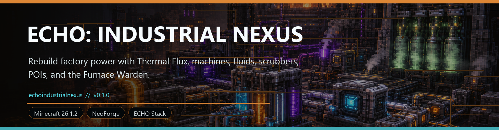
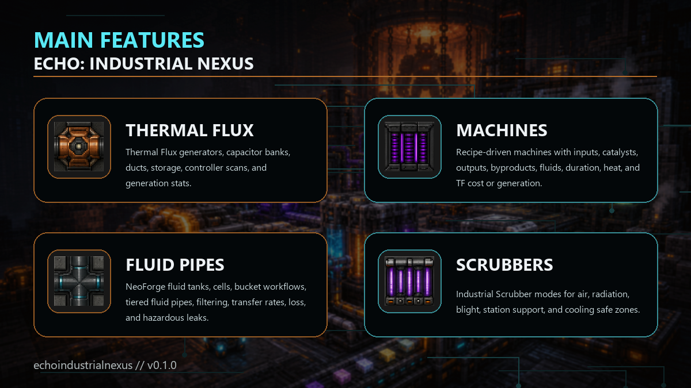

<!-- CURSEFORGE_README_START -->
# ECHO: Industrial Nexus



**Rebuild factory power with Thermal Flux, machines, fluids, scrubbers, MultiblockCore factories, POIs, and the Furnace Warden.**



## CurseForge Summary

Industrial automation chapter with Thermal Flux, machines, ducts, fluids, heat, scrubber safe zones, playable MultiblockCore factories, POIs, and boss progression.

## Overview

ECHO: Industrial Nexus turns Ashfall survival into infrastructure recovery. It adds Thermal Flux power, recipe-driven machines, sided automation, item ducts, Flux ducts, NeoForge fluid tanks and pipes, machine heat, Industrial Scrubbers, playable MultiblockCore factory routes, procedural industrial POIs, and Furnace Warden progression.

The addon is built to support the rest of the ECHO stack. It can manufacture survival filters, pressure parts, launch components, station repairs, blackbox machinery pieces, Core key support, and late-game factory materials while still owning its own machine and safety loop.

With ECHO Terminal installed, Industrial Nexus registers missions, records, support caches, factory scans, POI hints, actions, and a Recipe Index provider that reads industrial processing JSON into player-facing process notes.

## Main Features

- Thermal Flux generators, capacitor banks, ducts, storage, controller scans, and generation stats.
- Recipe-driven machines with inputs, catalysts, outputs, byproducts, fluids, duration, heat, and TF cost or generation.
- NeoForge fluid tanks, cells, bucket workflows, tiered fluid pipes, filtering, transfer rates, loss, and hazardous leaks.
- Industrial multiblocks with blueprints, depot crates, robotic tool heads, task queues, Factory Command controls, and Logistics-ready loadouts.
- Nexus Furnace Array late-game automation for Hybrid Thermal Cores and Core Key Assemblies, with optional Nexus Protocol pressure telemetry.
- Industrial Scrubber modes for air, radiation, blight, station support, and cooling safe zones.
- Procedural Abandoned Thermal Plants, Rusted Factory Complexes, Geothermal Drill Sites, Reactor Cooling Stations, and Nexus Heat Exchanger Ruins.
- Furnace Warden activation, phased fight state, participant reward credit, and once-only Terminal reward eligibility.

## How It Plays

- Start with power and grinding, build machine chains, automate items and fluids, manage heat, place scrubbers for safer work zones, then push into industrial POIs for schematics and Warden progression.
- The more of the ECHO stack you run, the more Industrial Nexus becomes the practical backbone for filters, launch parts, station parts, and late-game infrastructure.

## Requirements

- Minecraft 26.1.2
- NeoForge 26.1.2.29-beta or newer
- Java 25+
- ECHO: Core 1.1.0 or newer
- ECHO: MultiblockCore 1.0.0 or newer

## Recommended Pairings

- ECHO: Terminal for missions, support caches, and Recipe Index visibility
- ECHO: RenderCore for visual polish
- ECHO: Ashfall Protocol for survival context

## Compatibility Notes

- Sibling chapter support is optional and reflection or registry guarded.
- Machine recipe authority stays with Industrial Nexus data.

## CurseForge Asset Files

- Banner: `docs/curseforge/echoindustrialnexus-banner.png`
- Feature image: `docs/curseforge/echoindustrialnexus-features.png`

<!-- CURSEFORGE_README_END -->
---

## Existing Developer Notes

# ECHO: Industrial Nexus

Industrial Nexus 1.2.0 makes the Nexus Furnace Array the headline late-game factory route for the ECHO mod family.

Industrial Nexus turns Ashfall survival into midgame infrastructure: Thermal Flux generators, recipe-driven machines, sided automation, item ducts, Flux ducts, NeoForge fluid tanks and pipes, overheating, scrubber safe zones, procedural industrial POIs, Furnace Warden progression, and soft ECHO Terminal missions.

## Status

Production Completion pass.

- Canonical source: `addons/echoindustrialnexus`
- Gradle project: `:echoindustrialnexus`
- Mod id: `echoindustrialnexus`
- Release jar: `addons/echoindustrialnexus/build/libs/echoindustrialnexus-1.2.0.jar`
- Required compile/runtime dependencies: `echocore`, `echomultiblockcore`
- Optional soft integrations: `echoterminal`, Ashfall Protocol, Nexus Protocol, Orbital Remnants, Stationfall, Blackbox Protocol

Industrial Nexus loads and plays without optional sibling chapters. When ECHO Terminal is present, it registers a shared Industrial Nexus chapter, Factory Command dashboard, mission provider, archive entries, actions for factory scans, POI hints, reward cache claims, factory queue control, and a terminal recipe provider for Industrial processing data.

## MultiblockCore Showcase

Industrial Nexus now uses ECHO MultiblockCore as the shared engine for factory facilities. Industrial owns the gameplay content; Core owns definition parsing, validation, task queues, diagnostics, blueprints, robotic arms, tool heads, runtime snapshots, and optional provider interfaces.

Added Industrial multiblocks:

- Industrial Assembly Line: robotic production line for reinforced machine frames and advanced parts.
- Scrap Processor: cuts salvage into usable scrap plates.
- Plate Press: presses scrap plates into refined plates.
- Circuit Fabricator: assembles precision circuits with inspection support.
- Recipe Matrix Core: late-game factory command structure for matrix shard encoding.
- Nexus Furnace Array: unstable late-game factory route for Hybrid Thermal Cores and Core Key Assemblies, with soft Nexus-safe pressure hooks.

The playable MVP loop is the Industrial Assembly Line. Build the structure, install an Industrial Welder Head in the Robotic Arm Mount, load the Input Depot Crate with 4 Refined Plates, 1 Servo Motor, and 1 Industrial Circuit, then right-click the formed controller to queue `Weld Reinforced Machine Frame`. Inputs are consumed when the task starts, the robotic arm animates through MultiblockCore, and the Reinforced Machine Frame is placed into the Output Depot Crate when complete.

Industrial tasks are JSON automation recipes under `data/echoindustrialnexus/echo_multiblock_tasks` and are executed by MultiblockCore:

- Process Scrap Into Scrap Plate, 120 ticks, Scrap Processor, Cutter/Cutting workcell.
- Press Scrap Plate Into Refined Plate, 160 ticks, Plate Press, Gripper/Pressing workcell.
- Weld Reinforced Machine Frame, 240 ticks, Industrial Assembly Line, Welder or Assembler/Assembly workcell.
- Assemble Precision Circuit, 200 ticks, Circuit Fabricator, Assembler or Scanner/Assembly workcell.
- Encode Recipe Matrix Shard, 320 ticks, Recipe Matrix Core, Scanner or Injector/Matrix Processing workcell.
- Stabilize Hybrid Thermal Core, 360 ticks, Nexus Furnace Array, Injector or Scanner/Matrix Processing workcell.
- Forge Core Key Assembly, 480 ticks, Nexus Furnace Array, Injector or Scanner/Matrix Processing workcell.

The Nexus Furnace Array is formed from its dedicated controller and blueprint. Build the array, install an Injector or Scanner-compatible robotic head, load a Stable Nexus Core, Recipe Matrix Shard, coolant, and Flux Crystals to stabilize a Hybrid Thermal Core, then forge a Core Key Assembly from the hybrid core, another matrix shard, Stabilized Alloy Plates, and Field Relays. The tasks record Nexus Furnace Array mission progress through MultiblockCore completion events; Nexus Protocol pressure telemetry is called only when that optional chapter is installed.

Right-clicking an incomplete controller validates or forms the structure. Right-clicking a formed Industrial controller opens the Factory Command GUI with status, integrity, completion, active task progress, blocked reason, robot/workcell summary, task queue buttons, x1/x3/x5 batch queue controls, clear queue, retry blocked, revalidate, optional Logistics request controls, and per-controller Logistics auto-restock toggles. Sneak-right-click and the Factory Diagnostic Tool keep the full chat diagnostic path.

Blueprints and the Factory Diagnostic Tool provide guidance outside the GUI. Terminal/Lens/DataCore/HoloMap-ready providers register through MultiblockCore service interfaces and filter to Industrial definitions. The Industrial Terminal tab now opens on a live Factory Command dashboard that syncs loaded facilities, aggregate online/active/blocked/queue/robot counts, facility detail, revalidate, queue, clear, retry, refresh, Logistics request actions, and auto-restock target controls. ECHO Lens can register a server-safe Deep Scan provider for Industrial controllers, robotic arm mounts, and depot crates. HoloMap consumes Industrial facility markers through the shared Core marker pipeline with alert and restock summaries. Logistics Network integration is optional-safe: Industrial reflects into `LogisticsFactoryBridge` only when the mod is present, while Logistics owns endpoint discovery, stock checks, courier dispatch, and auto-restock delivery to `echoindustrialnexus:input_depot_crate`.

## Production Features

- Thermal Flux network: generators, capacitor banks, Flux ducts, machine storage, generation stats, and controller scans.
- Machine gameplay: input, catalyst, output, byproduct, upgrade, sided inventory, recipe duration, TF cost/generation, heat gain/cooling, remote shutdown, warnings, and custom menu/screen sync.
- NeoForge fluid gameplay: registered Industrial fluids, machine fluid capabilities, internal tanks, bucket/cell fallback recipes, and active fluid pipes with tier capacity, transfer rate, filtering, loss, and hazardous leak behavior.
- Terminal Recipe Index integration: `echoindustrialnexus:industrial_processing` JSON is surfaced with item/tag ingredients, catalysts, byproducts, input/output fluids, Thermal Flux cost or generation, heat gain, process duration, and machine categories.
- Terminal Factory Command integration: loaded Industrial facilities sync to the Terminal tab, expose alert levels (`ONLINE`, `IDLE`, `ACTIVE`, `BLOCKED`, `DAMAGED`, `INCOMPLETE`), and run server-authoritative queue/revalidate/clear/retry/logistics/auto-restock actions.
- Logistics auto-restock ops: controllers persist opt-in restock state and x1/x3/x5 targets; Logistics loadout JSON declares factory task ids, target/min runs, in-flight caps, and cooldowns; Auto-Restock Stations dispatch couriers only when input depots are below threshold.
- Overheating: Cool, Warm, Hot, Critical, and Meltdown states with heat sinks, coolant, scrubber cooling, emergency shutdown modules, fire/leak fallout, and Terminal progress recording.
- Industrial Scrubber: Air, Radiation, Blight, Station, and Cooling modes with fallback safe-zone records and soft reflection hooks into sibling systems when they are installed.
- World content: configurable procedural Abandoned Thermal Plants, Rusted Factory Complexes, Geothermal Drill Sites, Reactor Cooling Stations, and Nexus Heat Exchanger Ruins with loot, hazards, schematics, and Warden arena support.
- Boss progression: Furnace Warden activation, phased fight state, participant reward credit, trophy/core drops, and one-time Terminal reward eligibility.

## Build And Validation

From the repository root:

```powershell
python tools\validate_resources.py --addon-set all
.\gradlew.bat :echomultiblockcore:compileJava --no-daemon --no-configuration-cache
.\gradlew.bat :echorendercore:compileJava --no-daemon --no-configuration-cache
.\gradlew.bat :echoterminal:compileJava :echolens:compileJava :echoholomap:compileJava --no-daemon --no-configuration-cache
.\gradlew.bat :echoindustrialnexus:compileJava --no-daemon --no-configuration-cache
.\gradlew.bat :echologisticsnetwork:compileJava --no-daemon --no-configuration-cache
.\gradlew.bat :echoindustrialnexus:build --no-daemon --no-configuration-cache
.\gradlew.bat :echoindustrialnexus:runGameTestServer --no-daemon --no-configuration-cache
.\gradlew.bat :echoindustrialnexus:runIndustrialClient --no-daemon --no-configuration-cache
```

Manual smoke checklist after the client launches:

- Craft a Scrap Dynamo, Copper Flux Duct, Ore Grinder, Scrap Fuel, and Thermal Wrench from survival materials or Industrial POI loot.
- Start the Scrap Dynamo with Scrap Fuel or a lava bucket and confirm Thermal Flux stores in the generator, the lava bucket returns an empty bucket, and the Ore Grinder receives power through a Copper Flux Duct.
- Process iron ore into Iron Dust, retrieve output by shift-use, then break the machine and Smart Duct to confirm machine inventory and duct filter stacks drop once.
- Open a machine GUI and confirm progress, Thermal Flux, heat, fluid bars, warnings, side config, and scrubber mode render.
- Build dirty power, automate filters, and complete the Dense Alloy chain.
- Fill/drain the Fluid Refiner and Water Purifier through cells and fluid pipes.
- Cycle Industrial Scrubber modes and confirm safe-zone progress updates.
- Use ECHO Terminal Industrial Nexus actions: scan factory, view POI hint, claim cache once.
- Open the ECHO Terminal Recipe Index and confirm Industrial machine categories show JSON-driven processing recipes, fluid notes, heat, Thermal Flux, catalysts, and byproducts.
- Build an Industrial Assembly Line from its blueprint, install an Industrial Welder Head into the Robotic Arm Mount, open the formed controller GUI, press 1/3/5 for Weld Reinforced Machine Frame, and confirm the Output Depot Crate receives the matching number of frames as the queue advances.
- Build the Recipe Matrix Core, encode a Recipe Matrix Shard, craft the Nexus Furnace Array controller and blueprint, form the array, then run Stabilize Hybrid Thermal Core and Forge Core Key Assembly from the controller GUI.
- Confirm the Nexus Furnace Array Terminal mission becomes claimable only after the Core Key Assembly task completes, not after older single-block machine recipes.
- Open ECHO Terminal, select Industrial Nexus, confirm Factory Command lists loaded facilities, then use revalidate, queue, clear, retry, refresh, and Logistics controls from the dashboard.
- With ECHO Lens present, run a Deep Scan against an Industrial controller, Robotic Arm Mount, and depot crate and confirm server-verified status/robot/tool/queue/inventory summaries appear.
- With ECHO HoloMap present, sync the map and confirm formed Industrial facilities appear on the Multiblocks layer with alert/integrity summaries.
- With ECHO Logistics Network present, connect an Input Depot Crate to a logistics network and use REQ in the controller GUI to dispatch the matching factory loadout. Toggle AUTO, choose x1/x3/x5, press RESTOCK, and confirm Logistics reports current target/in-flight status while the courier feeds the depot.
- Remove the welder head or a required casing and confirm controller diagnostics report the missing tool or incomplete structure.
- Generate or locate a procedural POI and verify loot/hazard placement.
- Activate and defeat the Furnace Warden and verify participant reward credit.

## Release Checklist

- Release jar: `addons/echoindustrialnexus/build/libs/echoindustrialnexus-1.2.0.jar`
- Required validation: JSON parse, `python tools\validate_resources.py --addon-set all`, `:echomultiblockcore:compileJava`, `:echorendercore:compileJava`, `:echoindustrialnexus:compileJava`, `:echologisticsnetwork:compileJava`, `:echoindustrialnexus:build`, and `:echoindustrialnexus:runGameTestServer`.
- Current RC note: Industrial JSON/resource validation, compile, build, and the shared `runGameTestServer` suite pass in this checkout.
- Optional compat matrix: Terminal, Lens, HoloMap, Logistics, Nexus, Orbital, Stationfall, and Blackbox present/absent paths.
- Ashfall source is not included under `addons`; Industrial keeps soft hooks for `ToxicAirHelper.cleanAirAround` and `RadiationHelper.reduceRadiationAround`.
- Publication note: ship this as part of the next public stack minor release; do not publish an addon-only public 1.2.0 unless the stack release process explicitly changes.
- Known RC note: final manual balance numbers and client UX sign-off still depend on a human playthrough of the full factory-to-Warden route.

## Release Notes

See `CHANGELOG.md` and `docs/release_notes_1.2.0.md` for the playable Nexus Furnace Array release notes.
