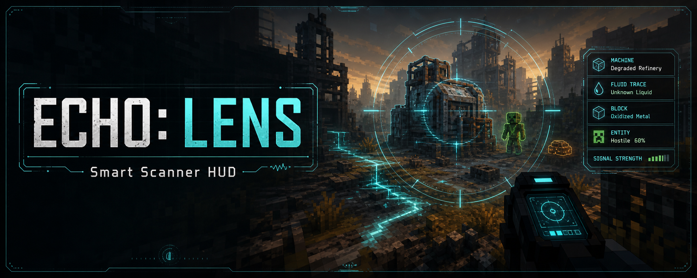
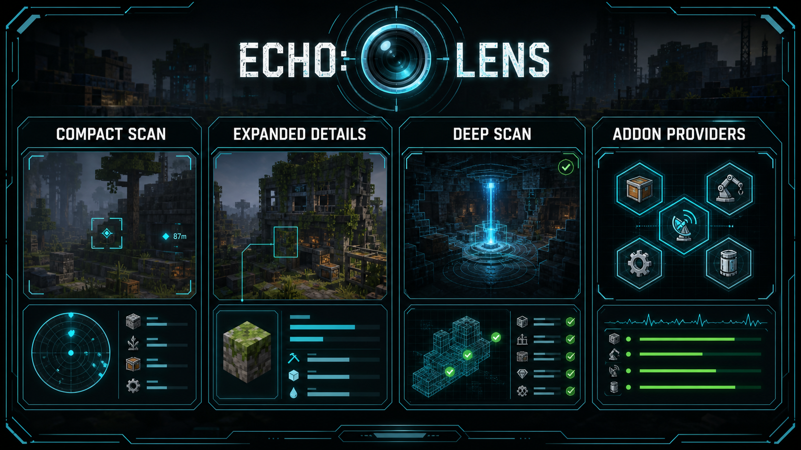

<!-- CURSEFORGE_README_START -->
# ECHO: Lens



**A smart scanner HUD for blocks, entities, fluids, machines, progression, and addon diagnostics.**



## CurseForge Summary

Modern inspection HUD with compact scans, expanded local details, server-verified Deep Scan, privacy rules, and provider APIs.

## Overview

ECHO: Lens gives players a modern inspection overlay for the ECHO stack. Look at a block, fluid, or entity to see compact public information, hold Shift for expanded local details, and hold the Deep Scan key for categorized server-verified facts.

The addon is a framework as much as a UI. Other mods can register Lens providers that contribute structured rows, categories, tones, and optional actions without hardwiring their data into Lens itself.

Lens is intentionally privacy-conscious. Local scans stay client-side, server Deep Scan requests are bounded and public-first, and inventory-like information follows configurable access policy rather than exposing private contents by default.

## Main Features

- Compact, expanded, and Deep Scan HUD modes.
- Server-assisted public scan rows through NetCore.
- Configurable position, scale, opacity, theme, category visibility, row limits, and reduced motion.
- Provider registry for addon-contributed block, entity, fluid, machine, progression, and diagnostic sections.
- Optional ECHO Index recipe, use, and tracking actions from inspection targets.

## How It Plays

- Install Lens, look at the world, and let the HUD tell you what matters. Hold Shift for more detail or Deep Scan for server-verified public facts when the target supports it.
- In a large ECHO pack, Lens becomes the fast answer for what a machine is doing, whether a target is public, and which addon owns the interaction.

## Requirements

- Minecraft 26.1.2
- NeoForge 26.1.2.29-beta or newer
- Java 25+
- ECHO: Core
- ECHO: NetCore 1.0.0 or newer

## Recommended Pairings

- ECHO: Index for recipe/use/track actions
- ECHO: Terminal for shared settings context
- ECHO: RenderCore for optional client visual support

## Compatibility Notes

- Deep Scan respects server config, distance, rate limits, and protected-target redaction.
- Lens registers no player-facing blocks or items; it is a HUD and provider framework.

## CurseForge Asset Files

- Banner: `docs/curseforge/echolens-banner.png`
- Feature image: `docs/curseforge/echolens-features.png`

<!-- CURSEFORGE_README_END -->
---

## Existing Developer Notes

# ECHO: Lens

ECHO: Lens is a hybrid framework/UI addon for the ECHO stack. It provides a modern inspection HUD for players and a structured provider API for addons that want to contribute scanner data.

Lens intentionally registers no gameplay items, blocks, block entities, entities, menus, recipes, loot tables, or tags. The player loop is simple: install the addon, look at a block, fluid, or entity, read the compact overlay, hold Shift for expanded local details, and hold the Deep Scan key for categorized diagnostics with server-verified public rows.

## Player Controls

- Look at a block, fluid, or entity to show the compact HUD.
- Hold Shift to show expanded block/entity/fluid stats.
- Hold Left Alt by default for Deep Scan. This key is configurable and requests public server-verified rows through NetCore.
- Press `R`, `U`, or `T` while looking at a block item target to open ECHO: Index recipes, uses, or tracking when ECHO: Index is installed.

## Privacy

Lens is public-first by default. Compact and expanded scans stay client-local. Deep Scan may send a small NetCore request to the server for public verified facts, but it never requests inventory contents. The built-in inventory provider only reports safe public state according to the common `inventory_access_policy` config.

## Configuration

NeoForge config owns persistence for Lens settings. ECHO Core also receives Lens config metadata through `EchoConfigRegistry` under module id `echolens`.

Important client settings include:

- HUD position, offsets, scale, opacity, animation, reduced motion, and max scan distance.
- Theme selection: ECHO Dark, Clean Minimal, Vanilla Compact, and Ashfall Hazard.
- Visible data categories and row limits for compact, expanded, and deep scans.
- Server Deep Scan timeout, cache duration, and status badge visibility.

Important common settings include:

- Inventory access policy.
- Machine status visibility.
- Beginner hints.
- Debug command availability.
- Server Deep Scan enablement, distance, rate limit, and protected-target redaction.

## Provider API

Addons register structured providers through `LensProviderRegistry`. Providers return `LensInfoSection` values with typed categories, tones, visibility, rows, and optional actions.

```java
LensProviderRegistry.register(new BlockLensProvider() {
    @Override
    public Identifier id() {
        return Identifier.fromNamespaceAndPath("examplemod", "machine_status");
    }

    @Override
    public int priority() {
        return 250;
    }

    @Override
    public List<LensInfoSection> inspectBlock(LensContext context, BlockState state, BlockPos pos) {
        return List.of(LensInfoSection.of(
                Identifier.fromNamespaceAndPath("examplemod", "section/machine_status"),
                LensDataCategory.MACHINE,
                "Machine",
                "#",
                LensTone.INFO,
                LensVisibility.EXPANDED,
                List.of(LensInfoRow.of("Power", "Stable", "P", LensTone.GOOD, LensVisibility.EXPANDED))));
    }
});
```

For batch registration, use `LensProviderRegistry.registerAll(...)`. The registry rejects duplicate provider ids, sorts by priority, isolates provider exceptions during scans, and exposes immutable diagnostics for commands and Terminal integration. Providers that are safe to run during server-assisted Deep Scan can also implement `ServerLensProvider`.

Other addons can safely call `EchoServiceRegistry.find(ILensInspectionService.class).orElse(ILensInspectionService.NOOP)` when Lens may be absent.

## Optional Integrations

- ECHO Core and ECHO NetCore are required. Core receives the Lens service, addon chapter, route record, diagnostics, and config metadata; NetCore carries rate-limited Deep Scan requests and responses.
- ECHO: Terminal is optional and receives Lens addon info through reflection when present.
- ECHO: Index is optional and powers recipe, uses, and track shortcuts when present.
- ECHO: RenderCore remains optional; Lens 1.0.0 uses a 2D client HUD and does not require RenderCore.

## Commands

The `/echolens` command requires gamemaster permission.

- `/echolens status` reports provider count, server provider count, packet registration, and optional addon availability.
- `/echolens providers` lists provider diagnostics and whether each provider can run on the server scan path.
- `/echolens validate` checks registry, server scan, and privacy basics when debug commands are enabled.

## Validation

Recommended release checks:

```powershell
$env:JAVA_HOME='C:\Github\Echo\.local\jdk25'
$env:PATH="$env:JAVA_HOME\bin;$env:PATH"
.\gradlew :echonetcore:compileJava
.\gradlew :echolens:compileJava
.\gradlew :echolens:build
.\gradlew :echolens:runGameTestServer
.\gradlew validateEchoResources
.\gradlew buildEchoWorkspace
```

Manual checks:

1. Look at stone with the wrong and correct tools.
2. Look at water, lava, powered redstone blocks, a chest, a zombie, a passive mob, and a tame wolf.
3. Verify compact, Shift-expanded, and Deep Scan modes.
4. Confirm Deep Scan shows Querying and then Verified, Redacted, Unavailable, or Stale.
5. Test HUD positions, GUI scales, opacity, reduced motion, and category toggles.
6. Install ECHO: Index and test Recipes, Uses, and Track shortcuts.
