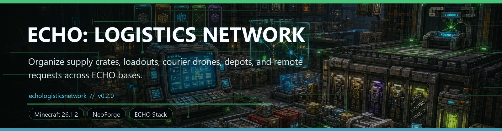
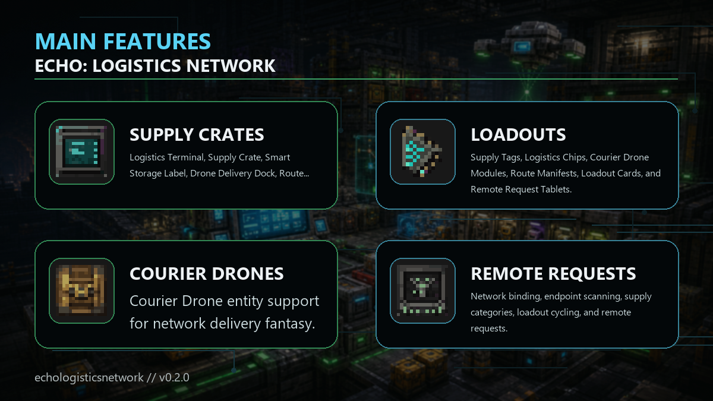

<!-- CURSEFORGE_README_START -->
# ECHO: Logistics Network

**Organize supply crates, loadouts, courier drones, depots, and remote requests across ECHO bases.**

## CurseForge Summary

Supply crates, labels, loadouts, drone delivery docks, route requesters, faction depots, and operations dashboards.

## Overview

ECHO: Logistics Network gives the ECHO stack a practical supply layer. It adds tagged storage, loadout cards, route manifests, remote request tablets, drone delivery docks, faction trade depots, restock stations, networked logistics terminals, and Industrial factory auto-restock.

The addon is built for repeated field operations. Instead of digging through scattered chests before every expedition, players can mark supply categories, bind logistics endpoints, request loadouts, dispatch courier support, and keep faction or chapter supplies in known places.

Logistics Network pairs naturally with Convoy Protocol, Armory, Industrial Nexus, Terminal, and late-route chapters because every one of those systems benefits from cleaner supply movement and better preparation.

## Main Features

- Logistics Terminal, Supply Crate, Smart Storage Label, Drone Delivery Dock, Route Requester, Loadout Locker, Faction Trade Depot, Remote Reward Relay, and Auto-Restock Station.
- Supply Tags, Logistics Chips, Courier Drone Modules, Route Manifests, Loadout Cards, and Remote Request Tablets.
- Courier Drone entity support for network delivery fantasy.
- Network binding, endpoint scanning, supply categories, loadout cycling, and remote requests.
- Optional Terminal and Industrial Nexus integration with hooks for Orbital, Stationfall, Nexus, and Blackbox support.
- Data-driven factory restock policies on loadouts: factory task id, target/minimum runs, max in-flight deliveries, and cooldown ticks.

## How It Plays

- Create a logistics network, label storage by role, bind endpoints with manifests or request tablets, then use terminals and drones to keep expedition supplies moving.
- As your base grows, Logistics turns repeated prep into an operations loop: scan, request, restock, dispatch, and go.
- With Industrial Nexus present, Auto-Restock Stations can keep connected Input Depot Crates stocked for enabled factory recipes without adding an Industrial compile dependency.

## Requirements

- Minecraft 26.1.2
- NeoForge 26.1.2.29-beta or newer
- Java 25+
- ECHO: Core 1.0.0 or newer

## Recommended Pairings

- ECHO: Terminal for operations visibility
- ECHO: Industrial Nexus for production support
- ECHO: Convoy Protocol for route hauling
- ECHO: Armory for loadouts

## Compatibility Notes

- Optional sibling chapter integrations are guarded.
- The system is designed for survival organization, not global free item teleportation.

## CurseForge Asset Files

- Banner: `docs/curseforge/echologisticsnetwork-banner.png`
- Feature image: `docs/curseforge/echologisticsnetwork-features.png`

<!-- CURSEFORGE_README_END -->
