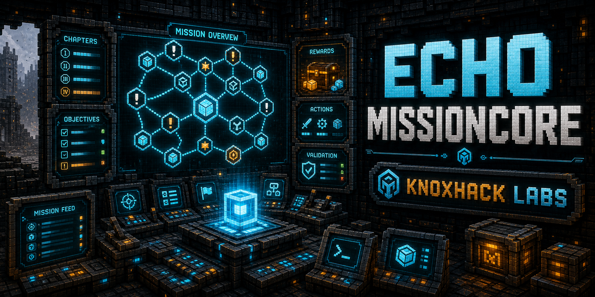
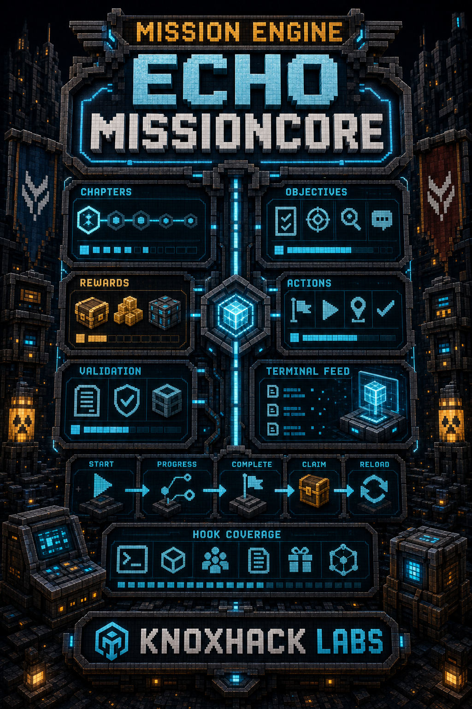

<!-- CURSEFORGE_README_START -->
# ECHO: MissionCore



**Shared mission, objective, reward, action, and Terminal feed backend for ECHO addons.**



## CurseForge Summary

Mission backend for chapter definitions, objectives, progression, rewards, actions, and Terminal mission feeds.

## Overview

ECHO: MissionCore is the shared backend for modular ECHO missions. It lets addons define chapters, phases, objectives, rewards, completion rules, repeat policies, and mission actions while keeping the public contracts available through ECHO Core.

The goal is migration without chaos. Existing addon mission sets can be mirrored into MissionCore while owning addons keep their public mission IDs and save compatibility. Terminal-facing providers can draw from a common service instead of each chapter inventing its own state pipeline.

Players experience MissionCore indirectly through better mission consistency. Pack authors and addon developers get cleaner registration, validation commands, objective reporting, reward claim handling, and future-ready mission graph surfaces.

## Main Features

- Mission chapters, phases, definitions, objective types, rewards, completion rules, and repeat policies.
- Core service hooks for no-op-safe mission registration and progress reporting.
- Terminal feed support for shared mission presentation.
- Server-authoritative custom addon actions.
- Validation, inspect, start, complete, claim, and progress commands for development and operations.

## How It Plays

- Install it as a library beside ECHO chapters that use shared mission state. Players will see the effect through cleaner mission feeds and reward behavior rather than a standalone block.
- Addon authors register mission content during setup and report objective progress through Core services.

## Requirements

- Minecraft 26.1.2
- NeoForge 26.1.2.29-beta or newer
- Java 25+
- ECHO: Core 1.0.0 or newer

## Recommended Pairings

- ECHO: Terminal for mission browsing and action surfaces

## Compatibility Notes

- Owning addons should keep mission IDs stable for save compatibility.
- MissionCore no-ops safely through Core contracts when absent from optional callers.

## CurseForge Asset Files

- Banner: `docs/curseforge/echomissioncore-banner.png`
- Feature image: `docs/curseforge/echomissioncore-features.png`

<!-- CURSEFORGE_README_END -->
---

## Existing Developer Notes

# ECHO: MissionCore

MissionCore is the shared backend for ECHO missions, objectives, rewards, and Terminal mission feeds.

Version `1.0.0` is the direct hook hardening release. Existing addon
`TerminalMissionProvider` mission sets still register into MissionCore without
changing their public mission IDs, while real server-side gameplay events now record
objective progress directly through Core service helpers.

## Addon Registration

Addons should depend on `echocore` and register content through Core:

```java
EchoCoreServices.registerMissionContent("myaddon", registry -> {
    Identifier chapterId = Identifier.fromNamespaceAndPath("myaddon", "field_ops");
    registry.registerChapter("myaddon", new MissionChapterDefinition(
            chapterId, "Field Ops", "Addon objectives.", 50, 0x55FFDD));

    registry.registerMission("myaddon", MissionDefinition.builder(
                    Identifier.fromNamespaceAndPath("myaddon", "first_signal"), chapterId)
            .phase("field_ops", "Field Ops", 0, 1)
            .text("First Signal", "Scan the first signal.", "Signal archived.")
            .objective(ObjectiveDefinition.simple(
                    Identifier.fromNamespaceAndPath("myaddon", "first_signal/scan"),
                    MissionObjectiveType.SCAN_BLOCK,
                    "Scan signal block",
                    "",
                    ItemStack.EMPTY,
                    1))
            .reward(RewardDefinition.item(
                    Identifier.fromNamespaceAndPath("myaddon", "first_signal/reward"),
                    MissionRewardClaimMode.CLAIMABLE,
                    new ItemStack(Items.EMERALD)))
            .build());
});
```

Gameplay code should report progress through `EchoCoreServices.recordMissionObjective(...)`. MissionCore safely no-ops when it is not loaded.

Hook targets should be stable addon namespace IDs:

```java
Identifier target = MissionHookTargets.objectiveTarget(
        "myaddon",
        Identifier.fromNamespaceAndPath("myaddon", "first_signal"),
        "scan");

EchoCoreServices.recordMissionObjective(
        player,
        MissionObjectiveType.SCAN_BLOCK,
        target,
        1,
        MissionHookTargets.context("myaddon", missionId, "action", "scanner"));
```

The target convention is `<addon>:mission/<legacy_mission>/<objective_key>`.
Context maps should include `source`, `legacy_mission`, and one gameplay detail such
as `route`, `machine`, `region`, or `action`.

## Custom Addon Actions

Static JSON missions keep the built-in `start`, `complete`, and `claim` actions. Java
registrations can add addon-specific actions, such as scan, decode, route, or path
choice buttons:

```java
registry.registerMission("myaddon", MissionDefinition.builder(id("decode_cache"), chapterId)
        .text("Decode Cache", "Decode the recovered cache.", "Cache decoded.")
        .actionProvider((player, mission, status, completeNow) ->
                List.of(MissionActionView.enabled("decode_cache", "Decode")))
        .actionHandler((player, mission, actionId) ->
                "decode_cache".equals(actionId) && LegacyTerminalActions.decodeCache(player))
        .build());
```

MissionCore merges custom `MissionActionView`s into Terminal snapshots and delegates
unknown action ids to the mission action handler. Complex actions should stay in Java
adapters; JSON intentionally does not deserialize arbitrary executable handlers.

## JSON Content

Datapacks can register chapters under:

- `data/<namespace>/missioncore/chapters/*.json`
- `data/<namespace>/missioncore/missions/**/*.json`

Mission rewards support `immediate` and `claimable` modes. Objective `type` accepts the shared MissionCore objective ids such as `obtain_item`, `place_block`, `kill_entity`, `establish_route`, and `unlock_research`.

## Validation and Debug

MissionCore is server-authoritative. Operators can inspect and test content with:

- `/echomission list`
- `/echomission inspect <mission>`
- `/echomission start <mission>`
- `/echomission progress <mission> <objective> <amount>`
- `/echomission record <objective_type> <target> <amount>`
- `/echomission complete <mission>`
- `/echomission claim <mission>`
- `/echomission validate`
- `/echomission reload`

JSON missions with duplicate ids, missing chapters, broken prerequisites, unknown objective types, unknown reward modes, or invalid reward items are skipped with warnings instead of crashing world load.

`/echomission validate` also reports migrated-source hook coverage as
`direct-hooks`, `adapter-state`, or `mixed`. Direct hooks mean gameplay events can
advance MissionCore without Terminal snapshots; adapter-state remains supported for
legacy compatibility.

## Migration Notes

When ECHO Terminal is installed, MissionCore registers one shared mission feed. Legacy addon Terminal mission providers should skip their direct mission provider registration when `echomissioncore` is loaded, while keeping non-mission dashboards, archives, and actions registered. Existing addon save data remains authoritative until its adapter mirrors completion and reward claims into MissionCore.

The 1.0.0 hook pass covers Reclamation, Industrial, Convoy, Orbital, Nexus,
Blackbox, and Stationfall provider migration. Each adapter preserves the
`TerminalMissionDefinition.id()` as the MissionCore mission id, delegates custom
Terminal action ids back to the legacy provider logic, and records direct objective
hooks where stable server-side gameplay events exist.
