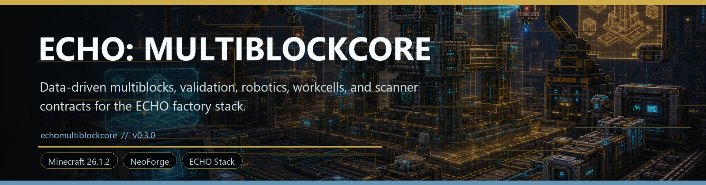
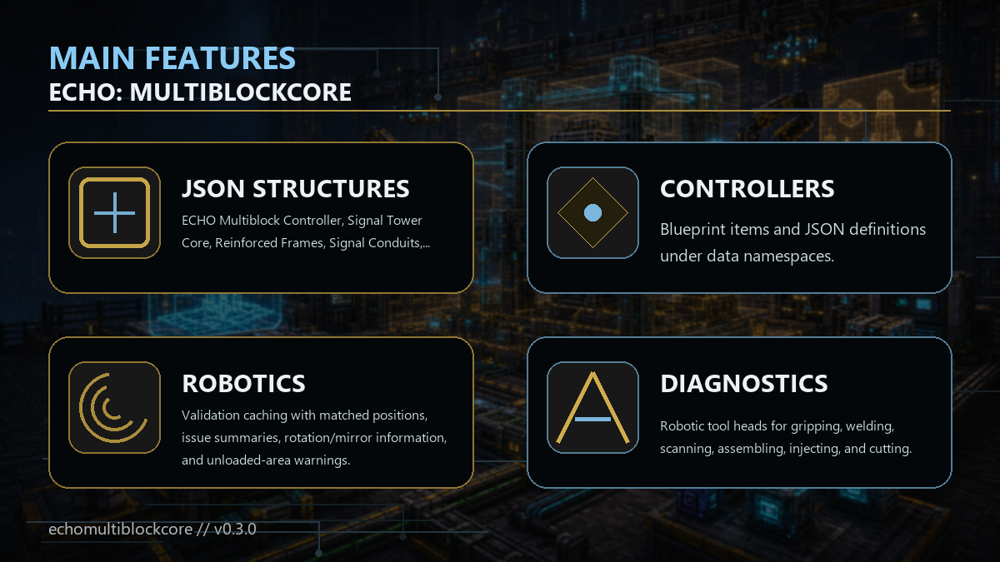

<!-- CURSEFORGE_README_START -->
# ECHO: MultiblockCore



**Data-driven multiblocks, validation, robotics, workcells, and scanner contracts for the ECHO factory stack.**



## CurseForge Summary

Shared multiblock validation and runtime framework with controllers, frames, robotic arms, task queues, JSON definitions, and a playable facility progression chain.

## Overview

ECHO: MultiblockCore provides a shared framework for larger ECHO machines and structures. It adds data-driven multiblock definitions, controller validation, runtime state, diagnostics, task queues, robotics parts, workcell concepts, and integration hooks for scanner, map, and terminal surfaces.

The addon is built to keep complex structures from becoming one-off code in every chapter. A multiblock can be described in JSON, validated in world, reported through diagnostics, cached safely, and rebuilt across runtime versions with clearer ownership.

For players, MultiblockCore is the foundation for bigger factory and infrastructure builds. For developers, it is the common language for signal towers, assembly lines, robot arms, crates, power buses, data buses, and future ECHO workcells.

## Main Features

- ECHO Multiblock Controller, Signal Tower Core, Reinforced Frames, Signal Conduits, Power Bus, Data Bus, Input/Output Crates, Robotic Arms, Machine Frames, and showcase facility blueprints.
- Blueprint items and JSON definitions under data namespaces.
- Facility progression data under `data/<namespace>/echo_multiblock_progression/*.json` for tiering, prerequisites, featured recipes, rewards, guide text, and advancements.
- Validation caching with matched positions, issue summaries, rotation/mirror information, and unloaded-area warnings.
- Robotic tool heads for gripping, welding, scanning, assembling, injecting, cutting, clamping, drilling, calibrating, and stabilizing.
- Runtime schemas, task transactions, diagnostics, and optional Terminal/HoloMap/Lens hooks.

## How It Plays

- Build a defined structure, place or use a controller, inspect the blueprint, resolve validation issues, then let the runtime handle workcell-style tasks and diagnostics.
- Large machines become understandable because the controller can explain what is missing and which parts are participating.

## Requirements

- Minecraft 26.1.2
- NeoForge 26.1.2.29-beta or newer
- Java 25+
- ECHO: Core 1.0.0 or newer
- ECHO: NetCore 1.0.0 or newer

## Recommended Pairings

- ECHO: Terminal for diagnostics
- ECHO: HoloMap for marker context
- ECHO: Lens for inspection

## Compatibility Notes

- Definitions are namespaced JSON and can be supplied by other addons.
- Task transactions are designed to avoid item loss when outputs are blocked.

## CurseForge Asset Files

- Banner: `docs/curseforge/echomultiblockcore-banner.png`
- Feature image: `docs/curseforge/echomultiblockcore-features.png`

<!-- CURSEFORGE_README_END -->
---

## Existing Developer Notes

# ECHO: MultiblockCore

Version target: `1.0.0`

ECHO: MultiblockCore is the shared service layer for ECHO facility-scale multiblocks. It provides data-driven structure definitions, data-driven automation recipes, controller orchestration, validation diagnostics, formed runtime snapshots, persisted robotic task queues, workcells, integrity state, blueprints, and optional integration contracts for future ECHO UI and mission modules.

The module intentionally hard-depends only on `echocore` and `echonetcore`. Terminal, Lens, HoloMap, MissionCore, DataCore, and content addons should consume the public API, provider interfaces, automation effect handlers, and NeoForge events without creating compile-time dependency cycles.

## v1.1 Facility Progression

v1.0.0 turns the v1 showcase set into a playable MultiblockCore-only facility chain. It keeps v1 APIs and ids compatible while adding progression data, onboarding advancements, facility blueprints, missing tool heads, and one featured automation loop per showcase structure.

- Progression definitions live at `data/<namespace>/echo_multiblock_progression/*.json` and declare a facility id, tier, prerequisite facilities, featured recipe ids, reward items, advancement id, title, and guide text.
- Every showcase facility now has a blueprint item, simple model, recipe, material summary support, progression entry, and vanilla-safe advancement milestone.
- New tool heads complete the `RobotToolType` enum surface: Clamp Head, Drill Head, Calibrator Head, and Stabilizer Head.
- New first-party facility loop outputs include Supply Manifest, Scanner Matrix, Vehicle Frame Kit, Launch Guidance Core, Archive Memory Cell, Reclamation Growth Matrix, Nexus Field Coil, Armory Pattern Core, and Construction Planner.
- Controller snapshots and the first-party screen expose progression tier/title/featured recipe hints. Terminal/Lens/HoloMap providers receive the same additive fields without requiring those addons at runtime.
- Debug commands include `/echo_multiblock progression list`, `/echo_multiblock progression info <facility>`, and `/echo_multiblock progression next`.

Minimal progression JSON:

```json
{
  "id": "echomultiblockcore:scanner_array",
  "facility": "echomultiblockcore:scanner_array",
  "tier": 4,
  "prerequisites": ["echomultiblockcore:logistics_depot"],
  "featured_recipes": ["echomultiblockcore:run_scanner_sweep"],
  "reward_items": ["echomultiblockcore:scanner_matrix"],
  "advancement": "echomultiblockcore:multiblock/scanner_array",
  "title": "Scanner Array",
  "guide": "Turn staged manifests into survey matrices for later facilities."
}
```

The loader isolates malformed progression files independently from multiblock definitions and automation recipes. Unknown optional links warn with field-path diagnostics but do not reject otherwise valid progression data.

## v1 Vision Completion Core

v1.0.0 turns MultiblockCore into a full first-party facility mod while preserving it as the reusable ECHO spine.

- Controller UI: sneak-use a controller to open the first-party status screen for integrity, validation, robots, queue controls, repairs, capability health, damage groups, upgrades, and auto-builder actions.
- Capability runtime: definitions and recipes can declare power/data/item capability requirements. Runtime bus nodes are discovered from matched blocks, task planning blocks with clear diagnostics when capacity or throughput is missing, and snapshots expose capability health.
- Upgrade runtime: upgrades load from `data/<namespace>/echo_multiblock_upgrades/*.json`; operators can inspect/list/install/remove upgrades through `/echo_multiblock upgrades ...`; modifiers currently affect speed/capability headroom and are snapshot-visible for integrations.
- Auto Builder: the `auto_builder` component and `/echo_multiblock autobuild` consume exact-block materials from linked input crates and place valid missing blueprint cells without touching wrong/occupied/unloaded positions.
- Robotic animation state: robot animation packets now carry versioned pose/profile data, clients retain short-lived arm animation state, and legacy particle feedback remains as the safe visible fallback.
- Showcase facilities: Logistics Depot, Scanner Array, Vehicle Repair Gantry, Orbital Launch Platform, Archive Data Chamber, Agriculture Dome, Nexus Stabilizer, Armory Fabricator, and Auto Builder Yard ship as JSON-defined facility examples.

New additive API contracts include `MultiblockCapabilityRuntime`, `CapabilityRequirement`, `CapabilityNode`, `CapabilityThroughput`, `CapabilityDiagnostic`, `MultiblockUpgradeDefinition`, `InstalledMultiblockUpgrade`, `UpgradeModifier`, `UpgradeSlotRule`, `RobotAnimationState`, `RobotPoseSnapshot`, `RobotKinematicTarget`, `AutoBuilderPlan`, `AutoBuilderStep`, `AutoBuilderResult`, and `ConstructionPermissionPolicy`.

## v7 Automation Effects Core

v0.7.0 keeps JSON automation recipes as the source of truth and adds a safe side-effect layer for addons that need gameplay mutations after MultiblockCore handles the standard robot/workcell/input/output transaction.

- Automation recipes can declare optional `"effects": ["namespace:effect_id"]`. Missing or unregistered handlers are no-op diagnostics, while malformed ids warn during parse without rejecting otherwise valid recipes.
- `AutomationEffectHandler`, `AutomationEffectHandlers`, `AutomationEffectResult`, and `AutomationEffectInvocation` are the public side-effect contracts.
- Effects can block before start, run on start/tick/complete/fail, and failures are isolated into task diagnostics instead of crashing the queue.
- `TaskExecutionSnapshot` now exposes declared effect ids and the latest effect diagnostic.
- `AutomationTaskHandler` remains source-compatible for existing internal hooks, but new addon behavior should use effect handlers rather than broad completion-event listeners or recipe-registry replacement.
- Convoy Protocol recipes now attach effects in JSON and register a provider-deduped handler for convoy state/logistics mutations.

## v6 Build Assist Polish

v0.6.0 keeps the v0.5 build-assist workflow and focuses on correctness, readability, and beta workspace confidence.

- Client preview geometry is shared with tested build-assist helpers so controller anchoring, rotations, mirrors, and layer slices line up with validation-oriented transforms.
- Blueprint HUD text is translatable and reports anchor mode, rotation, mirror, layer, completion, warnings, material checklist lines, and grouped missing/wrong cells.
- Exact block/item requirements can show player inventory counts in the HUD. Tag requirements remain requirement-only because client inventory cannot honestly prove tag substitutions.
- Large previews are capped or warned instead of silently disappearing.
- The full beta workspace build is now part of the acceptance gate for MultiblockCore polish releases.

## v5 Build Assist UX

v0.5.0 upgrades blueprints from a simple bounding box into an interactive build-assist overlay. Holding a blueprint now uses synced, capped definition metadata to render per-cell outlines, compare client-visible blocks, and show a compact material/diagnostic HUD.

- Build assist supports rotation cycling, mirror toggling for mirrorable definitions, layer up/down, and controller-slot anchoring.
- Overlay colors distinguish valid, missing, wrong, optional, and air-violation cells; server validation remains authoritative on controller use.
- Blueprint tooltips and `/echo_multiblock materials <definition>` expose material summaries.
- The old Java task shim is removed. Data recipes remain the only task lookup path, with optional `AutomationTaskHandler` hooks using `AutomationTaskContext`.
- Convoy Protocol task ids are now data-backed JSON recipes instead of runtime recipe registration.

## v4 Automation Expansion

v0.4.0 moved multiblock robotics from hardcoded Java tasks to datapack automation recipes. The old `echomultiblockcore:assemble_reinforced_machine_frame` id is preserved, but it is now loaded from `data/<namespace>/echo_multiblock_tasks/*.json`.

- `AutomationRecipeRegistry` is the public lookup surface for recipes.
- `MultiblockAutomationRecipe`, `AutomationIngredient`, `AutomationOutput`, and `MultiblockAutomationRecipeParseResult` are the data contracts for addons.
- `AutomationTransaction` supports multiple item/tag inputs and multiple outputs with no item loss on blocked output.
- Task snapshots now include category, robot id, workcell id, and input/output summaries for Terminal/DataCore consumers.
- Queue controls include start, clear, retry, pause, and resume through commands and the optional Terminal bridge.
- The optional Terminal bridge registers recipe index data, addon status metrics, and action handlers when `echoterminal` is installed, without creating a required runtime dependency.

## v3 Integration Core

v0.3.0 keeps the v2 gameplay and persistence behavior intact while making the module easier for other ECHO addons to consume safely.

- `MultiblockIntegrationServices` is the public facade for registering and aggregating Terminal, Lens-style scan, DataCore, and map marker providers.
- Provider registration deduplicates by `providerId()` and catches provider failures so a broken optional addon cannot crash aggregation.
- First-party default providers expose saved formed runtimes, loaded controller snapshots, robotic arm scans, and EchoCore map markers.
- `MultiblockMapDataProvider` now emits real `IMapLayer` and `IMapMarker` output through EchoCore without depending on HoloMap.
- Lifecycle and task events keep old constructors and add before/after snapshot payloads where useful.
- Debug commands include `/echo_multiblock integrations`, `/echo_multiblock snapshot`, `/echo_multiblock scan`, and `/echo_multiblock markers`.

For module-only builds and GameTests, optional UI/runtime companion addons are not loaded. Use `-PechoMultiblockIncludeOptionalRuntime=true` when you want the dev run to also include Terminal, Lens, and HoloMap beside MultiblockCore.

## v2 Core Guarantees

- Controllers keep existing v1 behavior: right-click validates/forms, sneak-right-click prints diagnostics, and the Industrial Assembly Line queues the demo task.
- Controller block entities remain persistence owners, but validation caching, runtime rebuilds, diagnostics, integrity transitions, and task queues live in focused service classes.
- Existing v1 NBT keys are still read. New saves include `runtime_schema_version = 2`, `structure_version`, and a persisted bounded task queue.
- Validation results include matched world positions, grouped issue summaries, definition id, timestamp, rotation/mirror match, and unloaded-area warnings.
- Task transactions check robot, tool, workcell, input, and output availability before work begins. Inputs are consumed only during commit; blocked output does not lose items.
- JSON reloads isolate bad files and keep the last good registry if a reload produces no valid definitions.

## JSON Definitions

Definitions live at `data/<namespace>/echo_multiblocks/*.json`.

```json
{
  "id": "echomultiblockcore:signal_tower_tier_1",
  "display_name": "Signal Tower",
  "role": "INFRASTRUCTURE",
  "category": "signal",
  "size": [3, 4, 3],
  "controller": "echomultiblockcore:signal_tower_core",
  "allowed_rotations": true,
  "mirrorable": false,
  "requires_foundation": true,
  "layers": [
    ["FFF", "FCF", "FFF"]
  ],
  "palette": {
    "F": { "tag": "echomultiblockcore:reinforced_frames" },
    "C": { "controller": true, "block": "echomultiblockcore:signal_tower_core" },
    ".": { "air": true }
  },
  "capabilities": ["echo:scanner_target", "echo:map_marker", "echo:terminal_tab"],
  "workcells": [
    {
      "id": "echomultiblockcore:signal_anchor",
      "type": "SCANNING",
      "pos": [1, 1, 1],
      "size": [1, 1, 1],
      "required_tools": ["SCANNER"]
    }
  ],
  "integrity": { "max": 100, "damageable": true },
  "preview": { "color": "00d8ff" }
}
```

Production parser checks include controller block ids, palette key reachability, duplicate workcell ids, invalid colors, invalid enum fallbacks, layer dimensions, missing palette references, and configured max validation volume.

## Automation Recipes

Automation recipes live at `data/<namespace>/echo_multiblock_tasks/*.json`.

```json
{
  "id": "echomultiblockcore:assemble_reinforced_machine_frame",
  "display_name": "Assemble Reinforced Machine Frame",
  "category": "assembly",
  "allowed_multiblocks": ["echomultiblockcore:industrial_assembly_line_demo"],
  "required_workcell": "ASSEMBLY",
  "required_tools": ["WELDER", "ASSEMBLER"],
  "duration_ticks": 200,
  "heat_per_second": 2,
  "animation": "assemble",
  "effects": ["exampleaddon:after_frame_assembled"],
  "consume_inputs_on_start": true,
  "inputs": [
    { "item": "echomultiblockcore:reinforced_frame", "count": 4 },
    { "item": "echomultiblockcore:signal_conduit", "count": 1 }
  ],
  "outputs": [
    { "item": "echomultiblockcore:reinforced_machine_frame", "count": 1 }
  ]
}
```

Inputs may use `item` or `tag`. Outputs are exact items. `effects` is optional and names side-effect hooks implemented by addon-owned `AutomationEffectHandler` providers. Bad recipe files are isolated during reload; unknown output/input item ids reject only that recipe. Invalid workcell/tool enums and malformed effect ids warn so pack authors get diagnostics instead of crashes.

## Runtime And Tasks

`MultiblockControllerBlockEntity` owns a `MultiblockTaskQueue` of `QueuedMultiblockTask` entries. Queue states are `WAITING`, `BLOCKED`, `ACTIVE`, `PAUSED`, `COMPLETED`, `FAILED`, and `RETRYING`. Blocked tasks remain retryable so fixing input materials, output capacity, or a tool head can let the same queued task continue. Paused tasks remain paused until `/echo_multiblock task resume` or a Terminal resume action.

The first production recipe is `echomultiblockcore:assemble_reinforced_machine_frame`:

- Input: 4x Reinforced Frame, 1x Signal Conduit
- Robot: Welder or Assembler head
- Workcell: Assembly/Welding
- Output: 1x Reinforced Machine Frame
- Commit: consumes input only when output insertion can succeed

Assembly Suite recipes included in this module:

- `echomultiblockcore:assemble_reinforced_machine_frame`
- `echomultiblockcore:fabricate_signal_circuit`
- `echomultiblockcore:calibrate_data_bus`
- `echomultiblockcore:weld_power_bus`
- `echomultiblockcore:assemble_machine_casing`
- `echomultiblockcore:repair_structure_integrity`

## Addon Integration

Use the public API package for stable contracts:

- `MultiblockIntegrationServices` for no-hard-dependency provider registration and aggregation.
- `AutomationRecipeRegistry` for data recipe lookup.
- `AutomationEffectHandlers` for addon-owned recipe side effects that can block before start or react to start/tick/complete/fail without replacing the recipe registry.
- `MultiblockBuildAssistSnapshot`, `MultiblockBuildAssistCell`, `MultiblockMaterialSummary`, `BuildAssistTransform`, `BuildAssistGeometry`, `BuildAssistAnchor`, and `BuildAssistMaterialChecklist` for blueprint/build-assist tooling.
- `MultiblockDefinitionParseResult` for tooling/tests around JSON definitions.
- `MultiblockAutomationRecipeParseResult` for tooling/tests around automation recipe JSON.
- `ValidationOptions` and `ValidationCacheKey` for controlled validation.
- `ValidationResult` grouped issues and matched block positions for diagnostics/runtime rebuilds.
- `MultiblockRuntimeSnapshot` for serializable dashboard, map, scan, or persistence views.
- `MultiblockTerminalProvider`, `MultiblockScanProvider`, `MultiblockMapMarkerProvider`, and `MultiblockDataCoreProvider` for no-hard-dependency bridges.

NeoForge events are emitted for formed, broken, damaged, repaired, upgraded, activated, overloaded, task started, task blocked, task completed, and task failed flows where implemented.

Example provider registration:

```java
MultiblockIntegrationServices.registerTerminalProvider(myTerminalProvider);
MultiblockIntegrationServices.registerScanProvider(myLensScanProvider);
MultiblockIntegrationServices.registerDataCoreProvider(myDataProvider);
MultiblockIntegrationServices.registerMapMarkerProvider(myMapProvider);
```

All aggregation methods return empty/no-op output when no providers exist or when an optional provider throws:

```java
List<MultiblockStatusSnapshot> terminal = MultiblockIntegrationServices.terminalSnapshots(player);
Optional<LensMultiblockScan> scan = MultiblockIntegrationServices.scan(player, level, pos);
List<MultiblockRuntimeSnapshot> data = MultiblockIntegrationServices.dataSnapshots(player);
List<MultiblockMapMarkerSnapshot> markers = MultiblockIntegrationServices.mapMarkers(player);
```

## Examples

- `echomultiblockcore:signal_tower_tier_1` demonstrates JSON validation, formed state, diagnostics, blueprint metadata, scanner/map/terminal capability flags, and break/reform behavior.
- `echomultiblockcore:industrial_assembly_line_demo` demonstrates matched-position runtime discovery, workcells, input/output crates, robotic arm tool installation, persisted queue state, task transactions, and animation packets.

## Optional Terminal Bridge

When `echoterminal` is installed, MultiblockCore reflectively registers:

- A `TerminalRecipeProvider` for automation recipes.
- A `TerminalAddonInfoProvider` with definition, recipe, runtime, and active-task metrics.
- Terminal actions on tab id `echomultiblockcore:terminal`: `start_task`, `clear_queue`, `retry_blocked`, `pause_queue`, and `resume_queue`.

Action payloads are JSON strings:

```json
{
  "dimension": "minecraft:overworld",
  "controller_pos": [12, 64, -8],
  "recipe_id": "echomultiblockcore:assemble_reinforced_machine_frame"
}
```

Malformed payloads, unloaded controllers, cross-dimension access, out-of-range actions, and unknown recipes are rejected without crashing the Terminal action dispatcher.
