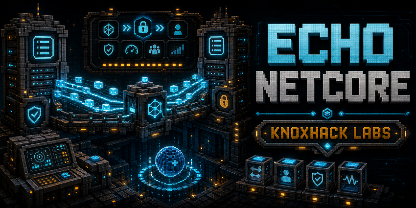
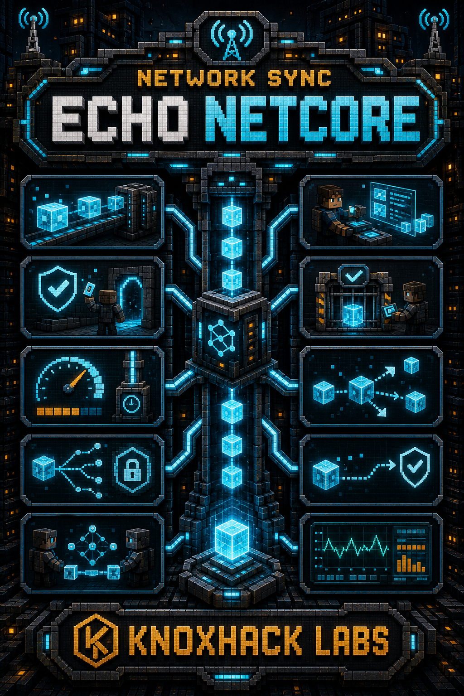

<!-- CURSEFORGE_README_START -->
# ECHO: NetCore



**Shared networking, sync, server actions, rate limits, and diagnostics for ECHO addons.**



## CurseForge Summary

Packet bridge, sync helpers, optional-channel safe sends, server action validation, rate limits, and packet diagnostics.

## Overview

ECHO: NetCore is the networking foundation for the ECHO ecosystem. It centralizes packet registration patterns, clientbound sync helpers, serverbound action validation, rate limit policies, optional send handling, debug hooks, and client action helpers.

The addon exists so gameplay chapters can focus on authority and state instead of duplicating fragile network glue. Serverbound packets represent intent only; handlers validate permissions, distance, ownership, inventory, menu state, and world state on the server.

For players, NetCore is a library dependency. For developers, it is the standard way to keep optional addon channels, packet diagnostics, and action rate limits consistent across Terminal buttons, machine screens, scanner requests, and mission actions.

## Main Features

- Optional packet registrar helpers for clientbound sync, serverbound actions, and debug packets.
- Rate-limited server action policies.
- Safe send helpers that catch missing-channel failures and emit debug events.
- Client action helpers for UI and terminal buttons.
- Shared network bridge for data, mission progress, visual state, machines, debug data, factions, and discovery toasts.

## How It Plays

- Install it as a required library for ECHO modules that need shared packets or sync. It has no standalone survival loop, but it makes interactive ECHO screens and services behave safely.
- Addon developers should keep direct NeoForge packet registration inside NetCore patterns and validate all serverbound actions authoritatively.

## Requirements

- Minecraft 26.1.2
- NeoForge 26.1.2.29-beta or newer
- Java 25+
- ECHO: Core 1.0.0 or newer

## Recommended Pairings

- ECHO: Terminal, HoloMap, Lens, DataCore, WorldCore, and any interactive ECHO chapter

## Compatibility Notes

- Debug packets are disabled by default and should require operator permissions when enabled.
- Optional sends should never crash missing consumers.

## CurseForge Asset Files

- Banner: `docs/curseforge/echonetcore-banner.png`
- Feature image: `docs/curseforge/echonetcore-features.png`

<!-- CURSEFORGE_README_END -->
---

## Existing Developer Notes

# ECHO: NetCore

ECHO: NetCore is the shared packet, sync, server action, rate limiting, and debug network layer for ECHO addons.

## Packet Categories

- Clientbound sync packets mirror server-owned state to the logical client.
- Serverbound action packets represent player intent only; handlers must validate permissions, distance, ownership, inventory, menu state, and world state on the server.
- Debug/dev packets are disabled by default and require operator permissions when enabled.
- Optional addon packets should use optional registration and safe send helpers so missing consumers do not crash a server or client.

## Registering Packets

Use `EchoNetPayloads.optional(event)` to create the shared optional registrar, then register packets by category:

```java
PayloadRegistrar registrar = EchoNetPayloads.optional(event);
EchoNetPayloads.clientboundSync(registrar, MySyncPacket.TYPE, MySyncPacket.CODEC, MyNetwork::handleSync);
EchoNetPayloads.serverboundAction(registrar, MyActionPacket.TYPE, MyActionPacket.CODEC,
        EchoRateLimitPolicy.of(10, "my_action"), MyNetwork::handleAction);
```

Serverbound handlers receive a `ServerPlayer`; packets from non-server contexts are dropped before the handler runs. Rate-limited packets are dropped without mutating gameplay state.

## Sync Helpers

`EchoCoreServices.networkBridge()` exposes no-op-safe helpers for player data, world data, mission progress, visual state, machine/block-entity state, debug data, faction sync, and discovery toasts. NetCore supplies the real bridge when loaded; ECHO Core falls back to `NoOpNetworkService`.

Client code can subscribe to generic NetCore sync packets with `EchoClientSyncRegistry.register(type, channelId, consumer)`.

## Safe Sends

Use `EchoNetSend.toPlayer(player, payload, kind)` for optional clientbound sends. It catches missing-channel failures and emits packet debug events. Use `EchoNetClientActions.sendServerboundAction(payload)` from client-only classes for terminal buttons and other UI actions, or `EchoNetClientActions.trySendServerboundAction(payload)` when optional cross-addon UI sends need a boolean success result.

## Packet Ownership

As of NetCore 1.2, addons may declare packet payload records and handlers, but direct NeoForge packet registration and distribution calls should stay inside NetCore. Addons should use `EchoNetPayloads` for registration, `EchoNetSend` for server-to-client sync, and `EchoNetClientActions` for client-to-server UI/action packets. This keeps optional-channel failures, debug hooks, and rate limits consistent across the ECHO stack.

Serverbound action packets should choose an explicit rate limit:

```java
EchoNetPayloads.serverboundAction(registrar, MyActionPacket.TYPE, MyActionPacket.CODEC,
        EchoRateLimitPolicy.of(4, "my_action"), MyNetwork::handleAction);
```

Use `EchoRateLimitPolicy.NONE` only when an existing validated flow already owns its throttle semantics.

## Debug Logging

Packet logging is controlled by NetCore common config:

- `debugPacketLogging=false`
- `logDroppedPackets=false`
- `enableDebugPackets=false`

Debug logs and debug packet handlers stay silent unless explicitly enabled.
