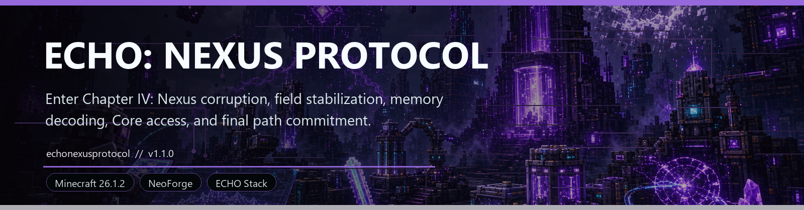
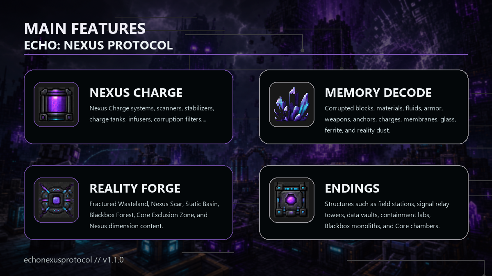

<!-- CURSEFORGE_README_START -->
# ECHO: Nexus Protocol

**Enter Chapter IV: Nexus corruption, field stabilization, memory decoding, Core access, and final path commitment.**

## CurseForge Summary

Nexus corruption chapter with Nexus Charge, field planning, corrupted biomes, machines, memory decoding, clearer route guidance, Guardian fights, and endings.

## Overview

ECHO: Nexus Protocol is Chapter IV of the ECHO collapse saga. It opens deeper Core corruption and memory systems after Stationfall or development unlocks, then pushes players through dirty charge, stabilization, signal towers, deleted history, monolith memory, reality forging, Core access, and final path decisions.

Version 1.2.0 is an addon-only Nexus Protocol polish release. It keeps the existing Nexus content spine intact while improving mission guidance, field recovery advice, machine feedback, boss readability, and route-critical rewards while the rest of the ECHO stack may remain on 1.1.3.

The addon introduces Nexus Charge, corrupted materials, field stabilizers, memory decoders, a Reality Forge, corruption reactors, protocol seals, new biomes and structures, Nexus gear, and a smarter field-map risk layer. It is where the old ECHO infrastructure stops being background lore and starts rewriting the route.

Nexus Protocol can commit Restore, Control, Destroy, or Merge. It respects Ashfall as the first irreversible Nexus choice while exposing deeper Core-state interpretations for the later stack.

## Main Features

- Nexus Charge systems, scanners, stabilizers, charge tanks, infusers, corruption filters, memory decoders, and Reality Forge progression.
- Terminal route placement, mission hints, Field Map recovery recommendations, and machine status feedback tuned for the full Nexus path.
- Corrupted blocks, materials, fluids, armor, weapons, anchors, charges, membranes, glass, ferrite, and reality dust.
- Fractured Wasteland, Nexus Scar, Static Basin, Blackbox Forest, Core Exclusion Zone, and Nexus dimension content.
- Structures such as field stations, signal relay towers, data vaults, containment labs, Blackbox monoliths, and Core chambers.
- Threats including Nexus Husk, Data Wraith, Static Crawler, Core Soldier, Archive Seeker, Corruption Warden, and Nexus Guardian.
- Restore, Control, Destroy, and Merge path commitment support.

## How It Plays

- Stabilize your camp, gather charge and corrupted materials, use machines to decode memory and forge reality-grade components, then unlock deeper Core access through monoliths and Guardian proof.
- The route expects planning: risk, charge, stabilizers, gear, and field-map decisions all matter before the final commitment.

## Requirements

- Minecraft 26.1.2
- NeoForge 26.1.2.29-beta or newer
- Java 25+
- ECHO: Core 1.1.3 or newer

## Recommended Pairings

- ECHO: Terminal 1.2.0 or newer for chapter missions, route placement, and records
- ECHO: Orbital Remnants for previous route context
- JEI for recipe visibility

## Compatibility Notes

- Orbital and Terminal integrations are optional where configured.
- Nexus choices are intended to be consequential in the ECHO story chain.
- The 1.2.0 release is scoped to `echonexusprotocol`; use an addon-specific tag such as `echonexusprotocol-v1.2.0`.

## CurseForge Asset Files

- Banner: `docs/curseforge/echonexusprotocol-banner.png`
- Feature image: `docs/curseforge/echonexusprotocol-features.png`

<!-- CURSEFORGE_README_END -->
