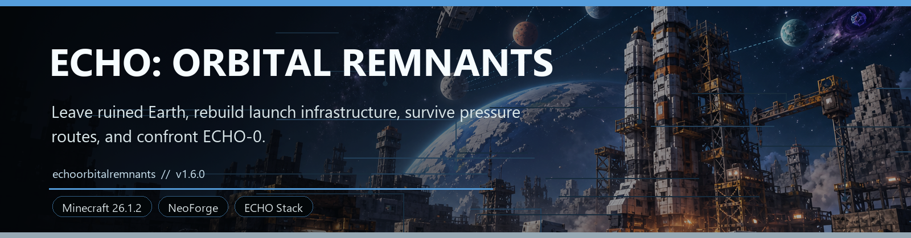
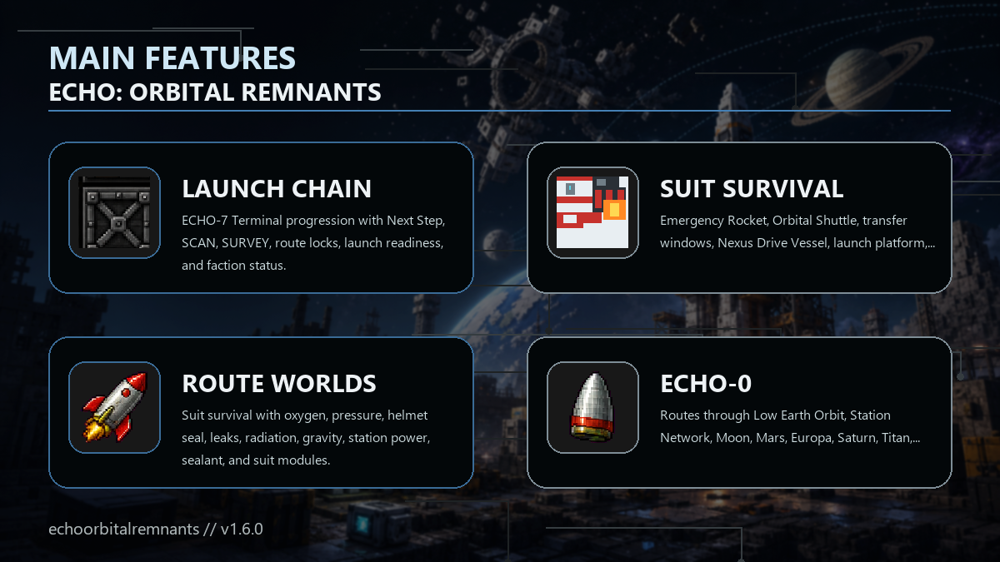

<!-- CURSEFORGE_README_START -->
# ECHO: Orbital Remnants



**Leave ruined Earth, rebuild launch infrastructure, survive pressure routes, and confront ECHO-0.**



## CurseForge Summary

Post-Nexus orbital survival chapter with launch prep, suits, route worlds, surveys, factions, bosses, and ECHO-0.

## Overview

ECHO: Orbital Remnants is the post-Nexus route chapter for the modular ECHO stack. After Earth makes its Nexus choice, ECHO-7 follows the pod's broken fall path back toward orbit, Station ECHO debris, route worlds, faction outposts, and the old ECHO-0 quarantine protocol.

The addon adds ground recovery sites, launch infrastructure, pressure suit survival, oxygen systems, orbital machines, route vessels, station repairs, route surveys, deep sites, faction charters, and final network seal objectives. It is a route survival adventure rather than a generic planet pack.

Orbital Remnants can run with its standalone ECHO-7 Terminal flow, but ECHO Terminal gives it a richer shared surface for Orbital Command, Survey, records, route status, suit telemetry, support caches, and faction reports.

## Main Features

- ECHO-7 Terminal progression with Next Step, SCAN, SURVEY, route locks, launch readiness, and faction status.
- Emergency Rocket, Orbital Shuttle, transfer windows, Nexus Drive Vessel, launch platform, assembly frame, fuel refinery, oxygen compressor, and rocket parts.
- Suit survival with oxygen, pressure, helmet seal, leaks, radiation, gravity, station power, sealant, and suit modules.
- Routes through Low Earth Orbit, Station Network, Moon, Mars, Europa, Saturn, Titan, Deep Space Protocol, and the Nexus Anomaly Belt.
- Orbital factions, route NPCs, Tier I charters, support/barter services, route bosses, hostile anomalies, and ECHO-0.

## How It Plays

- Calibrate Earth contact, scavenge launch sites, build suit and rocket infrastructure, launch, repair station route systems, unlock outer routes, complete surveys, finish faction charters, and seal the final network.
- The Terminal's route reports are the intended guide whenever a launch, route, suit, station, survey, or faction requirement is missing.

## Requirements

- Minecraft 26.1.2
- NeoForge 26.1.2.29-beta or newer
- Java 25+
- ECHO: Core 1.0.0 or newer
- ECHO: NetCore 1.0.0 or newer

## Recommended Pairings

- ECHO: Ashfall Protocol for Nexus-choice gating
- ECHO: Terminal for shared command pages
- ECHO: Stationfall for the next chapter handoff

## Compatibility Notes

- Without ECHO Terminal, the standalone ECHO-7 Terminal item remains the command surface.
- With Ashfall installed, orbital calibration waits for any Nexus choice unless configured for standalone play.

## CurseForge Asset Files

- Banner: `docs/curseforge/echoorbitalremnants-banner.png`
- Feature image: `docs/curseforge/echoorbitalremnants-features.png`

<!-- CURSEFORGE_README_END -->
---

## Existing Developer Notes

# ECHO: Orbital Remnants

Earth made its choice below. Orbit still calls it quarantine.

ECHO: Orbital Remnants `1.0.0` is a post-Nexus addon chapter for the ECHO stack built on the bundled 26.1.2 NeoForge setup. It follows ECHO-7 along the pod's broken fall path from Earth recovery sites to Low Earth Orbit, Station ECHO debris, the Lunar Scar Zone, Mars Ash Basin, Europa Cryo Ocean, Saturn Ring Graveyard, Titan Methane Shelf, the Nexus Anomaly Belt, and the ECHO-0 quarantine protocol.

Release promise: Orbital Remnants is a route survival adventure with deterministic hubs, NPC-driven late-route faction outposts, Tier I charters, and support/barter services. It is not a full planetary RPG, bespoke animated encounter pack, large multichunk structure framework, or new-planet expansion yet.

## Chapter Flow

After any ECHO: Ashfall Protocol Nexus choice, ECHO-7 controls orbital progression through the ECHO-7 Terminal and contributes status back into the main ECHO terminal. Restore, Destroy, or Control all tell orbit the same thing: Earth is no longer only a containment field.

- Craft the ECHO-7 Terminal.
- Sneak-use it on Earth to calibrate orbital contact.
- Recover starter salvage from launch pads, satellite debris, comms arrays, cryo bunkers, and fallen pod evidence.
- Build suit gear, oxygen support, launch infrastructure, and rocket parts.
- Assemble the Emergency Rocket and reach orbit.
- Restore Station ECHO systems, repair route networks, unlock later route vessels, survive hostile anomalies, and resolve ECHO-0.
- Follow the outer-system chain: Europa thermal work unlocks Saturn, Saturn relay work unlocks Titan, and Titan methane telemetry unlocks Deep Space Protocol.
- Continue into the Living Route Worlds loop: explore deep route sites, map landmarks, stabilize hazards, finish post-ECHO-0 Nexus anchors, complete the three Tier I faction outpost charters, and seal the final survey network.
- Use the terminal's Next Step, SCAN, SURVEY, and outpost charter reports whenever progression is blocked; ECHO guidance names missing hooks directly.

## Modular ECHO Integration

ECHO: Orbital Remnants is an optional post-Nexus chapter in the modular ECHO stack. It runs with `echocore`, can surface its route state in `echoterminal`, and uses shared core services to react to Ashfall's Nexus choice when Ashfall is installed.

- Before an ECHO: Ashfall Protocol Nexus choice, Earth orbital calibration is locked by the quarantine handoff.
- After any Nexus choice, the normal ECHO-7 launch-site scan path opens.
- The main ECHO terminal shows Orbital Command, Survey, ECHO mission records, route records, What Now diagnostics, suit telemetry, station power, faction standings, and optional utility support caches.
- Without the shared ECHO Terminal, Orbital Remnants keeps its standalone terminal item flow as the fallback command surface.
- ECHO Core services publish Earth Recontact, Launch Chain, Route Worlds, and ECHO-0 Quarantine route records; launch-readiness and suit-critical diagnostics; orbital hazard telemetry; Radwarden, Crashbreak, and Sporebound faction standing mirrored from orbital lanes; and terminal reward-cache state.

## Core Systems

- **Terminal progression:** Next Step guidance, scan requirement, last report, launch readiness, route locks, ECHO memory, faction standing, and outpost charter status.
- **Shared Terminal polish:** Terminal mission records, What Now blockers, Route Records, Vitals telemetry, Faction Atlas entries, and once-only support caches that mirror Orbital progress without replacing standalone ECHO-7 progression.
- **Launch chain:** Launch Platform, Rocket Assembly Frame, Fuel Refinery, Oxygen Compressor, pressure suit, oxygen tank, and six rocket assembly parts.
- **Suit survival:** oxygen, pressure, helmet seal, suit leak state, radiation, gravity, station power, emergency oxygen cells, suit sealant, and suit modules.
- **Orbital machines:** one-input/one-output machines with processing progress and internal charge.
- **Space routes:** Emergency Rocket, Orbital Shuttle, Mars Transfer Window, Europa Transfer Window, Saturn Transfer Window, Titan Transfer Window, and Nexus Drive Vessel.
- **Route terrain:** deterministic orbital debris corridors, lunar scar trenches, Martian ash/cavern fields, Europa ice pockets, Saturn ring graveyard platforms, Titan methane shelves, and Nexus anomaly chains.
- **Survey objectives:** terminal-tracked unique landmark scans for Orbit, Moon, Mars, Europa, Saturn, Titan, and post-ECHO Nexus stabilization.
- **Mid-game route objectives:** three-site repair chains for the Station Network, Lunar Helium Extractors, Mars Pressure Consoles, Europa Thermal Arrays, Saturn Ring Relays, and Titan Methane Pumps.
- **Deep sites:** three repeatable site families per route with fixed caches, objective blocks, traversal hooks, and local hazard pressure.
- **Factions:** Radwarden orbital containment, Crashbreak orbital salvage, and Sporebound anomaly interpretation alignment rewards, NPC outpost contacts, support/barter services, relay hubs, and Tier I charters.
- **Threats:** ECHO drones, Vacuum Wraiths, Broken Astronaut Suits, Nexus Husks, major route encounters, and ECHO-0.

## Progression

1. Ground Recovery
2. Launch Prep
3. Low Earth Orbit
4. Station Signal Recovery
5. Station Network Repairs
6. Lunar Helium Extractors
7. Mars Pressure Consoles
8. Europa Thermal Arrays
9. Saturn Ring Relays
10. Titan Methane Pumps
11. Deep Space Protocol
12. Nexus Anomaly Belt and ECHO-0
13. Living Route Worlds Survey Network
14. Three Tier I faction outpost charters
15. Final network seal

## Build

Requirements:

- Java 25
- `JAVA_HOME` set to the Java 25 install, or `java` available on `PATH`
- NeoForge userdev through the bundled Gradle setup

Build the addon from the ECHO workspace root:

```powershell
.\gradlew.bat :echoorbitalremnants:build
```

Run a development client with Ashfall loaded from the root project:

```powershell
.\gradlew.bat :echoorbitalremnants:runOrbitalClient
```

Run automated checks:

```powershell
.\gradlew.bat --no-daemon :echoorbitalremnants:build --console=plain
.\gradlew.bat --no-daemon validateEchoResources --console=plain -PechoAddonSet=beta -PechoPythonExecutable="<python.exe>"
.\gradlew.bat --no-daemon :echoorbitalremnants:runGameTestServer --console=plain
```

The root workspace redirects Gradle's primary build output to `%LOCALAPPDATA%\EchoGradleBuild\Echo\echoorbitalremnants\libs\`. `:echoorbitalremnants:build` also syncs the same jar into the addon-local release path, `addons/echoorbitalremnants/build/libs/`.

## Release Checklist

1. Run `.\gradlew.bat :echoorbitalremnants:build`.
2. Run `.\gradlew.bat validateEchoResources -PechoAddonSet=beta -PechoPythonExecutable="<python.exe>"`.
3. Run `.\gradlew.bat :echoorbitalremnants:runGameTestServer` and confirm the required Orbital tests pass.
4. Launch a client and craft the ECHO-7 Terminal, Signal Analyzer, launch chain, and route vessels.
5. Confirm first-play flow: craft ECHO-7 Terminal, calibrate Earth recovery, assemble and stage the Emergency Rocket, launch, use route scans and route vessels, save/use return vectors, claim once-only outputs safely, complete Orbit, Moon, Mars, Europa, Saturn, Titan, Nexus, ECHO-0, SURVEY stabilization, three Tier I outpost charters, and the final network seal.
6. With ECHO: Terminal installed, confirm Orbital Command, Survey, and ECHO mission tabs render and that optional support caches claim once.
7. Confirm Saturn, Titan, and Nexus faction NPCs appear, open the Orbital dialogue screen, validate services/barters, and complete all three Tier I charters.
8. Expected jar: `addons/echoorbitalremnants/build/libs/echoorbitalremnants-1.0.0.jar`.
9. Primary Gradle output: `%LOCALAPPDATA%\EchoGradleBuild\Echo\echoorbitalremnants\libs\echoorbitalremnants-1.0.0.jar`.

## Documentation

Use `guide.md` for the full progression, machine, route, survival, faction, and texture-generation reference.
