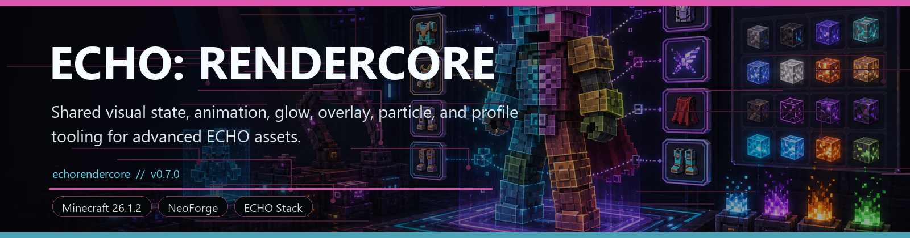
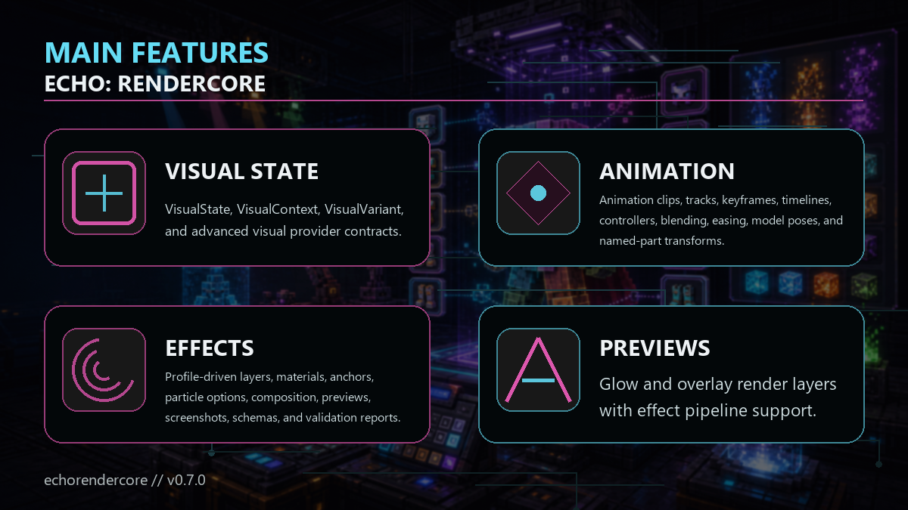

<!-- CURSEFORGE_README_START -->
# ECHO: RenderCore



**Shared visual state, animation, glow, overlay, particle, and profile tooling for advanced ECHO assets.**



## CurseForge Summary

Lightweight rendering and animation framework with visual profiles, named parts, effects, previews, and validation reports.

## Overview

ECHO: RenderCore is the shared client visual framework for advanced ECHO assets. It provides visual state contracts, animation timelines, named-part transforms, glow and overlay layers, particle anchors, visual profiles, composition, previews, validation, and debug tooling without making gameplay modules depend on a heavy external animation library.

RenderCore helps the ECHO stack present machines, vehicles, entities, terminals, and effects consistently. Addons can expose gameplay state on the common API, map it to profiles, and let client renderers compose animations, materials, lights, overlays, and particles from data.

Players experience RenderCore as polish: more readable machines, cleaner state transitions, better animated objects, and richer effects in chapters that opt into it.

## Main Features

- VisualState, VisualContext, VisualVariant, and advanced visual provider contracts.
- Animation clips, tracks, keyframes, timelines, controllers, blending, easing, model poses, and named-part transforms.
- Profile-driven layers, materials, anchors, particle options, composition, previews, screenshots, schemas, and validation reports.
- Glow and overlay render layers with effect pipeline support.
- Debug HUD, client commands, hot-swap and profile preview tooling for artists and developers.

## How It Plays

- Install RenderCore with addons that use it. It has no standalone survival loop, but it upgrades how participating ECHO content looks and communicates state.
- Addon developers can keep server-safe state in common code and register client integrations only when RenderCore is present.

## Requirements

- Minecraft 26.1.2
- NeoForge 26.1.2.29-beta or newer
- Java 25+
- ECHO: Core 1.0.0 or newer

## Recommended Pairings

- ECHO: Convoy Protocol, Industrial Nexus, HoloMap, Index, and other visual-heavy ECHO modules

## Compatibility Notes

- Optional consumers should guard client integrations behind mod-loaded checks.
- Profiles are data-driven and designed for validation instead of silent failure.

## CurseForge Asset Files

- Banner: `docs/curseforge/echorendercore-banner.png`
- Feature image: `docs/curseforge/echorendercore-features.png`

<!-- CURSEFORGE_README_END -->
---

## Existing Developer Notes

# ECHO: RenderCore

`echorendercore` is a lightweight shared rendering and animation module for ECHO addons. It provides data-driven visual state, named-part animation, per-part glow and overlay layers, particle anchors, validation/lint reports, and client debug tools without depending on GeckoLib or any Ashfall gameplay module.

## Module Setup

RenderCore depends only on `echocore`. Addons that require it can use `implementation project(":echorendercore")` and a required TOML dependency.

Optional consumers should use:

```groovy
compileOnly project(":echorendercore")
localRuntime project(":echorendercore")
```

Then add an optional TOML dependency and register client integrations only behind `ModList.get().isLoaded("echorendercore")` plus reflection. Convoy and Industrial Nexus both use this pattern.

## Public API

Common API lives under `com.knoxhack.echorendercore.api` and is server-safe:

- `VisualState`, `IVisualStateProvider`, `IAdvancedVisualEntity`, `IAdvancedVisualBlockEntity`
- `VisualContext`, `VisualVariant`, `VisualProgressProvider`

Animation API lives under `com.knoxhack.echorendercore.animation`:

- `AnimationClip`, `AnimationTrack`, `AnimationKeyframe`, `AnimationTimeline`
- `AnimationController`, `AnimationPlayer`, `AnimationBlendMode`, `Easing`
- `PartTransform`, `ModelPose`

Profile API lives under `com.knoxhack.echorendercore.profile` and includes visual layers, materials, anchors, particle options, block part selectors, profile composition, builder/data-gen helpers, cache metrics, performance diagnostics, creator-pack manifests/cards/audits/migration reports/certification reports, screenshot-preview hooks, hot-swap results, stable validation issue codes, and namespace-filterable report types.

## Entity Integration

1. Expose or derive a profile id such as `yourmod:your_entity`.
2. Map gameplay state to `VisualState`.
3. Build a `VisualContext` in the client renderer.
4. Submit the model through `VisualProfileRenderer.submitEntityModel`.
5. Apply named-part animation with `AnimationController` or `AnimationPlayer` plus `ModelPoseApplier`.
6. Spawn configured emitters with `RenderCoreParticleSpawner.spawnForEntity`.

The Wasteland Rover in `echoconvoyprotocol` is the entity example. Convoy keeps its fallback renderer and registers the RenderCore renderer only when this module is loaded.

## Block Entity Integration

For hard dependencies, implement `IAdvancedVisualBlockEntity`. For optional dependencies, keep the block entity clean and add a reflection-gated client renderer or adapter.

Industrial Nexus demonstrates the optional pattern: `IndustrialMachineBlockEntity` exposes ordinary machine status/progress accessors, `IndustrialRenderCoreVisuals` maps those to RenderCore state names without importing RenderCore, and the client-only renderer consumes RenderCore only when the mod is present.

V4 adds opt-in baked block model helpers for renderers that want lightweight layer masks over vanilla-style models. V5 extends those selectors with block-state gates and tint-index rules:

- `BakedBlockPartResolver.collect(blockState)` collects `BlockStateModelPart` values from `BlockStateModel.collectParts`.
- `BakedBlockPartResolver.resolve(blockState, profile)` maps `visual_profile.block_parts` aliases to collected baked parts and applies `block_state`/`tint_indices` rules.
- `AdvancedBlockEntityVisualRenderer.submitBlockModelLayers(...)` submits matching layer masks for block entity renderers.
- `RenderCoreBlockPartProvider` is available for custom renderers that already know their own stable block part aliases.

RenderCore never invents semantic block part names from baked models. Addons must define aliases with selector rules.

## Visual Profiles

Profiles load from every namespace at:

```text
assets/[modid]/rendercore/visual_profiles/[name].json
```

V14 is the visual-proof and ecosystem-integration creator tooling release, not a new runtime profile schema. V11 remains the active runtime schema. V7-V10 authored profiles are still readable by the creator migration tools, but they no longer activate at runtime until migrated; skipped profiles report `migration_required` diagnostics instead of crashing reload. V14 creator-pack exports add deterministic certification reports, visual-QA evidence, Workbench draft metadata, screenshot references, and all-ECHO showcase coverage on top of the V11 profile format:

```json
{
  "schema_version": 11,
  "base_texture": "yourmod:textures/entity/machine.png",
  "animation_profile": "yourmod:machine",
  "particle_profile": "yourmod:machine",
  "default_state": "ONLINE",
  "transition_seconds": 0.2,
  "effect": {
    "preset": "neon",
    "glow_intensity": 1.2,
    "bloom_intensity": 0.5,
    "pulse_speed": 1.5,
    "pulse_min_alpha": 0.65,
    "pulse_max_alpha": 1.0,
    "hue_shift_speed": 0.02,
    "advanced_enabled": true,
    "bloom_radius": 2.0,
    "bloom_threshold": 0.65,
    "bloom_passes": 2,
    "screen_blend": 0.25,
    "target_scope": "entity",
    "bloom_mask_mode": "emissive",
    "bloom_tint": "#FF66E8FF",
    "bloom_mask_alpha": 0.72,
    "bloom_channel": "machine_core",
    "bloom_downscale": 2,
    "advanced_priority": 20
  },
  "includes": [
    { "profile": "yourmod:machine_base", "states": ["ONLINE", "ACTIVE"] }
  ],
  "preview": {
    "title": "Machine",
    "screenshot": { "enabled": false }
  },
  "materials": {
    "cyan_emissive": {
      "color": "#FF66E8FF",
      "alpha": 0.9,
      "emissive": true,
      "blend_mode": "additive",
      "light_mode": "fullbright",
      "render_pass": "emissive",
      "depth_write": false,
      "light_override": 15728880,
      "overlay_override": 0,
      "outline_color": "#FF66E8FF",
      "sort_order": 1,
      "render_priority": 2,
      "effect": {
        "preset": "hologram",
        "scanline_strength": 0.25,
        "advanced_enabled": false,
        "target_scope": "profile"
      }
    }
  },
  "layers": [
    {
      "id": "online_glow",
      "kind": "glow",
      "texture": "yourmod:textures/entity/machine_glow.png",
      "material": "cyan_emissive",
      "states": ["ONLINE", "ACTIVE", "WORKING"],
      "parts": ["core", "screen"],
      "light_mode": "emissive",
      "render_priority": 1,
      "effect": {
        "preset": "energy_field",
        "flicker_intensity": 0.08,
        "depth_bias": 1.0,
        "advanced_enabled": true,
        "bloom_radius": 1.5,
        "bloom_threshold": 0.7,
        "bloom_passes": 1,
        "screen_blend": 0.2,
        "target_scope": "entity"
      }
    }
  ],
  "state_animations": {
    "ACTIVE": "work_loop"
  },
  "anchors": {
    "exhaust_left": { "part": "exhaust_left", "offset": [-0.4, 0.6, 0.8] }
  },
  "block_parts": {
    "core": {
      "indices": [0],
      "directions": ["north", "south", "up"],
      "ambient_occlusion": true
    },
    "active_core": {
      "directions": ["north", "south", "up"],
      "block_state": { "active": "true" }
    },
    "screen": {
      "directions": ["north"],
      "tint_indices": [0]
    }
  }
}
```

Missing optional profile references become validation warnings. Invalid JSON skips only the bad file. `parts`, `part_filter`, and `partFilter` all map to the same named-part mask. Entity models that want per-part layers implement the client-only `RenderCorePartProvider`; block renderers use V4 `block_parts`. Missing masked parts are skipped safely and can be linted with `RenderCoreProfileValidator.validateLayerParts` or `validateBlockPartSelectors`.

`block_state` selector values may be a string or a string list. A selector matches only when the current `BlockState` exposes the property and its serialized value is allowed. `tint_indices` uses collected baked quad material tint metadata when Minecraft exposes it; missing tint indices become validation warnings and the masked alias is skipped safely.

V6/V7 material controls are best-effort wrappers over stable renderer hooks: `light_mode` supports `profile`, `packed`, `fullbright`, and `emissive`; `render_pass` supports `auto`, `base`, `cutout`, `translucent`, and `emissive`; `cull`, `depth_write`, `sort_order`, `render_priority`, `light_override`, `overlay_override`, and `outline_color` are parsed and applied where the current renderer exposes stable values. Unsupported values become `unsupported_material_option` warnings; out-of-range packed overrides become `invalid_material_option` warnings.

V11 `effect` may be declared on the profile, a material, or a layer. Layer effects override material effects, material effects override the profile default, and missing effects resolve to `none`. Stable runtime support applies alpha pulse, flicker, hue shift, scanline-style modulation, fullbright/emissive coloring, and effect-aware ordering. Advanced fields are `advanced_enabled`, `bloom_radius`, `bloom_threshold`, `bloom_passes`, `screen_blend`, `target_scope`, `bloom_mask_mode`, `bloom_tint`, `bloom_mask_alpha`, `bloom_channel`, `bloom_downscale`, and `advanced_priority`, with camelCase aliases for V10-era fields.

Advanced FX remains client-only and disabled by default through the client config. `/rendercore debug advancedfx true|false` sets a session override; `/rendercore debug advancedfx reset` returns to config; `/rendercore debug advancedfx status` reports mode, source, mask submissions, skipped submissions, channel count, downscale, pass count, bloom cost, and fallback reason. V14 adds `/rendercore debug advancedfx evidence start|capture|status|export|reset` so release QA can capture deterministic snapshots for isolated bloom, fullscreen fallback, stable fallback, shader unavailable, resize/reload, entity masks, and block masks. The preferred V11 rendering mode is still isolated bloom: RenderCore submits stable geometry as usual, duplicates eligible effect masks into `rendercore:bloom_mask`, and composites the blurred mask back to `minecraft:main`. If the mask target, shaders, or framegraph hooks are unavailable, the status falls back to `effects advanced fullscreen fallback`, `effects stable fallback`, or `effects advanced unavailable` without breaking base rendering.

`includes` composes visual profiles before rendering. Included profiles are resolved in order, optional state/variant filters narrow inherited layers, and the root profile wins for duplicate material ids and top-level texture/profile references. Missing includes, include cycles, duplicate layers, and duplicate materials warn with stable codes and skip only the invalid include path.

## Animation Profiles

Animation profiles load from:

```text
assets/[modid]/rendercore/animations/[name].json
```

Legacy `from`/`to` tracks still work. V2 tracks can use keyframes:

```json
{
  "animations": {
    "scanner_rotate": {
      "loop": true,
      "length": 4.0,
      "transition_seconds": 0.15,
      "tracks": [
        {
          "part": "scanner",
          "channel": "rotation_y",
          "keyframes": [
            { "time": 0.0, "value": 0.0 },
            { "time": 4.0, "value": 360.0, "easing": "linear" }
          ]
        }
      ]
    }
  }
}
```

Channels: position, rotation, scale, visibility, and alpha. Rotations are degrees in JSON and are converted to model radians during application.

## Particle Emitters

Particle profiles load from:

```text
assets/[modid]/rendercore/particles/[name].json
```

```json
{
  "emitters": {
    "damaged_smoke": {
      "anchor": "exhaust_left",
      "particle": "minecraft:smoke",
      "states": ["DAMAGED", "FAILED"],
      "requires_damaged": true,
      "rate": 0.05,
      "burst_count": 1,
      "offset": [0.0, 0.1, 0.0],
      "velocity": [0.0, 0.02, 0.0],
      "spread": [0.1, 0.02, 0.1]
    },
    "dust": {
      "anchor": "wheel_back_left",
      "particle": "minecraft:dust",
      "state": "ACTIVE",
      "requires_moving": true,
      "options": {
        "color": [0.47, 0.36, 0.24],
        "scale": 0.9,
        "lifetime": 28
      }
    }
  }
}
```

Simple particles and `minecraft:dust` color/scale render by default. V4 built-ins also cover `dust_transition`, `color`/`entity_effect`, `item`, `block`, and `trail` option payloads when Minecraft exposes stable constructors:

```json
{
  "options": {
    "type": "dust_transition",
    "from_color": "#FF66E8FF",
    "to_color": "#FFFF7A28",
    "scale": 0.9
  }
}
```

Additional fields parsed by V4 include `from_color`, `to_color`, `item`, `block_state`, `target`, and `duration`. Optional addons can register client-only typed resolvers through `RenderCoreParticleOptionResolvers.register`. Unsupported custom options and currently non-applied lifetime values appear as `unsupported_particle_option` validation warnings.

## Data Generation

Addons can generate profile JSON from Java using the server-safe builders:

```java
VisualProfileBuilder.create(id("industrial_machine"))
   .schemaVersion(11)
   .baseTexture(id("textures/block/machine_casing.png"))
   .blockPart("screen", new BlockPartSelectorProfile("screen", List.of(), Set.of(Direction.NORTH), 0, true, List.of()));
```

Use `RenderCoreProfileDataProvider` from a client-data run and call `visual(...)`, `animation(...)`, and `particle(...)` inside `registerProfiles()`. `VisualProfileBuilder` defaults to schema 11, and builder output round-trips through the same V11 runtime parser used by resource reload. Providers generate deterministic V14 creator-pack artifacts under `assets/[modid]/rendercore/creator/profiles/[name].creator.json` by default and write namespace indexes under `assets/[modid]/rendercore/creator/index.creator.json` when `generateCreatorPackIndex()` is enabled. Override `generateCreatorPackArtifacts()` or `generateCreatorPackIndex()` to disable either output.

For CI or custom datagen, call `RenderCoreCreatorPackExporter.export(...)` for a `CreatorExportIndex` containing `CreatorPackManifest`, `CreatorCertificationReport`, `CreatorVisualQaReport`, `CreatorProfileCard`, `CreatorProfileAudit`, `CreatorMigrationReport`, all-ECHO `CreatorAddonIntegration` coverage, and per-profile artifacts with normalized V11 profile JSON. Creator artifacts summarize layers, materials, includes, animations, emitters, anchors, block part aliases, validation counts, performance counts, active effect counts, bloom cost, advanced pass count, target scope, migration status, screenshot hook status/path, draft editor metadata, certification status, addon compatibility, and visual-QA status. RenderCore does not require GPU screenshots; creator tools can register a `ProfileScreenshotPreviewProvider`, while the client Workbench provider can capture the current viewport to deterministic generated screenshot paths.

V14 certification keeps the default `errors_only` policy. Certification fails on validation errors, `migration_required` runtime content, malformed source JSON, missing required dependencies, and export artifact failures. Certification warns without failing for validation warnings, performance warnings, missing optional screenshots, advanced-FX fallback warnings, and high effect/bloom cost. Reports sort issue summaries by namespace/profile, severity, code, and path and avoid timestamps or machine-local absolute paths. Visual-QA reports also avoid timestamps and absolute paths; remaining blockers stay explicit until screenshots/snapshots prove each fallback mode.

## Debug Tools

Client commands:

```text
/rendercore reload
/rendercore validate all
/rendercore validate yourmod
/rendercore creator status
/rendercore creator open
/rendercore creator index all
/rendercore creator profile yourmod:machine
/rendercore creator export yourmod
/rendercore creator certify all
/rendercore creator certify yourmod
/rendercore creator migrate yourmod dryrun
/rendercore creator migrate yourmod write
/rendercore debug state ACTIVE 30
/rendercore debug hud true
/rendercore debug anchors true
/rendercore debug missingparts true
/rendercore debug advancedfx true
/rendercore debug advancedfx status
/rendercore debug advancedfx evidence start
/rendercore debug advancedfx evidence capture isolated
/rendercore debug advancedfx evidence status
/rendercore debug advancedfx evidence export
/rendercore debug advancedfx evidence reset
/rendercore debug advancedfx reset
/rendercore debug blockparts
```

The Creator Workbench commands build a creator index from the active V11 cache, open the client Workbench screen, export deterministic V14 creator-pack JSON, certify namespace/all pack readiness, and migrate V7-V10 source profiles into generated V11 output without overwriting source files. The Workbench can create draft edits, edit title/notes/screenshot metadata, apply effect/material/layer presets, create anchors/includes, capture or clear a viewport thumbnail, show certification and visual-QA status, and save generated V11 JSON under `rendercore_creator_drafts`. `/rendercore creator certify` returns success for `pass` or `warn` and failure for `fail`, then logs the full deterministic certification JSON. The debug HUD shows loaded profile counts, validation counts, target information, active advanced effect count, advanced pass count, V11 mask submissions, skipped submissions, channel count, downscale, bloom cost, fallback reason, and debug toggles. Missing part warnings and anchor diagnostics are opt-in.
When optional consumers call the debug target registry, the HUD also shows looked-at profile id, state, variant, active layer count, anchor count, and warning count. Anchor debug draws world-space bounds and anchor boxes for recently rendered RenderCore targets.
`/rendercore reload` uses the hot-swap path. A clean V11 candidate cache replaces the active cache; if edited JSON fails or legacy profiles require migration while a previous cache is available, RenderCore keeps the last known-good cache and logs the rejection.
`/rendercore debug blockparts` inspects the looked-at RenderCore-supported block entity, posts a short chat summary, and logs the full block part export: profile id, block state, collected part count, aliases, matched indices, selector rules, material flags, AO rules, directions, tint indices, and warning count. Debug export remains chat/log only.

## Validation And Lint

Validation and certification issues include stable machine-readable codes:

```text
missing_base_texture
migration_required
migration_parse_failed
malformed_source_json
screenshot_missing
missing_profile_reference
missing_animation_clip
missing_anchor
unsupported_particle_option
unsupported_material_option
invalid_material_option
masked_part_missing
block_part_selector_empty
block_part_index_out_of_range
block_state_property_missing
block_state_property_value_missing
block_part_tint_index_missing
missing_profile_include
profile_include_cycle
duplicate_composed_layer
duplicate_composed_material
screenshot_preview_unavailable
unsupported_effect_option
invalid_effect_option
effect_pipeline_unavailable
advanced_effect_disabled
advanced_effect_compile_failed
advanced_effect_mask_unavailable
advanced_effect_budget_exceeded
advanced_effect_channel_limit
advanced_effect_config_disabled
profile_perf_high_layer_count
profile_perf_high_emitter_rate
profile_perf_high_animation_track_count
profile_perf_high_effect_cost
profile_perf_high_bloom_cost
profile_preview_generation_failed
```

`ProfileValidationReport.forNamespace("yourmod")` returns a namespace-filtered report for commands, CI-style checks, or data generators. `RenderCoreProfileComposer.composeAll(...)` resolves includes into ordinary `VisualProfile` snapshots and returns composition warnings for migrator/export paths. `RenderCoreProfileValidator.validateLayerParts(profile, knownParts)` validates entity/custom model masks. `RenderCoreProfileValidator.validateBlockPartSelectors(profile, collectedPartCount, blockState, tintIndices)` validates baked block selectors with V5 state/tint context. `RenderCoreProfileValidator.analyzePerformance(...)` returns a `ProfilePerformanceReport` with layer count, masked layer count, clip/track count, emitter count, max burst estimate, active effect count, estimated effect cost, bloom cost, advanced pass count, target scope, estimated mask submissions, channel count, downscale, priority skips, and advanced mode. `RenderCoreProfileValidator.diagnostics(...)` is the preferred CI/data-gen entry point; it bundles validation, performance, and `ProfileCacheMetrics` with profile counts, discovered/loaded/failed JSON counts, warning/error counts, namespaces, and schema-version range. `RenderCoreCreatorPackExporter.export(...)` is the preferred V14 creator-pack entry point; it emits V11-normalized profile artifacts plus `CreatorCertificationReport`, `CreatorVisualQaReport`, and all-ECHO addon showcase coverage for pack readiness. Legacy previewer types remain only for older tooling paths. `/rendercore validate` and `/rendercore creator certify` are backed by the same diagnostics model.

Editor-friendly schema resources are shipped at:

```text
assets/echorendercore/rendercore/schemas/visual_profile.schema.json
assets/echorendercore/rendercore/schemas/animation_profile.schema.json
assets/echorendercore/rendercore/schemas/particle_profile.schema.json
assets/echorendercore/rendercore/schemas/creator_pack.schema.json
assets/echorendercore/rendercore/schemas/profile_preview.schema.json
```

## Testing

Recommended checks after Java 25 is on `PATH`/`JAVA_HOME`:

```text
.\gradlew.bat --no-configuration-cache :echorendercore:build
.\gradlew.bat --no-configuration-cache :echorendercore:runGameTestServer
.\gradlew.bat --no-configuration-cache :echoconvoyprotocol:build
.\gradlew.bat --no-configuration-cache :echoindustrialnexus:build
.\gradlew.bat --no-configuration-cache :echoindustrialnexus:runGameTestServer
.\gradlew.bat --no-configuration-cache :echolens:build
.\gradlew.bat --no-configuration-cache validateEchoResources
```

## Known Limitations

- Per-part material masks are active for entity models that implement the client-only named-part provider. Baked block selectors are opt-in and selector-based because vanilla baked models do not expose stable semantic bones.
- V11 material and effect controls keep the stable light/pass/order/overlay hooks as the guaranteed path; isolated/fullscreen advanced postprocessing is optional, client-only, and may fall back when Minecraft/NeoForge hooks are unavailable.
- V5-V11 block model helpers resubmit selected baked model parts for layer effects, but they do not replace a full custom block model renderer for complex moving geometry.
- V7-V10 visual profiles must be migrated before runtime activation; migration tooling can read them, but the active renderer only accepts schema 11.
- V14 certification is a pack-readiness gate, not a renderer runtime gate; warning-only packs can still certify successfully under the default `errors_only` policy.
- Particle lifetime is parsed and linted but only native particle options supported by Minecraft or a custom resolver can use it directly.
- Screenshot previews are optional. The client Workbench can capture the current viewport to deterministic generated paths, while headless/datagen exports still use metadata cards when screenshots are missing.

## V14 Visual Proof Roadmap

- Java 25 `:echorendercore:check` is a release gate, followed by `:echorendercore:runGameTestServer` and manual advanced-FX visual QA.
- Workbench authoring now includes generated draft saves, screenshot metadata, preset controls, anchors, includes, certification status, and visual-QA status; deeper graph editing can build on `CreatorProfileDraft`.
- Advanced FX remains opt-in and must be visually proven in isolated, fullscreen fallback, stable fallback, shader-unavailable, resize/reload, entity-mask, and block-mask modes before release.
- All `echo*` addons are represented in the creator export compatibility matrix as either integrated showcase targets or declared no-visual-surface modules.
- Final release packaging should include the V14 certified showcase pack, visual-QA evidence JSON/screenshots, migration guide, compatibility matrix, config notes, changelog, and CurseForge/Modrinth copy.
