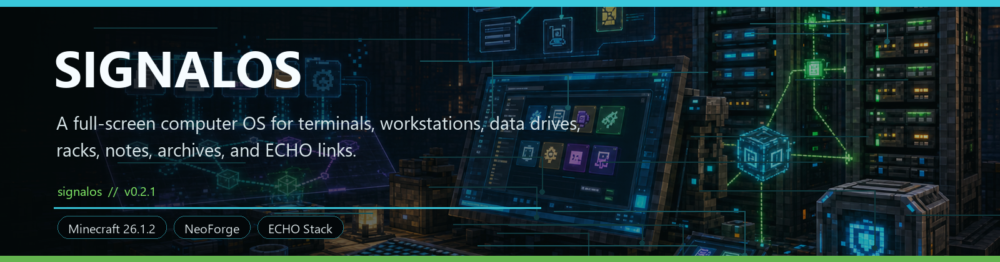
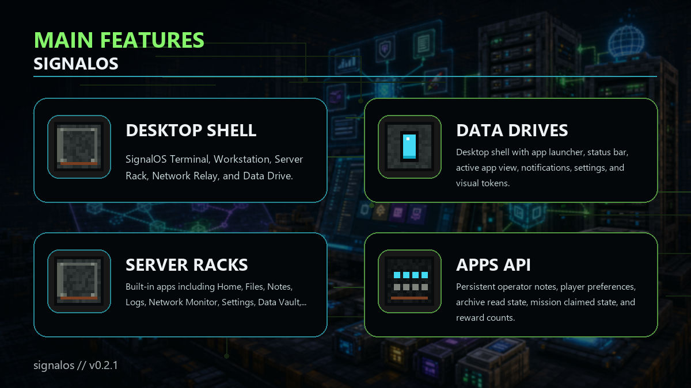

<!-- CURSEFORGE_README_START -->
# SignalOS



**A full-screen computer OS for terminals, workstations, data drives, racks, notes, archives, and ECHO links.**



## CurseForge Summary

Standalone Echo-compatible computer tech addon with desktop shell, apps, data drives, server racks, missions, archives, and diagnostics.

## Overview

SignalOS is an Echo-compatible computer tech addon for NeoForge. It adds terminal and workstation blocks, server racks, network relays, portable data drives, and a full-screen desktop shell with apps, notifications, settings, notes, files, logs, data vaults, ECHO links, missions, archives, rewards, and diagnostics.

It is not a replacement for ECHO: Terminal. SignalOS owns the computer OS fantasy while still bridging into ECHO Core state and exposing compatible mission, archive, reward, and diagnostic surfaces.

The 0.2 line focuses on real persistence and interaction: editable operator notes, drive records, rack bays, network discovery, player preferences, archive read state, mission claim state, pending reward counts, Java registration APIs, datapack JSON content, and a soft KubeJS bridge.

## Main Features

- SignalOS Terminal, Workstation, Server Rack, Network Relay, and Data Drive.
- Desktop shell with app launcher, status bar, active app view, notifications, settings, and visual tokens.
- Built-in apps including Home, Files, Notes, Logs, Network Monitor, Settings, Data Vault, Echo Link, Missions, Archives, Rewards, and Diagnostics.
- Persistent operator notes, player preferences, archive read state, mission claimed state, and reward counts.
- Server-rack screen with drive bays, templates, rename, clear, copy, remove, and apply-template actions.
- Java registration APIs, datapack JSON loading, and KubeJS-friendly bridge access.

## How It Plays

- Place a terminal or workstation, open the desktop shell, use built-in apps to manage notes and records, then expand into server racks, relays, drives, and networked data surfaces.
- Pack makers can register custom apps, chapters, missions, archives, diagnostics, and drive records using Java or datapack content.

## Requirements

- Minecraft 26.1.2
- NeoForge 26.1.2.29-beta or newer
- Java 25+
- ECHO: Core 1.0.0 or newer
- ECHO: NetCore 1.0.0 or newer

## Recommended Pairings

- KubeJS for packs that want script-driven SignalOS content
- ECHO: Terminal when you want both command-terminal and computer-OS fantasies

## Compatibility Notes

- SignalOS uses one active app at a time rather than draggable windows.
- Notes and drive records are bounded for persistence safety.

## CurseForge Asset Files

- Banner: `docs/curseforge/signalos-banner.png`
- Feature image: `docs/curseforge/signalos-features.png`

<!-- CURSEFORGE_README_END -->
---

## Existing Developer Notes

# SignalOS

SignalOS is a standalone Echo-compatible computer tech addon for NeoForge. It provides a full-screen desktop shell, utility apps, networked computer blocks, portable data drives, and a defensive bridge into Echo Core state.

SignalOS is not a replacement for `echoterminal`. It owns the computer OS fantasy while continuing to expose legacy-compatible mission, archive, reward, and diagnostic surfaces inside the new shell.

## 1.0.0 Scope

SignalOS 1.0.0 ships:

- `signalos:terminal` as the base access point and `signalos:workstation` as the stronger access tier.
- `signalos:server_rack`, `signalos:network_relay`, and `signalos:data_drive` for computer-network gameplay.
- A desktop shell with an app launcher, status bar, active app view, notifications, settings surface, and shared visual tokens.
- Built-in apps: Home, Files, Notes, Logs, Network Monitor, Settings, Data Vault, Echo Link, Missions, Archives, Rewards, and Diagnostics.
- Editable operator notes with selected-note editing, title/body drafts, Save, New, Delete, and Clear actions. Notes persist per player and are capped at 64 notes, 80-character titles, and 2000-character bodies.
- A server-rack screen opened by empty-hand right-click, with four drive bays, player inventory transfer, selected drive details, drive records, network records, drive templates, rename, clear, copy, remove, and apply-template actions.
- Server-owned network discovery around owned terminals/workstations, including linked racks, relays, drives, and data records.
- Persistent player preferences, operator notes, archive read state, mission claimed state, and pending terminal reward counts.
- Java registration APIs and datapack JSON loading for apps, custom record views, data records, drive templates, chapters, missions, and archives.
- Client-only Java app renderers keyed by app `type`, with render, click, key, character input, and terminal-action helper hooks.
- Optional Echo Core integration through `EchoCoreServices` for module reports, diagnostics, route records, and platform summaries.
- A soft KubeJS-friendly bridge through `Java.loadClass`, without a hard KubeJS runtime dependency.

Current limitations:

- SignalOS uses one active app at a time, not draggable multi-window management.
- Notes and drive records are intentionally text-oriented and bounded for persistence safety.
- Player-facing rack actions cap data drives at 64 records.
- The block/item models intentionally use simple placeholder geometry until production art is added.

## Java API

```java
SignalOsApi.registerApp(SignalOsApp.builder("example:field_files")
        .title("Field Files")
        .type("files")
        .summary("Browse recovered field records.")
        .order(25)
        .accentColor(0x66E8FF)
        .build());

SignalOsApi.registerDataProvider(new SignalOsDataProvider() {
    @Override
    public Identifier id() {
        return SignalOsApi.id("example:cache_records");
    }

    @Override
    public List<SignalOsDataRecord> records(Player player) {
        return List.of(SignalOsDataRecord.of(
                "example:records/cache_note",
                "Cache Note",
                "record",
                "Example Module",
                "A server-synced record visible in Files and Data Vault.",
                10));
    }
});

SignalOsApi.registerComputerPeripheral(new SignalOsPeripheralProvider() {
    @Override
    public Identifier id() {
        return SignalOsApi.id("example:beacons");
    }

    @Override
    public List<SignalOsPeripheralProvider.Peripheral> peripherals(Player player) {
        return List.of(new SignalOsPeripheralProvider.Peripheral(
                SignalOsApi.id("example:peripherals/beacon"),
                "relay",
                "Beacon Peripheral",
                "ONLINE",
                player.blockPosition(),
                1));
    }
});
```

Custom record-view apps can be registered without a renderer:

```java
SignalOsApi.registerApp(SignalOsApp.builder("example:field_records")
        .title("Field Records")
        .type("field_records")
        .summary("Focused field cache records.")
        .view("records")
        .recordTypes(List.of("record", "diagnostic"))
        .recordSources(List.of("Example Module"))
        .includeArchived(false)
        .emptyText("NO FIELD RECORDS")
        .order(40)
        .build());
```

Client code can provide a richer renderer for a custom type:

```java
SignalOsAppRenderers.register("field_records", new SignalOsAppRenderer() {
    @Override
    public void render(SignalOsAppRenderContext context, GuiGraphicsExtractor graphics,
            int mouseX, int mouseY, float partialTick) {
        graphics.drawString(context.minecraft().font, "Custom SignalOS surface",
                context.x(), context.y(), 0xFF66E8FF, false);
    }

    @Override
    public boolean mouseClicked(SignalOsAppRenderContext context, double mouseX, double mouseY, int button) {
        context.sendAction(SignalOsApi.id("field_records"), SignalOsApi.id("refresh"), "clicked");
        return true;
    }
});
```

Legacy terminal content remains supported:

```java
SignalOsApi.registerChapter(TerminalChapter.builder("example:field_ops")
        .title("Field Ops")
        .section("progress")
        .page("missions")
        .page("archives")
        .build());

SignalOsApi.registerMission(TerminalMission.builder("example:secure_cache")
        .chapter("example:field_ops")
        .title("Secure the Cache")
        .description("Find shelter and recover the field cache.")
        .objective("Find shelter")
        .completionAdvancement("minecraft:story/root")
        .reward("minecraft:bread", 4)
        .build());
```

## JSON Content

Datapacks can place content in:

- `data/<namespace>/signalos/apps/*.json`
- `data/<namespace>/signalos/data_records/*.json`
- `data/<namespace>/signalos/drive_templates/*.json`
- `data/<namespace>/signalos/chapters/*.json`
- `data/<namespace>/signalos/missions/*.json`
- `data/<namespace>/signalos/archives/*.json`

KubeJS packs can put the same files under the KubeJS `data/` folder. See [DATA_FORMATS.md](DATA_FORMATS.md) for field-level examples.

SignalOS intentionally ships a `kubejs.classfilter.txt` soft bridge instead of `kubejs.plugins.txt`; KubeJS' addon guidance reserves `kubejs.plugins.txt` for compile-time KubeJS plugin classes.

## Computer Gameplay

- Terminals and workstations anchor an operator network when owned by the player.
- Empty-hand right-click opens the server-rack screen; right-clicking with a data drive inserts it; sneak empty-hand right-click ejects the last installed drive.
- Server racks store up to four installed data drives and expose their records to Files, Logs, Data Vault, and Echo Link views.
- Rack actions validate the open menu, rack position, selected slot, held drive component, network snapshot records, and loaded drive templates before changing drive data.
- The rack screen can copy a selected network record to a drive, remove a drive record, apply a drive template, clear drive records, and rename the drive label.
- Network relays increase the discovered network footprint by participating in the scan.
- Data drives carry portable `SignalOsDriveData` components with small text-oriented records.
- Player persistent data stores settings, notes, recently exposed records, mission claims, archive read state, and terminal reward inbox counts.

Network identity is server-owned and derived from dimension, anchor position, and owner. SignalOS works without rich Echo addons, then surfaces more records when Echo Core providers return module, diagnostic, route, discovery, faction, or profile data.

## KubeJS Example

For reloadable pack content, prefer JSON in the KubeJS `data/` folder. Use the soft bridge when a script needs to assemble content procedurally.

```js
const SignalOSEvents = Java.loadClass('com.knoxhack.signalos.kubejs.SignalOSEvents')

ServerEvents.loaded(event => {
  SignalOSEvents.content(event => {
    event.clear()
    event.chapter('signalosexample:field_ops')
      .title('Field Ops')
      .section('progress')
      .page('missions')
      .page('archives')
      .register()

    event.mission('signalosexample:secure_cache')
      .chapter('signalosexample:field_ops')
      .title('Secure the Cache')
      .description('Find shelter and recover the field cache.')
      .objective('Find shelter')
      .completionAdvancement('minecraft:story/root')
      .reward('minecraft:bread', 4)
      .register()
  })
})
```

## Build And Release Checks

From the workspace root:

```powershell
.\gradlew.bat :echosignalos:build --warning-mode all
.\gradlew.bat :signalosexample:build --warning-mode all
.\gradlew.bat :echosignalos:runGameTestServer --warning-mode all
python tools\validate_resources.py --addon-set beta
```

Release safety notes:

- Keep `echoterminal` imports and content separate; SignalOS integrates through Echo Core and shared service contracts.
- Keep Echo integration optional and defensive.
- Terminal app rendering resolves in order: built-in app type, registered Java renderer, JSON `view: "records"`, then unsupported metadata view.
