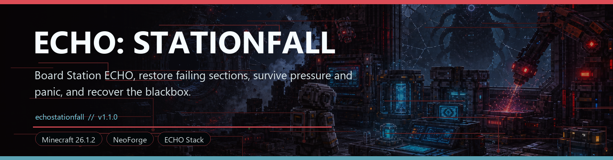
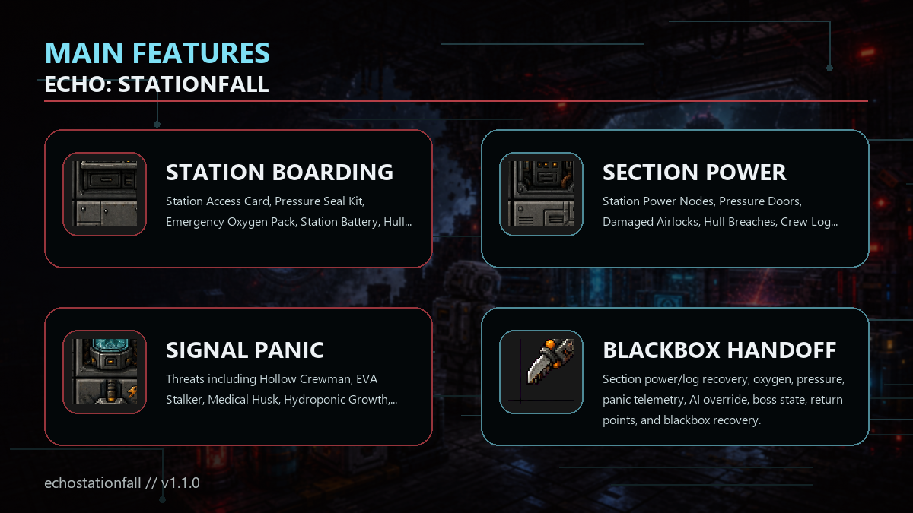

<!-- CURSEFORGE_README_START -->
# ECHO: Stationfall

**Board Station ECHO, restore failing sections, survive pressure and panic, and recover the blackbox.**

## CurseForge Summary

Station ECHO horror chapter with boarding, section power, crew logs, oxygen, pressure, Signal Panic, AI override, and Station Mother.

## Overview

ECHO: Stationfall follows the orbital signal into Station ECHO. It is a contained horror-survival chapter about boarding a damaged station, restoring section power, reading crew logs, managing oxygen and pressure, surviving Signal Panic, overriding corrupted systems, and confronting Station Mother.

The station is built around nine sections: Docking Ring, Crew Quarters, Hydroponics Bay, Medical Wing, Engineering Deck, Data Core, Observation Deck, Containment Wing, and Command Module. Each section can carry power, doors, records, pressure hazards, and route consequences.

Recovering the Stationfall Blackbox records the handoff that opens deeper Nexus Protocol and Blackbox Protocol routes, making Stationfall the bridge between Orbital Remnants and the memory endgame.

## Main Features

- Station Access Card, Pressure Seal Kit, Emergency Oxygen Pack, Station Battery, Hull Cutter, Crew Log Tablet, AI Override Chip/Core, Signal Panic Dampener, and Stationfall Blackbox.
- Station Power Nodes, Pressure Doors, Damaged Airlocks, Hull Breaches, Crew Log Terminals, Data Core Terminals, Command Consoles, Observation Glass, Containment Pods, and corrupted hydroponics.
- Threats including Hollow Crewman, EVA Stalker, Medical Husk, Hydroponic Growth, Maintenance Drone, Screaming Signal, Station Mimic, Suit Without a Body, and Station Mother.
- Section power/log recovery, oxygen, pressure, panic telemetry, AI override, boss state, return points, and blackbox recovery.
- Terminal integration for Stationfall state and handoff visibility.

## How It Plays

- Board Station ECHO from the orbital route, restore power section by section, gather crew logs, manage oxygen and pressure tools, obtain the AI override, and start the Station Mother finale from the Command Console.
- Recover the blackbox to close Stationfall and unlock the next memory and Nexus escalation.

## Requirements

- Minecraft 26.1.2
- NeoForge 26.1.2.29-beta or newer
- Java 25+
- ECHO: Core 1.0.0 or newer
- ECHO: Orbital Remnants 1.0.0 or newer

## Recommended Pairings

- ECHO: Terminal for chapter state and records
- ECHO: Blackbox Protocol for the later memory finale
- ECHO: Nexus Protocol for the next route

## Compatibility Notes

- Stationfall is designed as a post-Orbital chapter.
- Blackbox recovery is the intended route handoff into later chapters.

## CurseForge Asset Files

- Banner: `docs/curseforge/echostationfall-banner.png`
- Feature image: `docs/curseforge/echostationfall-features.png`

<!-- CURSEFORGE_README_END -->
