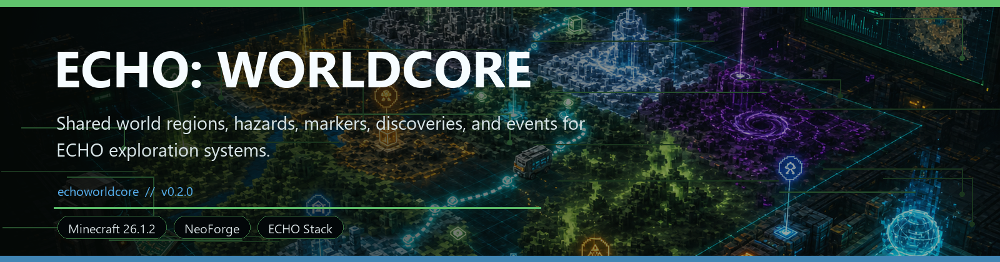
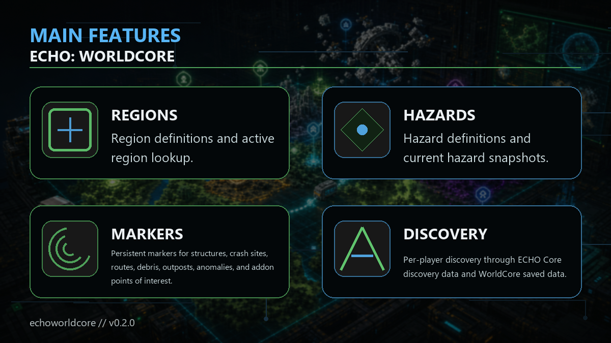

<!-- CURSEFORGE_README_START -->
# ECHO: WorldCore

**Shared world regions, hazards, markers, discoveries, and events for ECHO exploration systems.**

## CurseForge Summary

Foundation module for region definitions, world markers, hazard snapshots, structure discovery, and world event contracts.

## Overview

ECHO: WorldCore is the shared world vocabulary for the ECHO ecosystem. It does not own Ashfall worldgen, Convoy routes, Orbital debris, or Nexus structures. Instead, it provides common services and definitions so those systems can describe regions, markers, hazards, discoveries, and events consistently.

WorldCore gives addons a safer way to publish region definitions, active region lookup, hazard definitions, current hazard snapshots, persistent world markers, per-player discovery, runtime events, validation commands, and optional Terminal or HoloMap feeds.

For players, it is a library that makes exploration features line up. For pack authors, it is the reason a crash site, convoy route, orbital scan, anomaly zone, faction outpost, and hazard field can all participate in the same map and diagnostic language.

## Main Features

- Region definitions and active region lookup.
- Hazard definitions and current hazard snapshots.
- Persistent markers for structures, crash sites, routes, debris, outposts, anomalies, and addon points of interest.
- Per-player discovery through ECHO Core discovery data and WorldCore saved data.
- Runtime bus events for region enter, discover, scan, marker reveal, and hazard changes.
- Optional Terminal status, HoloMap feed support, RenderCore profiles, and future AudioCore ambience profile resources.

## How It Plays

- Install it with ECHO chapters that publish shared world telemetry. The result is cleaner maps, safer diagnostics, and route systems that can describe locations in a common way.
- Developers should call ECHO Core service accessors so optional integrations fall back to no-op world services when WorldCore is absent.

## Requirements

- Minecraft 26.1.2
- NeoForge 26.1.2.29-beta or newer
- Java 25+
- ECHO: Core
- ECHO: NetCore 1.0.0 or newer

## Recommended Pairings

- ECHO: Terminal for status surfaces
- ECHO: HoloMap for world marker display
- ECHO: Ashfall Protocol, Orbital Remnants, Convoy Protocol, and Nexus Protocol for rich world telemetry

## Compatibility Notes

- WorldCore is a foundation module and should not own sibling chapter worldgen.
- Missing implementation services fall back to no-op Core services.

## CurseForge Asset Files

- Banner: `docs/curseforge/echoworldcore-banner.png`
- Feature image: `docs/curseforge/echoworldcore-features.png`

<!-- CURSEFORGE_README_END -->
---

## Existing Developer Notes

# ECHO: WorldCore

WorldCore is a foundation module for the ECHO ecosystem. It does not own
Ashfall world generation, Convoy routes, Orbital debris generation, Nexus
structures, or any player craftable content. It provides the shared vocabulary
and runtime services that those systems use to describe the same world safely.

## What WorldCore Provides

- Region definitions and active region lookup.
- Hazard definitions and current hazard snapshots.
- Persistent world markers for structures, crash sites, routes, debris, outposts,
  and anomalies.
- Per-player region discovery through ECHO Core discovery data plus WorldCore
  SavedData.
- Runtime bus events for region enter/discover/scan, marker reveal, and hazard
  changes.
- Optional Terminal status and HoloMap feed support through ECHO Core services.
- Permission-gated `/echoworld` validation and inspection commands.
- RenderCore profile resources for every built-in region and hazard category.
- Forward-compatible AudioCore ambience profile resources for built-in region
  `audioProfileId` values.

## Public Services

Use ECHO Core accessors instead of depending on the implementation class:

- `EchoCoreServices.worldRegions()`
- `EchoCoreServices.regionService()`
- `EchoCoreServices.hazardService()`
- `EchoCoreServices.worldMarkerService()`
- `EchoCoreServices.structureDiscoveryService()`

When WorldCore is absent, these resolve to `NoOpWorldService`, so optional
integrations can call them safely.

## Built-In Integrations

- Ashfall scanner discoveries are recorded as WorldCore structure markers.
- Convoy route start, checkpoint, and destination events create route markers.
- Orbital recovery and debris sites create persistent orbital markers.
- HoloMap consumes WorldCore regions, markers, and hazards through Core services.
- Terminal shows active regions, marker counts, hazard summary, validation state,
  and a HoloMap link when HoloMap is installed.
- DataCore subscribes to WorldCore runtime events and stores last region, marker,
  discovery, and hazard summary keys when DataCore is installed.
- MissionCore subscribes to WorldCore runtime events and records matching
  `enter_region`, `discover_structure`, and custom objective progress.

## Commands

All commands require operator/game-master permission and
`debug.commandsEnabled=true`.

- `/echoworld validate`
- `/echoworld list [region|hazard|all]`
- `/echoworld nearby [radius]`
- `/echoworld markers [radius]`
- `/echoworld hazard`
- `/echoworld reveal <region_id>`

## Configuration

Common config keys:

- `runtime.playerScanIntervalTicks`
- `runtime.activeRegionRadius`
- `runtime.markerQueryRadiusCap`
- `debug.commandsEnabled`

Defaults preserve the initial WorldCore behavior.
