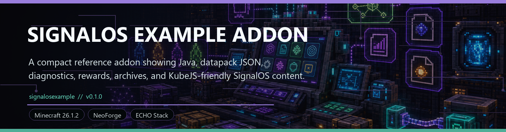
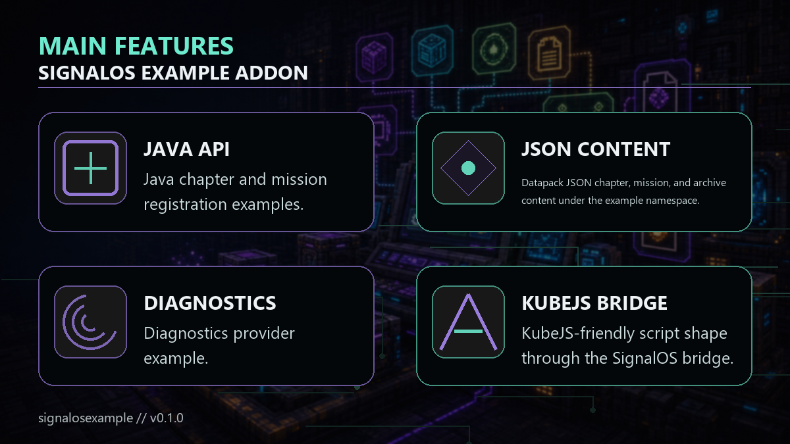

<!-- CURSEFORGE_README_START -->
# SignalOS Example Addon



**A compact reference addon showing Java, datapack JSON, diagnostics, rewards, archives, and KubeJS-friendly SignalOS content.**



## CurseForge Summary

Example SignalOS integration module with Java registration, JSON content, diagnostics, archives, missions, and script-friendly patterns.

## Overview

SignalOS Example Addon is a small reference module for pack authors and developers. It demonstrates how to register SignalOS chapters, missions, archives, diagnostics, rewards, and content from both Java and datapack JSON.

The addon intentionally keeps its content simple so the integration shape is easy to copy. It includes Java and JSON chapters, quick missions, archive records, diagnostics providers, and KubeJS-friendly bridge usage examples.

Most players do not need this in a final survival pack unless the pack wants a visible example chapter. Its real value is as documentation you can run.

## Main Features

- Java chapter and mission registration examples.
- Datapack JSON chapter, mission, and archive content under the example namespace.
- Diagnostics provider example.
- KubeJS-friendly script shape through the SignalOS bridge.
- Fast completion hooks suitable for testing a normal world.

## How It Plays

- Install it with SignalOS, open the SignalOS surfaces, and inspect the example Java and JSON content. Use the source files as a template for your own addon or pack scripts.
- Because it is a demonstration module, its content is intentionally small and direct.

## Requirements

- Minecraft 26.1.2
- NeoForge 26.1.2.29-beta or newer
- Java 25+
- SignalOS 1.0.0 or newer

## Recommended Pairings

- KubeJS if you want to test the script-friendly bridge

## Compatibility Notes

- This is a sample addon, not a required gameplay chapter.
- Keep it out of public packs unless you want example content visible to players.

## CurseForge Asset Files

- Banner: `docs/curseforge/signalosexample-banner.png`
- Feature image: `docs/curseforge/signalosexample-features.png`

<!-- CURSEFORGE_README_END -->
---

## Existing Developer Notes

# SignalOS Example Addon

This module shows three SignalOS integration paths:

- Java registration in `SignalOsExample`.
- Datapack JSON under `data/signalosexample/signalos`.
- KubeJS-friendly usage through `SignalOSKubeBridge`.

## Included Content

- Java chapter: `signalosexample:java_ops`
- Java mission: `signalosexample:java_boot`
- Java diagnostics provider: `signalosexample:example_diagnostics`
- JSON chapter: `signalosexample:field_ops`
- JSON mission: `signalosexample:secure_cache`
- JSON archive: `signalosexample:field_ops_brief`

The JSON mission uses `minecraft:story/root` as its completion advancement so it can be completed quickly in a normal test world.

## Java API Shape

```java
SignalOsApi.registerChapter(TerminalChapter.builder("signalosexample:java_ops")
        .title("Java Ops")
        .section("system")
        .page("missions")
        .page("archives")
        .page("diagnostics")
        .build());
```

## KubeJS-Friendly Script Shape

This is a soft bridge loaded through `Java.loadClass`, not a native KubeJS plugin event.

```js
const SignalOSEvents = Java.loadClass('com.knoxhack.signalos.kubejs.SignalOSEvents')

ServerEvents.loaded(event => {
  SignalOSEvents.content(event => {
    event.clear()

    event.chapter('signalosexample:script_ops')
      .title('Script Ops')
      .section('progress')
      .page('missions')
      .register()

    event.archive('signalosexample:script_brief')
      .chapter('signalosexample:script_ops')
      .title('Script Brief')
      .line('This content was registered from a KubeJS script.')
      .register()
  })
})
```

For reloadable pack content, prefer placing equivalent JSON files under the KubeJS `data/` folder.
