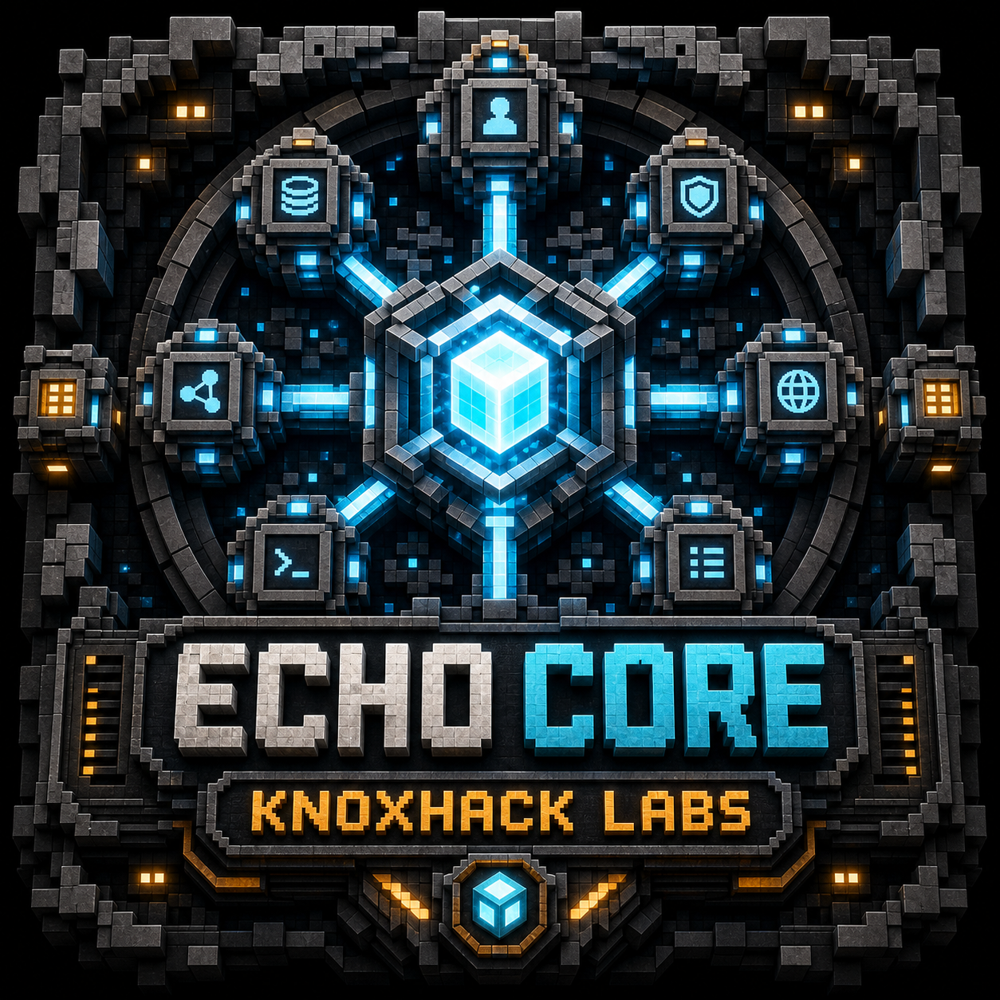
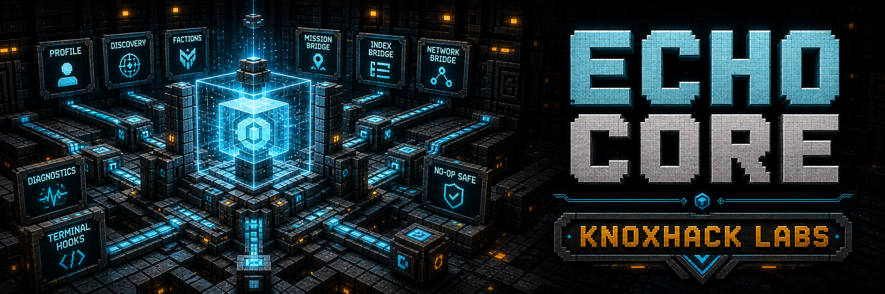
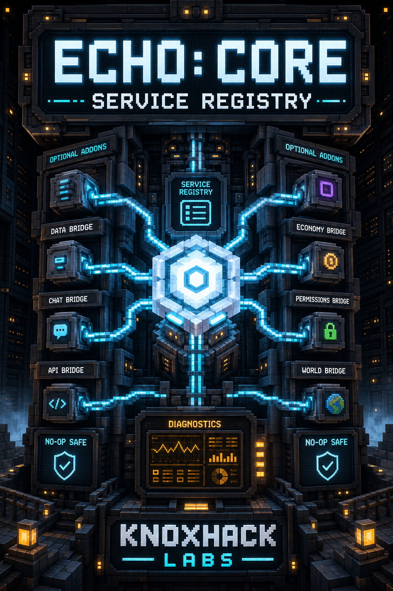
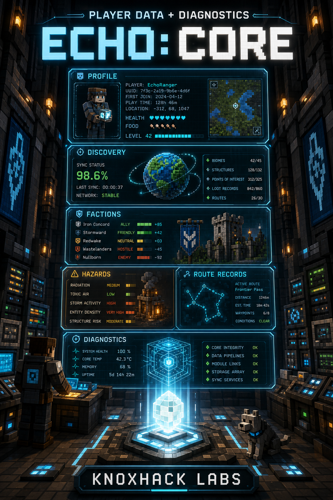

<!-- CURSEFORGE_README_START -->
# ECHO: Core





**Shared API, service registry, and integration foundation for the modular ECHO stack.**





## CurseForge Summary

Shared API, service registry, no-op-safe service contracts, player data attachments, diagnostics, faction/discovery sync, and optional integration hooks for ECHO mods and addons.

## Overview

ECHO: Core is the shared foundation for the modular ECHO ecosystem. It owns the public API layer and service registry that let Ashfall, Terminal, DataCore, MissionCore, WorldCore, NetCore, HoloMap, Index, Lens, Armory, Convoy, Industrial, Nexus, Stationfall, Blackbox, and other ECHO modules talk through stable contracts.

Core is intentionally light at the gameplay layer. It does not add a standalone campaign, machine chain, or survival loop by itself. Instead, it provides safe defaults, no-op services, player profile and discovery attachments, and optional service accessors so modules can load in different pack shapes without crashing when a sibling addon is absent.

For pack authors and addon developers, Core is the compatibility spine: shared pack mode, diagnostics, faction contracts, route records, hazard telemetry, recovery hooks, mission/index/network bridges, Terminal placement/reward contracts, and Nexus/intel handoff services all start here.

## Main Features

- `EchoServiceRegistry` and `EchoCoreServices` for no-op-safe optional integration between ECHO modules.
- Shared player profile, progress ledger, discovery data, faction standing, route record, diagnostics, and hazard telemetry contracts.
- Mission, index, network, map, world region, marker, and structure discovery bridges for specialized core modules.
- Terminal placement, terminal reward, Nexus path, Nexus campaign, recovery, and intel mirror handoff contracts.
- Expected ECHO module catalog used for diagnostics and ecosystem readiness checks.
- GameTest coverage for core no-op fallbacks, beta service contracts, discovery/faction sync, config registry, and integration safety.

## How It Plays

- Install it as the required foundation for ECHO modules. Players experience it indirectly through safer cross-addon features, stable saves, consistent diagnostics, and cleaner Terminal/mission/map integration.
- Addon developers should register services through `EchoCoreServices`, keep direct gameplay ownership inside the owning module, and rely on Core fallbacks when optional sibling modules are missing.

## Requirements

- Minecraft 26.1.2
- NeoForge 26.1.2.29-beta or newer
- Java 25+

## Recommended Pairings

- ECHO: Terminal for player-facing mission, archive, reward, and route surfaces.
- ECHO: NetCore, DataCore, MissionCore, WorldCore, RenderCore, HoloMap, Index, and Lens for the expanded shared-service stack.
- ECHO: Ashfall Protocol and route chapters for the full gameplay ecosystem.

## Compatibility Notes

- Core should stay server-safe and dependency-light. Feature modules should depend on Core, not the other way around.
- Services must fail soft through no-op implementations or empty snapshots so optional addon combinations remain loadable.
- Public IDs, service contracts, and player attachment data are save-facing and should be changed cautiously.

## CurseForge Asset Files

- Logo: `docs/curseforge/echocore-logo.png`
- Banner: `docs/curseforge/echocore-banner.png`
- Feature showcase: `docs/curseforge/echocore-feature-service-registry.png`
- Feature showcase: `docs/curseforge/echocore-feature-player-data-diagnostics.png`

<!-- CURSEFORGE_README_END -->

---

## Developer Notes

ECHO: Core is the stable API and runtime contract module for the ECHO family. The module id is `echocore`, the Maven group is `com.knoxhack.echocore`, and the current module version is `1.0.0`.

Core intentionally has no ordinary texture or model resource tree. Its publishing images live under `docs/curseforge` for documentation and CurseForge presentation. Runtime metadata is generated from `src/main/templates/META-INF/neoforge.mods.toml`.

## Source Map

- `src/main/java/com/knoxhack/echocore/EchoCore.java` registers attachments, player-login sync, and Core GameTests.
- `src/main/java/com/knoxhack/echocore/api/EchoCoreServices.java` is the main service facade used by the rest of the stack.
- `src/main/java/com/knoxhack/echocore/api/EchoServiceRegistry.java` stores optional service implementations by contract type.
- `src/main/java/com/knoxhack/echocore/registry/ModAttachments.java` registers Core player attachment data.
- `src/main/java/com/knoxhack/echocore/discovery/EchoDiscoveryData.java` stores player discovery state.
- `src/main/java/com/knoxhack/echocore/api/network` contains shared network-facing service contracts and debug hooks.
- `src/main/java/com/knoxhack/echocore/api/index` contains shared Index contracts.
- `src/main/java/com/knoxhack/echocore/api/config` contains config registry and validation contracts.
- `src/main/java/com/knoxhack/echocore/api/mission` contains mission, objective, reward, runtime, and registry contracts.
- `src/main/java/com/knoxhack/echocore/test/ModGameTests.java` protects the Core no-op and integration contract behavior.

## Service Families

Core exposes contracts for:

- Data and persistence: `IDataService`, `IDataKey`, `IDataView`, `IPlayerDataView`, `IWorldDataView`, and `ITeamDataView`.
- Player state: `EchoProfileService`, `EchoProfile`, `EchoProgressLedger`, and discovery sync.
- Missions: `IMissionService`, `IMissionRegistry`, mission content registrars, objective reporting, and reward claims.
- Index: `IIndexService`, entry providers, recipe providers, search, overlay, and Terminal bridge contracts.
- Networking: `INetworkService`, `INetworkBridge`, packet debug hooks, and discovery toasts.
- World/map systems: regions, markers, structure discoveries, hazard snapshots, route records, and map layers.
- ECHO operations: diagnostics, recovery, pack mode, faction definitions, faction standings, faction actions, Nexus paths, Nexus campaign state, Terminal placement, Terminal rewards, and intel mirroring.

## Registering Optional Services

Modules should register their concrete services during setup and call Core through the facade:

```java
EchoCoreServices.registerMissionService(myMissionService);
EchoCoreServices.registerRouteRecordService(myRouteProvider);
EchoCoreServices.registerDiagnosticService(myDiagnosticProvider);
```

Callers should prefer no-op-safe Core accessors over direct sibling imports:

```java
if (EchoCoreServices.missionCoreAvailable()) {
    EchoCoreServices.recordMissionObjective(player, type, target, amount, context);
}
```

This keeps optional addon combinations loadable and prevents missing-module crashes.

## Build And Verification

From the root ECHO checkout:

```powershell
cd C:\Github\Echo
.\gradlew.bat :echocore:build --warning-mode all
.\gradlew.bat :echocore:gameTestServer
```

When changing public contracts, also build the full workspace:

```powershell
.\gradlew.bat buildEchoWorkspace -PechoAddonSet=all --warning-mode all
```

## Change Rules

- Keep Core dependency-light and server-safe.
- Add no-op fallbacks for new service contracts.
- Preserve public IDs and save-facing data unless a migration is included.
- Add or update GameTests for new service surfaces, registries, and failure behavior.
- Keep gameplay ownership in the feature module. Core should define contracts and safe defaults, not chapter-specific progression.
